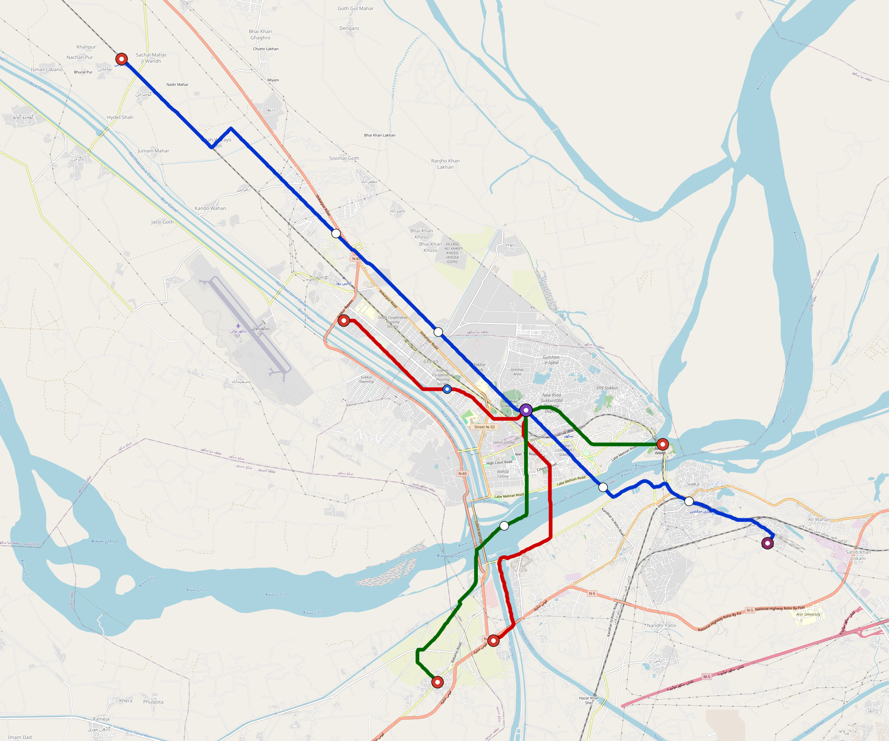

# Sukkur — Urban Rail Network

**Country:** PK · **Population:** 600,000

Auto-planned by the OpenSourceRail design pipeline: [`osr_geo`](../../../../design-py/src/osr_geo/) rasterises Overpass-verified OpenStreetMap features (arterial road graph, buildings, water, protected land, demand-anchor POIs) onto a 20 m cost / demand / buildability grid; [`osr-design`](../../../../crates/osr-design/) (rust) runs a demand-rewarded Dijkstra on that grid to synthesise corridors, places stations against the demand surface, and classifies every segment (at-grade / elevated / bridge — no tunnels per [RFC 0011](../../../../docs/rfcs/0011-civil-infrastructure-design-standard.md)). Population, country, and bbox are read from the canonical city catalog at [`lib/city-batches/world-sample.toml`](../../../../lib/city-batches/world-sample.toml).

## Network map



*Every line visible end-to-end — radials out to the city edge, forced-coverage suburbs, and the ring line if present. Auto-fit zoom based on the network's actual bounding box.*

Corridor polylines + stations as GeoJSON for GIS / alignment tooling: [`sukkur.corridor.geojson`](sukkur.corridor.geojson).

## At a glance

| Metric | Value |
|---|---|
| Lines | 3 |
| Unique stations | 31 |
| Interchange stations | 3 |
| Multi-line transfer reachability | 0% (line-pairs sharing ≥ 1 station) |
| Anchor-weighted coverage | 55.1% |
| Route length (double track) | 51.1 km |
| Revenue fleet | 46 × 3-car trainsets |
| Spare + cold-reserve | 7 × 3-car trainsets |
| Peak headway | 5 min |
| Service hours | 05:30 – 02:00 (≈ 20 h/day) |

## Lines

*Termini are tagged by compass quadrant + radial band (Inner < 0.33 R, Mid 0.33–0.67 R, Outer > 0.67 R, where R is the network's outermost station-to-centre distance).*

| Line | Length | Stations | Trainsets | Termini |
|---|---|---|---|---|
| line-1 | 15.0 km | 10 | 16 | W Mid ↔ SE Mid |
| line-2 | 13.1 km | 9 | 14 | NW Mid ↔ S Mid |
| line-3 | 23.0 km | 12 | 23 | NW Outer ↔ SE Outer |
| **Total** | **51.1 km** | **31 unique** | **53** | |

## Rolling stock

| Property | Value |
|---|---|
| Consist | 3-car, 57 m |
| Max speed | 90 km/h |
| Onboard battery | 360 kWh per trainset |
| Seats | 60 longitudinal seats |
| Nominal capacity (AW2) | 330 pax (seated + standing, `light-metro-3car` per RFC 0008 §1) |
| Crush capacity (AW3) | 420 pax, short-duration structural/egress reference |

## Ridership capacity

- **Per-train planning capacity:** 330 AW2 passengers (`light-metro-3car`)
- **Peak frequency:** 12 trains/hour/direction (5-min headway)
- **Peak capacity per line per direction:** 330 × 12 = **3,960 pphpd**
- **Network peak throughput (all lines, both directions):** 3 lines × 2 directions × 3,960 = **23,760 passengers/hour**
- **Daily theoretical capacity (peak × 10):** ≈ **237,600 passenger-trips/day**
- **Practical daily ridership estimate** (18-30% of catchment): ≈ **59,508 – 99,180 trips/day**

## Catchment

- City population: **600,000**
- Anchor-weighted coverage: 55.1%
- Catchment population: **≈ 330,600** (within ~800 m walk of a station)

## Energy infrastructure (solar + battery)

On-site trackside + depot PV and battery storage. Per-tier sizing (from [`../../../../lib/templates/energy-sites.toml`](../../../../lib/templates/energy-sites.toml)):

| Tier | Sites | PV each | Battery each |
|---|---|---|---|
| Depot-Main | 1 | 5000 kW | 40000 kWh |
| Interchange | 3 | 500 kW | 3000 kWh |
| Major | 10 | 400 kW | 2500 kWh |
| Standard | 11 | 300 kW | 2000 kWh |
| Terminal | 5 | 500 kW | 3000 kWh |
| **Total installed** | **30** | **16,300 kW** | **111,000 kWh** |

Aggregate station-rail charging power: **18,250 kW**. Trains opportunity-charge during station dwell per RFC 0002; onboard 360 kWh battery covers running.

### Energy Feasibility Check

| Check | Value | Interpretation |
|---|---:|---|
| Trainset line-haul intensity | 12.0 kWh/km | 3 cars × 4 kWh/car-km planning basis |
| Average one-way line energy | 204 kWh | 17.0 km average line length |
| Onboard battery coverage | 1.8× average line run | 360 kWh usable pack |
| Average 60 s dwell charge | 9.8 kWh/stop | 589 kW average charger across stops |
| Stops to refill one trainset pack | 37 stops | Opportunity charging supplements, not replaces, onboard reserve |
| PV daily yield proxy | 82 MWh/day | 5 peak-sun-hour planning proxy before local derates |
| Station/depot stationary storage | 111 MWh | Distributed Na-ion buffer for charging peaks and grid outages |

## CAPEX (planning grade)

All figures come from the `[costs]` block in `design.toml` — emitted by the `osr-design` Rust planner per RFC 0011 §9. The procurement basis is **USD marketplace / direct-supplier pricing**; `*_eur` fields remain in `design.toml` only as compatibility mirrors at 0.92 USD→EUR. **OSR-discipline unit costs**: prefab portal-frame canopies (no bespoke architectural cladding), at-grade depots without overhead bridge cranes, **marketplace-BOM rolling stock at about $267 k per self-contained car** (derived from the 800,334 USD 3-car BOM floor), commodity Na-ion cells + tier-2 PMSM motors + DIY SiC inverters, **onboard-first train control with only residual wayside** (no trackside fibre backbone, no proprietary CBTC vendor stack, no trackside computer interlockings — the function moves into the trainset, already counted in rolling-stock CAPEX), no overhead catenary, and self-EPC overhead. This is a listed-price floor, not a certified rail supplier quote; freight, duty, qualification, warranty, and acceptance testing sit outside the city CAPEX floor. `country-costs.toml` applies the per-country labour/material multiplier downstream where a local tender view is needed.

### Civil works

| Bucket | Value |
|---|---|
| At-grade (19.9 km @ $2.0 M/km) | $40 M |
| Elevated (31.0 km @ $9.0 M/km) | $279 M |
| **Civil subtotal** | **$319 M** |

### Stations

Prefab portal-frame canopy + factory-bonded PV sandwich panel (RFC 0010 §3, ~11 t / 13-bay canopy delivered on two lorries, 3–5 day erection). Precast L-unit platform edge. Vertical circulation per archetype.

| Archetype | Count | Unit | Subtotal |
|---|---|---|---|
| `halt` | 1 | $300 k | $300 k |
| `standard` | 11 | $800 k | $8.8 M |
| `major` | 10 | $1.60 M | $16 M |
| `terminal` | 5 | $1.40 M | $7.0 M |
| `depot-terminal` | 1 | $2.0 M | $2.0 M |
| `interchange` | 3 | $2.50 M | $7.5 M |
| **Stations subtotal** | | | **$42 M** |

### Depots

At-grade portal-frame workshop sheds; pit tracks with stinger + portable wheel lathe (no overhead bridge crane); on-site PV array; Na-ion stationary storage; no traction substation.

| Archetype | Count | Unit | Subtotal |
|---|---|---|---|
| `main-heavy` | 1 | $12.0 M | $12 M |
| `layup-minimal` | 5 | $2.0 M | $10 M |
| **Depots subtotal** | | | **$22 M** |

### Rolling stock

Rolling stock is costed at the **marketplace-BOM floor: $267 k per self-contained car**. The value comes from the 3-car light-metro BOM base of 592,840 USD direct material plus 35 % assembly allowance = 800,334 USD per consist and is divided across three cars. Motors, sensors, train-control computers, onboard batteries, roof PV, and charge hardware appear here ONLY — never re-billed elsewhere in the city cost stack.

| Per-car cost bucket | Basis | Cost |
|---|---|---|
| Body shell + interior + doors | Welded frame, composite panels, glass, doors, seats, PRM fixtures | $106 k |
| Bogies + brakes | Two 2-axle bogies per car, wheelsets, suspension, discs, pads, sensors | $51 k |
| Traction, battery, HVAC, solar + charging | PMSM/gear/inverter package, 120 kWh pack share, BMS, HVAC, roof PV, charger | $93 k |
| Electronics + train-control | T-ECU/S, T-ECU/A, T-OBS sensors, radios, cameras, PIS, event recorder | $16 k |
| Accessibility + safety kit | Passenger call buttons, signs, emergency lighting, first-aid/fire kit | $1 k |
| **Total per car** | | **$267 k** |

| Item | Count | Unit | Subtotal |
|---|---|---|---|
| `light-metro-3car` (revenue + spare + cold reserve) | 53 | $800 k | $42 M |

### Systems

| Item | Basis | Subtotal |
|---|---|---|
| Residual signalling / train-control wayside (onboard ATP/ATO + T-OBS carries the function; W-Nodes, balises, LoRa gateways, OCC interfaces remain) | 51.1 km × $0.015 M/km | $2.5 M |
| Station/depot charging microgrids (conductive charger, switchgear, inverter interface, local PV/battery tie-in; no continuous wayside supply) | per-stop allowance by station archetype | $13 M |
| EPC integration + project management (7%) | on subtotal | $31 M |

### Total

| Bucket | Value |
|---|---|
| Civil works | $319 M |
| Stations | $42 M |
| Depots | $22 M |
| Rolling stock | $42 M |
| Residual train-control wayside + charging microgrids | $16 M |
| EPC overhead (7%) | $31 M |
| **CAPEX total** | **$471 M** |
| Per-route-km | $9.2 M / km |
| Per-capita (city pop) | $785 / person |

## Funding & affordability

Planning-grade financing model anchored to country financial parameters from [`lib/templates/country-finance.toml`](../../../../lib/templates/country-finance.toml). Pure function of the [costs] block above + the country code — regenerate by re-running `scripts/regenerate-city.sh sukkur`.

### Government commitment summary (budgetable)

Bottom line for next year's budget submission. Construction phase runs **years 1–7** (equity drawdown + interest-only grace on multilateral + bonds); steady-state operation begins **year 8** and runs for **23 years** until the loans amortise.

| Phase | Annual gov / municipal commitment | Per resident / yr |
|---|---|---|
| Construction (years 1–7) | **$41 M / yr** | $68 |
| Steady-state, low-ridership (year 8+) | **$37 M / yr** | $61 |
| Steady-state, high-ridership (year 8+) | **$30 M / yr** | $49 |
| Steady-state, cost-neutral revenue case | **$0 / yr** | $0 |
| Lifecycle envelope (yr 1–30, low scenario) | **$1.13 bn cumulative** | $1,887 |
| Lifecycle envelope (yr 1–30, high scenario) | **$966 M cumulative** | $1,610 |
| Lifecycle envelope (yr 1–30, cost-neutral after opening) | **$286 M cumulative** | $476 |

_Population basis: 600,000 (catchment per `lib/city-batches/world-sample.toml`). After year 30, debt service drops to zero; the cost-neutral case already covers steady-state OPEX + debt service from fares, station shops, and advertising. Low/high residual OPEX shortfall before debt is $0 k / yr → $0 k / yr._

### CAPEX funding stack

| Tranche | Share | Principal | Rate | Tenor | Annual debt service (post-grace) |
|---|---|---|---|---|---|
| Multilateral concessional loan (IBRD / AfDB / ADB class) | 60% | $283 M | 4.0% | 30 y, 7 y grace | $19 M / yr |
| Sovereign bonds (10-y benchmark + project) | 25% | $118 M | 16.5% | 30 y, 7 y grace | $20 M / yr |
| Government equity (no debt service) | 15% | $71 M | — | — | — |
| **Total** | **100%** | **$471 M** | | | **$39 M / yr** |

_During the 7-year grace period the operator pays interest only — multilateral $11 M / yr + bonds $19 M / yr = **$31 M / yr** total — plus the equity tranche amortised across construction ($10 M / yr × 7 yr). Principal repayment begins in year 8 on a 23-year amortisation schedule._

### Annual OPEX (steady state)

| Component | Basis | Annual cost |
|---|---|---|
| Rolling-stock maintenance | 4 % of rolling-stock CAPEX | $1.7 M |
| Civil + station + depot maintenance | 2 % of fixed-asset CAPEX | $7.6 M |
| Residual train-control wayside maintenance | 5 % of residual signalling CAPEX | $127 k |
| Traction energy (92.9 GWh / yr) | trackside PV + Na-ion (RFC 0002) — **self-generated, $0 / yr** | $0 k |
| Labour (319 FTE) | ~6 FTE/route-km + 12 admin core × country median × 12 × engineer-premium 1.4 | $884 k |
| **OPEX subtotal** | | **$10 M / yr** |

_Annual fleet utilisation: 46 revenue trainsets × 20.5 h/day × 365 d/yr × 30 km/h commercial × 75% revenue factor = 7.7 M train-km / yr (~168 k km / trainset / yr)._

### Ticket pricing anchored to median income

Country median monthly income: **$165 USD** (per [`lib/templates/country-finance.toml`](../../../../lib/templates/country-finance.toml)). Base affordability marker: a monthly unlimited-ride pass costs **5 % of median monthly income**. The cost-neutral case lifts that to **6 %** (+20 % over the baseline) and pairs it with higher service uptake plus station retail and advertising. Single-trip fare is set so that 30 single trips equal one monthly pass — a frequent commuter averaging ~50 trips / month still receives an effective ~40 % bulk discount.

| Product | Price target |
|---|---|
| Baseline single-trip fare (5 % pass) | $0.28 |
| Cost-neutral single-trip fare (6 % pass) | $0.33 |
| Day pass (3 trips) | $0.84 (15 % bulk discount) |
| Monthly unlimited pass | $9.90 (~6 % of median monthly income) |
| Annual pass | $108.90 (11 × monthly = ~1 free month) |

### Revenue & cost-neutrality

Planning ridership bracket = 15-25% of urban population × 365 service-days at the cost-neutral fare. The cost-neutral column solves annual paid trips so **farebox + station-shop leases + advertising = OPEX + post-grace debt service**.

| | Low scenario | High scenario | Cost-neutral target |
|---|---|---|---|
| Daily paid trips | 90,000 | 150,000 | 395,466 |
| Daily paid trips / population | 15% | 25% | 66% |
| Annual paid trips | 32.9 M | 54.8 M | 144.3 M |
| Farebox revenue | $11 M / yr | $18 M / yr | $48 M / yr |
| Station shop leases | $681 k / yr | $681 k / yr | $681 k / yr |
| Advertising boards | $1.1 M / yr | $1.1 M / yr | $1.1 M / yr |
| **Total revenue** | **$13 M / yr** | **$20 M / yr** | **$49 M / yr** |
| Revenue / OPEX + debt-service recovery | 26% | 40% | 100% |
| Country farebox-only policy target (diagnostic) | 45% | 45% | 45% |
| Remaining steady-state gov gap | $37 M / yr | $30 M / yr | **$0 / yr** |
| Operating surplus after OPEX + debt | $0 k / yr | $0 k / yr | $0 / yr |

_Commercial-revenue assumptions: 4,888 m² of station shop/kiosk leases at $13/m²/month and 936 advertising boards at $115/board/month, with occupancy derates applied._

**Caveats:** The funding-stack 60/25/15 split, the 6 % cost-neutral fare target, the 15-25% daily-pax bracket, and the station-commercial assumptions are project-level defaults. Real deployments will negotiate the capital split with financing institutions and tune fares, retail mix, advertising inventory, and service frequency iteratively from boarding data. Treat the numbers above as a first-iteration sanity check, not as a bid-ready financial close.

## Files

| File | Role |
|---|---|
| [`design.toml`](design.toml) | Authoritative design |
| [`sukkur.toml`](sukkur.toml) | Expanded simulation scenario (input to `osr-sim`) |
| [`sukkur-network-map.png`](sukkur-network-map.png) | Auto-fit network map (rendered by `osr_scenario.render_map`) |
| [`sukkur.corridor.geojson`](sukkur.corridor.geojson) | Line polylines + stations (GeoJSON) |
| [`sukkur.stations.json`](sukkur.stations.json) | Machine-readable station list |
| [`sukkur.design-quality.yaml`](sukkur.design-quality.yaml) | Coverage / anchor-hit / civil-mix metrics + auto-gate result |

## Reproducibility

```bash
# 1. raster bundle from OpenStreetMap (cached by query hash)
python -m osr_geo.cli --slug sukkur

# 2. design.toml + corridor.geojson + design-quality.yaml
#    (population + country pulled from lib/city-batches/world-sample.toml)
cargo run --release --bin osr-design -- --slug sukkur \
    --sidecar .cache/osr-pipeline/rasters/sukkur.grid.json \
    --out-dir designs/.../Sukkur

# 3. scenario.toml + map PNGs + this README
python -m osr_scenario --design designs/.../design.toml
python -m osr_scenario.render_map --design designs/.../design.toml
python -m osr_scenario.network_readme \
    --design designs/.../design.toml \
    --scenario designs/.../sukkur.toml \
    --out designs/.../README.md
```

`scripts/regenerate-sukkur.sh` chains steps 3 + drift tests into a single command.
