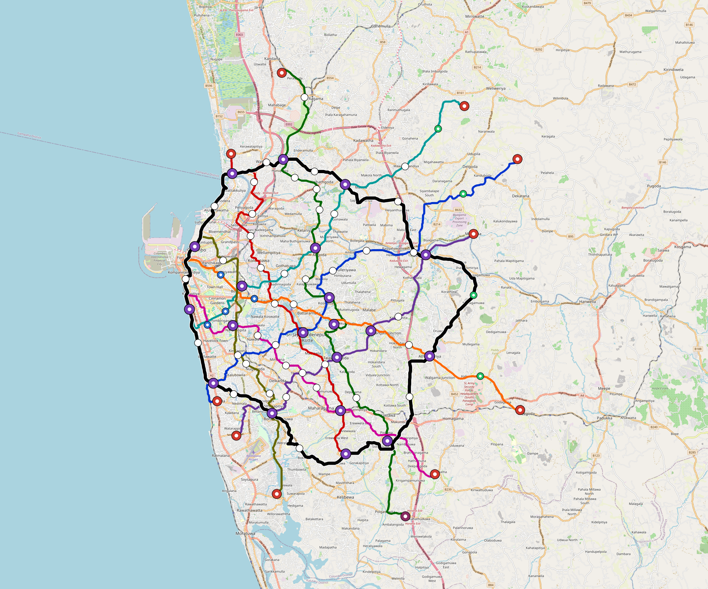

# Colombo — Urban Rail Network

**Country:** LK · **Population:** 5,648,000 · [National brief](../NATIONAL-BRIEF.md)

This page contains only Colombo-specific results. Shared routing, service, energy, civil, cost, finance, QA and validation methods are defined once in the [deployment planning reference](../../../../docs/deployment-planning-reference.md).

> [!IMPORTANT]
> **Foreign-capital advantage:** against the default equivalent foreign-turnkey sensitivity, this local plan avoids **$5.52 bn (85.4%) of external capital** and **$6.92 bn of external interest**. Capital plus saved interest totals **$12.45 bn**. See the common reference for interpretation and limitations.

Auto-planned by the OpenSourceRail design pipeline from the controlled city catalogue, source-locked geospatial inputs and shared templates.

## Network



| Local measure | Value |
|---|---:|
| Lines / unique stations / interchanges | 9 / 106 / 20 |
| Route length | 320.9 km double track |
| Coverage / transfer reachability | 68.5% / 58% |
| Estimated station catchment | 3,868,880 residents |
| Service span / peak headway | 05:30–02:00 / 3 min |
| Fleet | 497 × 6-car `metro-6car` trainsets (447 peak revenue) |
| Peak network throughput | 259,200 passengers/hour |
| Practical service capacity | 2,276,640 passenger-trips/day |
| Annual paid-trip planning range | 415.5–664.8 M |

### Lines

| Line | Length | Stations | Trainsets | Termini |
|---|---:|---:|---:|---|
| line-1 | 36.6 km | 11 | 65 | SW Mid ↔ NE Outer |
| line-2 | 29.1 km | 11 | 54 | NW Outer ↔ S Mid |
| line-3 | 43.9 km | 14 | 82 | N Outer ↔ SE Outer |
| line-4 | 27.5 km | 9 | 52 | NE Outer ↔ SW Mid |
| line-5 | 30.1 km | 10 | 57 | W Mid ↔ SE Outer |
| line-6 | 29.4 km | 10 | 56 | NE Outer ↔ W Mid |
| line-7 | 27.4 km | 10 | 50 | W Mid ↔ SE Outer |
| line-8 | 23.8 km | 8 | 47 | NW Mid ↔ S Outer |
| line-9 | 73.2 km | 23 | 34 | NW Mid ↔ W Mid |
| **Total** | **320.9 km** | **106 unique** | **497** | |

## Energy

| Local measure | Value |
|---|---:|
| Scheduled service | 3,952 one-way journeys / 132,186 train-km/day |
| Annual traction demand | 1,250.6 GWh |
| Station/depot PV / storage | 35.3 MW / 242.0 MWh |
| Aggregate charging power | 204.0 MW |
| Dedicated solar plant | 780.3 MW |
| Residual grid/PPA import | 0.0 GWh/yr |
| Worst powered-stop gap | line-1: 12.2 km / 182 kWh |
| Lowest traversal charging margin | line-1: 247 kWh |

## Capital And Funding

| Local CAPEX bucket | Planning value |
|---|---:|
| Civil works | $1.17 bn |
| Stations | $697 M |
| Depots | $8.0 M |
| Rolling stock | $835 M |
| Dedicated solar plant | $624 M |
| Residual train control | $16 M |
| Charging microgrids | $46 M |
| EPC / project services | $194 M |
| **Total city programme** | **$3.59 bn** |

| Local funding measure | Planning value |
|---|---:|
| Imported / external capital | $946 M (26.3%) |
| Domestic / local capital | $2.65 bn (73.7%) |
| Annual public construction commitment | $404 M / yr for 7 years |
| Annual post-grace debt service | $346 M / yr |
| External capital saved vs default turnkey sensitivity | $5.52 bn |
| Capital + lifetime external interest saved | $12.45 bn |
| Annual OPEX | $88 M / yr |

## Local Evidence

| Package | Current status | Evidence |
|---|---|---|
| Finance | pass | [`summary.json`](engineering/finance/summary.json) |
| Native simulation + degraded cases | pass | [`validation-summary.json`](engineering/simulation/validation-summary.json) |
| SUMO timetable | pass | [`summary.json`](engineering/sumo/summary.json) |
| GIS package | pass | [`summary.json`](engineering/gis/summary.json) |
| Grid/charging/solar | pass | [`summary.json`](engineering/energy/summary.json) |
| Operations, QA and maintenance | 1,119 assets / 5,124 tasks | [`colombo-operations-manifest.json`](operations/colombo-operations-manifest.json) |

## Local Files And Regeneration

| File | Local role |
|---|---|
| [`design.toml`](design.toml) | Authoritative generated city design |
| [`colombo.toml`](colombo.toml) | Expanded simulator scenario |
| [`colombo.corridor.geojson`](colombo.corridor.geojson) | GIS corridor and stations |
| [`colombo.design-quality.yaml`](colombo.design-quality.yaml) | Coverage, source and civil-quality gates |

```bash
scripts/regenerate-city.sh colombo
```
