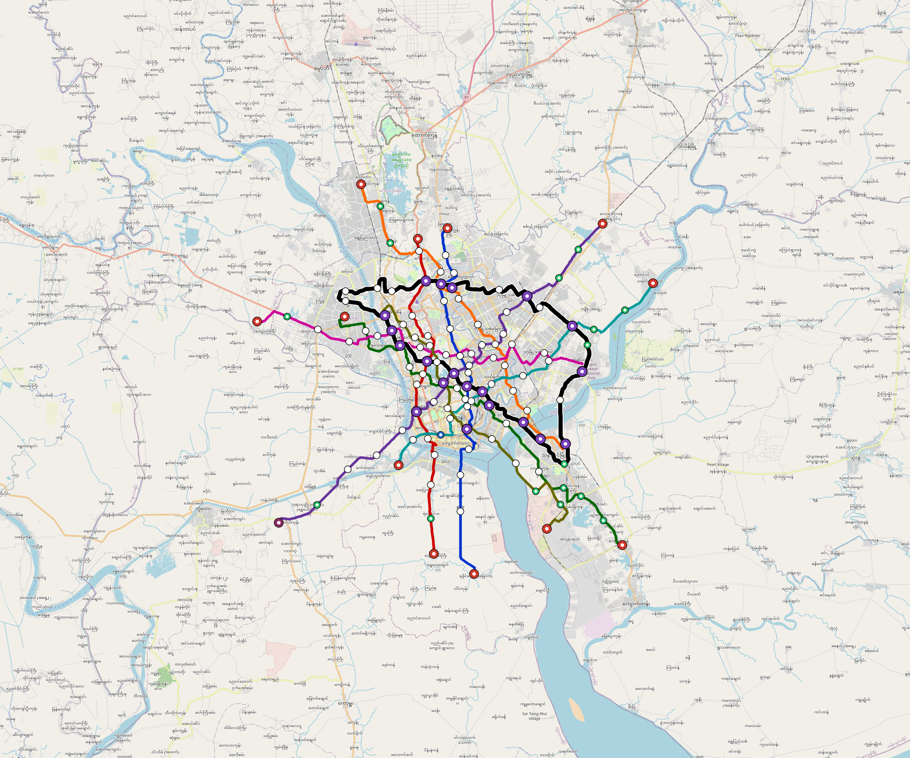

# Yangon — Urban Rail Network

**Country:** MM · **Population:** 5,200,000 · [National brief](../NATIONAL-BRIEF.md)

This page contains only Yangon-specific results. Shared routing, service, energy, civil, cost, finance, QA and validation methods are defined once in the [deployment planning reference](../../../../docs/deployment-planning-reference.md).

> [!IMPORTANT]
> **Foreign-capital advantage:** against the default equivalent foreign-turnkey sensitivity, this local plan avoids **$6.73 bn (85.0%) of external capital** and **$8.69 bn of external interest**. Capital plus saved interest totals **$15.42 bn**. See the common reference for interpretation and limitations.

Auto-planned by the OpenSourceRail design pipeline from the controlled city catalogue, source-locked geospatial inputs and shared templates.

## Network



| Local measure | Value |
|---|---:|
| Lines / unique stations / interchanges | 9 / 141 / 20 |
| Route length | 418.1 km double track |
| Coverage / transfer reachability | 57.9% / 42% |
| Estimated station catchment | 3,010,800 residents |
| Service span / peak headway | 05:30–02:00 / 3 min |
| Fleet | 661 × 6-car `metro-6car` trainsets (596 peak revenue) |
| Peak network throughput | 259,200 passengers/hour |
| Practical service capacity | 2,276,640 passenger-trips/day |
| Annual paid-trip planning range | 415.5–664.8 M |

### Lines

| Line | Length | Stations | Trainsets | Termini |
|---|---:|---:|---:|---|
| line-1 | 41.0 km | 15 | 74 | N Mid ↔ S Outer |
| line-2 | 36.8 km | 12 | 69 | S Outer ↔ N Mid |
| line-3 | 47.0 km | 16 | 86 | SE Outer ↔ NW Mid |
| line-4 | 51.7 km | 17 | 93 | NE Outer ↔ SW Outer |
| line-5 | 42.0 km | 16 | 83 | SE Mid ↔ NW Outer |
| line-6 | 37.3 km | 13 | 70 | SW Mid ↔ NE Outer |
| line-7 | 43.5 km | 14 | 80 | W Outer ↔ E Mid |
| line-8 | 36.3 km | 13 | 69 | NW Mid ↔ SE Outer |
| line-9 | 82.5 km | 25 | 37 | NW Mid ↔ NW Mid |
| **Total** | **418.1 km** | **141 unique** | **661** | |

## Energy

| Local measure | Value |
|---|---:|
| Scheduled service | 3,952 one-way journeys / 175,233 train-km/day |
| Annual traction demand | 1,657.8 GWh |
| Station/depot PV / storage | 42.2 MW / 288.0 MWh |
| Aggregate charging power | 250.0 MW |
| Dedicated solar plant | 1,039.7 MW |
| Residual grid/PPA import | 0.0 GWh/yr |
| Worst powered-stop gap | line-3: 14.0 km / 210 kWh |
| Lowest traversal charging margin | line-6: 317 kWh |

## Capital And Funding

| Local CAPEX bucket | Planning value |
|---|---:|
| Civil works | $1.43 bn |
| Stations | $713 M |
| Depots | $8.0 M |
| Rolling stock | $1.11 bn |
| Dedicated solar plant | $832 M |
| Residual train control | $21 M |
| Charging microgrids | $54 M |
| EPC / project services | $233 M |
| **Total city programme** | **$4.40 bn** |

| Local funding measure | Planning value |
|---|---:|
| Imported / external capital | $1.19 bn (27.0%) |
| Domestic / local capital | $3.21 bn (73.0%) |
| Annual public construction commitment | $451 M / yr for 10 years |
| Annual post-grace debt service | $415 M / yr |
| External capital saved vs default turnkey sensitivity | $6.73 bn |
| Capital + lifetime external interest saved | $15.42 bn |
| Annual OPEX | $105 M / yr |

## Local Evidence

| Package | Current status | Evidence |
|---|---|---|
| Finance | pass | [`summary.json`](engineering/finance/summary.json) |
| Native simulation + degraded cases | pass | [`validation-summary.json`](engineering/simulation/validation-summary.json) |
| SUMO timetable | pass | [`summary.json`](engineering/sumo/summary.json) |
| GIS package | pass | [`summary.json`](engineering/gis/summary.json) |
| Grid/charging/solar | pass | [`summary.json`](engineering/energy/summary.json) |
| Operations, QA and maintenance | 1,469 assets / 6,784 tasks | [`yangon-operations-manifest.json`](operations/yangon-operations-manifest.json) |

## Local Files And Regeneration

| File | Local role |
|---|---|
| [`design.toml`](design.toml) | Authoritative generated city design |
| [`yangon.toml`](yangon.toml) | Expanded simulator scenario |
| [`yangon.corridor.geojson`](yangon.corridor.geojson) | GIS corridor and stations |
| [`yangon.design-quality.yaml`](yangon.design-quality.yaml) | Coverage, source and civil-quality gates |

```bash
scripts/regenerate-city.sh yangon
```
