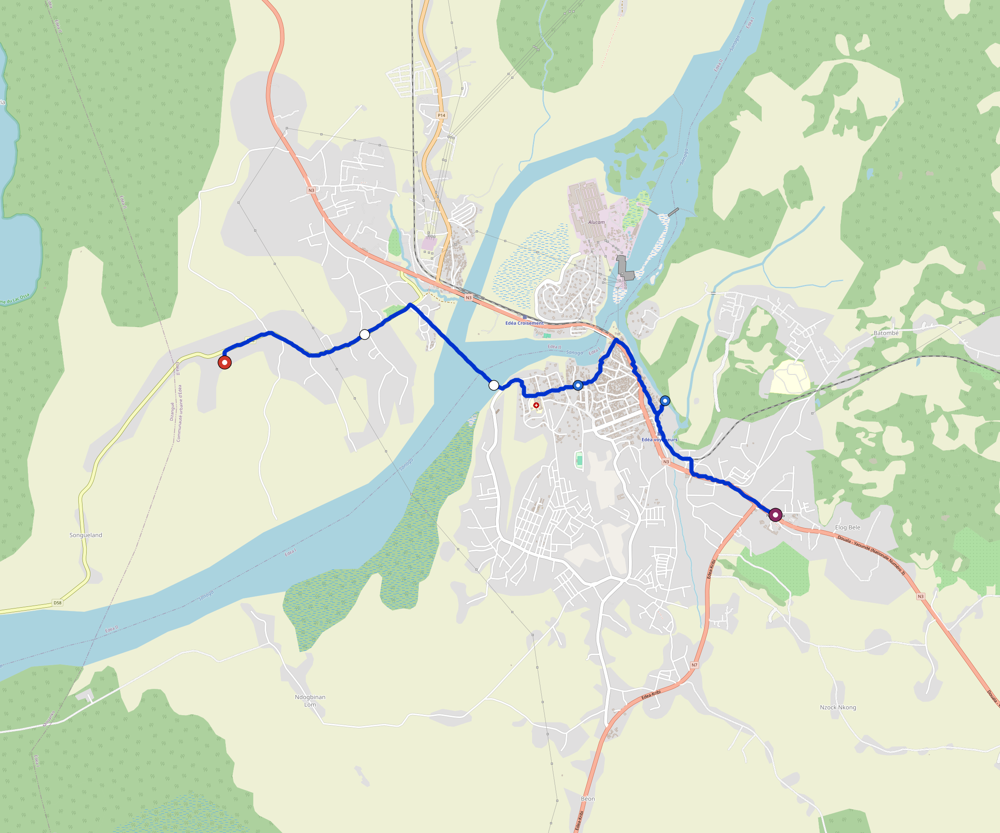

# Edea — Urban Rail Network

**Country:** CM · **Population:** 250,000 · [National brief](../NATIONAL-BRIEF.md)

This page contains only Edea-specific results. Shared routing, service, energy, civil, cost, finance, QA and validation methods are defined once in the [deployment planning reference](../../../../docs/deployment-planning-reference.md).

> [!IMPORTANT]
> **Foreign-capital advantage:** against the default equivalent foreign-turnkey sensitivity, this local plan avoids **$116 M (87.9%) of external capital** and **$145 M of external interest**. Capital plus saved interest totals **$261 M**. See the common reference for interpretation and limitations.

Auto-planned by the OpenSourceRail design pipeline from the controlled city catalogue, source-locked geospatial inputs and shared templates.

## Network



| Local measure | Value |
|---|---:|
| Lines / unique stations / interchanges | 1 / 5 / 0 |
| Route length | 9.6 km double track |
| Coverage / transfer reachability | 60.6% / 100% |
| Estimated station catchment | 151,500 residents |
| Service span / peak headway | 05:30–02:00 / 3 min |
| Fleet | 20 × 2-car `tram-2car` trainsets (18 peak revenue) |
| Peak network throughput | 9,600 passengers/hour |
| Practical service capacity | 89,280 passenger-trips/day |
| Annual paid-trip planning range | 16.3–26.1 M |

### Lines

| Line | Length | Stations | Trainsets | Termini |
|---|---:|---:|---:|---|
| line-1 |  9.6 km | 5 | 20 | W Outer ↔ SE Outer |
| **Total** | **9.6 km** | **5 unique** | **20** | |

## Energy

| Local measure | Value |
|---|---:|
| Scheduled service | 465 one-way journeys / 4,469 train-km/day |
| Annual traction demand | 14.1 GWh |
| Station/depot PV / storage | 6.2 MW / 42.0 MWh |
| Aggregate charging power | 2.5 MW |
| Dedicated solar plant | 2.1 MW |
| Residual grid/PPA import | 0.0 GWh/yr |
| Worst powered-stop gap | line-1: 3.4 km / 17 kWh |
| Lowest traversal charging margin | line-1: 53 kWh |

## Capital And Funding

| Local CAPEX bucket | Planning value |
|---|---:|
| Civil works | $25 M |
| Stations | $21 M |
| Depots | $8.0 M |
| Rolling stock | $11 M |
| Dedicated solar plant | $1.7 M |
| Residual train control | $480 k |
| Charging microgrids | $650 k |
| EPC / project services | $4.7 M |
| **Total city programme** | **$73 M** |

| Local funding measure | Planning value |
|---|---:|
| Imported / external capital | $16 M (21.7%) |
| Domestic / local capital | $57 M (78.3%) |
| Annual public construction commitment | $6.2 M / yr for 7 years |
| Annual post-grace debt service | $5.1 M / yr |
| External capital saved vs default turnkey sensitivity | $116 M |
| Capital + lifetime external interest saved | $261 M |
| Annual OPEX | $1.9 M / yr |

## Local Evidence

| Package | Current status | Evidence |
|---|---|---|
| Finance | pass | [`summary.json`](engineering/finance/summary.json) |
| Native simulation + degraded cases | pass | [`validation-summary.json`](engineering/simulation/validation-summary.json) |
| SUMO timetable | pass | [`summary.json`](engineering/sumo/summary.json) |
| GIS package | pass | [`summary.json`](engineering/gis/summary.json) |
| Grid/charging/solar | pass | [`summary.json`](engineering/energy/summary.json) |
| Operations, QA and maintenance | 52 assets / 217 tasks | [`edea-operations-manifest.json`](operations/edea-operations-manifest.json) |

## Local Files And Regeneration

| File | Local role |
|---|---|
| [`design.toml`](design.toml) | Authoritative generated city design |
| [`edea.toml`](edea.toml) | Expanded simulator scenario |
| [`edea.corridor.geojson`](edea.corridor.geojson) | GIS corridor and stations |
| [`edea.design-quality.yaml`](edea.design-quality.yaml) | Coverage, source and civil-quality gates |

```bash
scripts/regenerate-city.sh edea
```
