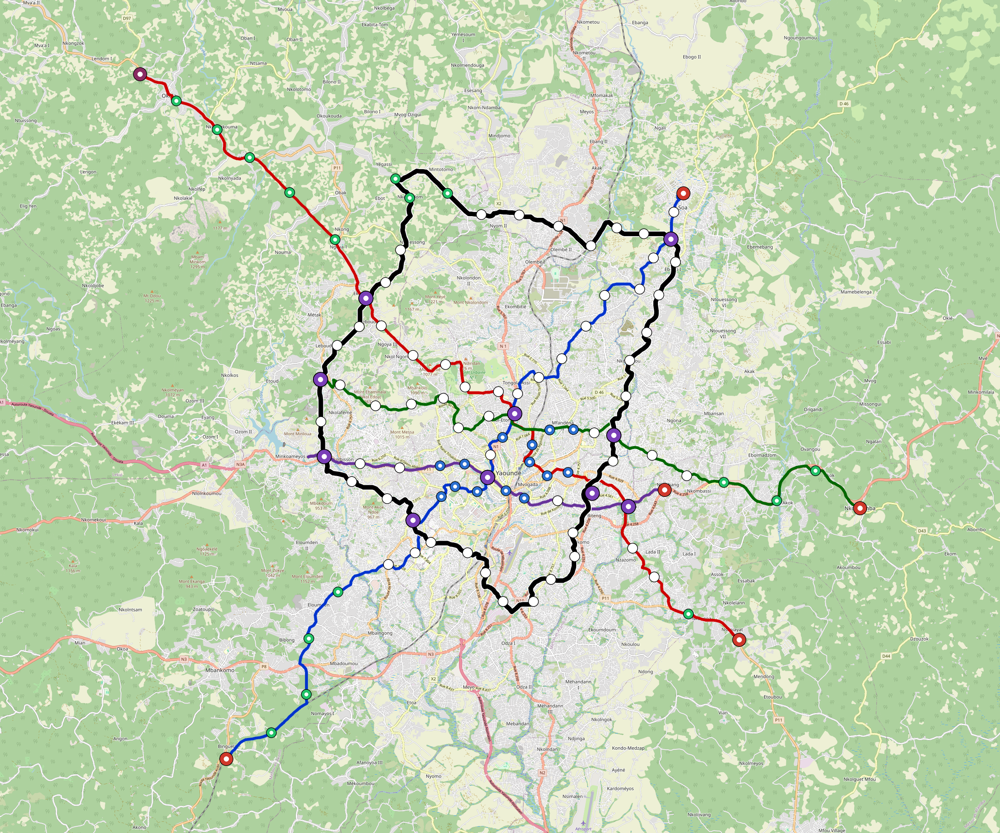

# Yaounde — Urban Rail Network

**Country:** CM · **Population:** 4,100,000 · [National brief](../NATIONAL-BRIEF.md)

This page contains only Yaounde-specific results. Shared routing, service, energy, civil, cost, finance, QA and validation methods are defined once in the [deployment planning reference](../../../../docs/deployment-planning-reference.md).

> [!IMPORTANT]
> **Foreign-capital advantage:** against the default equivalent foreign-turnkey sensitivity, this local plan avoids **$3.27 bn (85.0%) of external capital** and **$4.09 bn of external interest**. Capital plus saved interest totals **$7.36 bn**. See the common reference for interpretation and limitations.

Auto-planned by the OpenSourceRail design pipeline from the controlled city catalogue, source-locked geospatial inputs and shared templates.

## Network



| Local measure | Value |
|---|---:|
| Lines / unique stations / interchanges | 5 / 72 / 9 |
| Route length | 220.2 km double track |
| Coverage / transfer reachability | 56.0% / 70% |
| Estimated station catchment | 2,296,000 residents |
| Service span / peak headway | 05:30–02:00 / 3 min |
| Fleet | 312 × 6-car `metro-6car` trainsets (281 peak revenue) |
| Peak network throughput | 144,000 passengers/hour |
| Practical service capacity | 1,205,280 passenger-trips/day |
| Annual paid-trip planning range | 220.0–351.9 M |

### Lines

| Line | Length | Stations | Trainsets | Termini |
|---|---:|---:|---:|---|
| line-1 | 45.2 km | 16 | 86 | NE Mid ↔ SW Outer |
| line-2 | 47.4 km | 14 | 90 | SE Mid ↔ NW Outer |
| line-3 | 35.4 km | 12 | 65 | E Outer ↔ W Mid |
| line-4 | 20.4 km | 7 | 37 | SE Mid ↔ W Mid |
| line-5 | 71.8 km | 23 | 34 | NW Mid ↔ NW Mid |
| **Total** | **220.2 km** | **72 unique** | **312** | |

## Energy

| Local measure | Value |
|---|---:|
| Scheduled service | 2,092 one-way journeys / 85,701 train-km/day |
| Annual traction demand | 810.8 GWh |
| Station/depot PV / storage | 23.3 MW / 162.0 MWh |
| Aggregate charging power | 124.0 MW |
| Dedicated solar plant | 505.4 MW |
| Residual grid/PPA import | 0.0 GWh/yr |
| Worst powered-stop gap | line-2: 16.7 km / 250 kWh |
| Lowest traversal charging margin | line-4: 187 kWh |

## Capital And Funding

| Local CAPEX bucket | Planning value |
|---|---:|
| Civil works | $705 M |
| Stations | $341 M |
| Depots | $8.0 M |
| Rolling stock | $524 M |
| Dedicated solar plant | $404 M |
| Residual train control | $11 M |
| Charging microgrids | $27 M |
| EPC / project services | $113 M |
| **Total city programme** | **$2.13 bn** |

| Local funding measure | Planning value |
|---|---:|
| Imported / external capital | $575 M (26.9%) |
| Domestic / local capital | $1.56 bn (73.1%) |
| Annual public construction commitment | $176 M / yr for 7 years |
| Annual post-grace debt service | $147 M / yr |
| External capital saved vs default turnkey sensitivity | $3.27 bn |
| Capital + lifetime external interest saved | $7.36 bn |
| Annual OPEX | $52 M / yr |

## Local Evidence

| Package | Current status | Evidence |
|---|---|---|
| Finance | pass | [`summary.json`](engineering/finance/summary.json) |
| Native simulation + degraded cases | pass | [`validation-summary.json`](engineering/simulation/validation-summary.json) |
| SUMO timetable | pass | [`summary.json`](engineering/sumo/summary.json) |
| GIS package | pass | [`summary.json`](engineering/gis/summary.json) |
| Grid/charging/solar | pass | [`summary.json`](engineering/energy/summary.json) |
| Operations, QA and maintenance | 718 assets / 3,273 tasks | [`yaounde-operations-manifest.json`](operations/yaounde-operations-manifest.json) |

## Local Files And Regeneration

| File | Local role |
|---|---|
| [`design.toml`](design.toml) | Authoritative generated city design |
| [`yaounde.toml`](yaounde.toml) | Expanded simulator scenario |
| [`yaounde.corridor.geojson`](yaounde.corridor.geojson) | GIS corridor and stations |
| [`yaounde.design-quality.yaml`](yaounde.design-quality.yaml) | Coverage, source and civil-quality gates |

```bash
scripts/regenerate-city.sh yaounde
```
