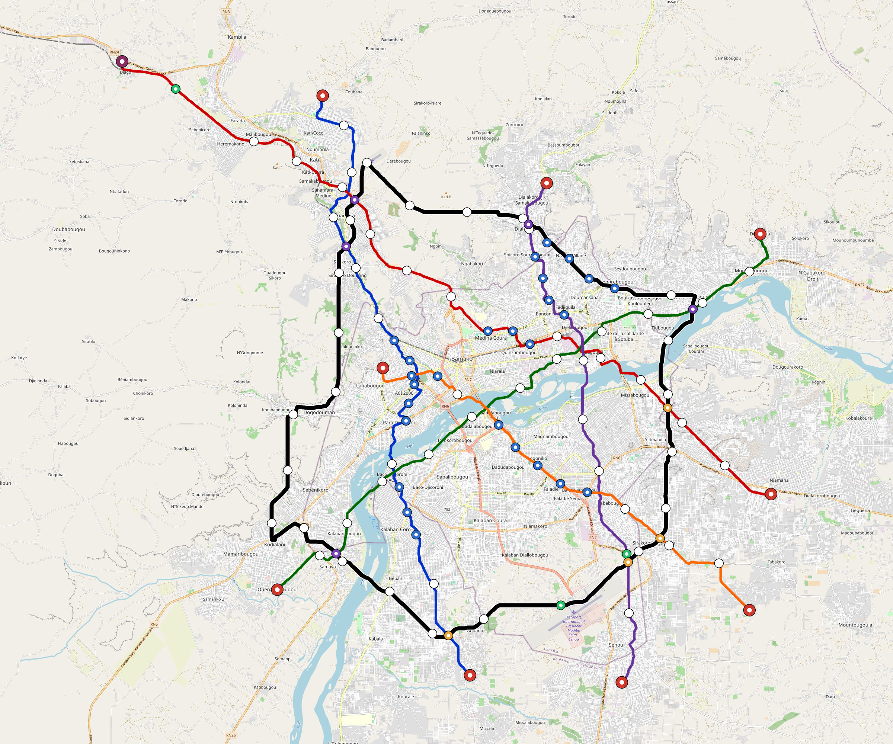

# Bamako — Urban Rail Network

**Country:** ML · **Population:** 2,929,000

Auto-planned by the OpenSourceRail design pipeline: [`osr_geo`](../../../../design-py/src/osr_geo/) rasterises Overpass-verified OpenStreetMap features (arterial road graph, buildings, water, protected land, demand-anchor POIs) onto a 20 m cost / demand / buildability grid; [`osr-design`](../../../../crates/osr-design/) (rust) runs a demand-rewarded Dijkstra on that grid to synthesise corridors, places stations against the demand surface, and classifies every segment (at-grade / elevated / bridge — no tunnels per [RFC 0011](../../../../docs/rfcs/0011-civil-infrastructure-design-standard.md)). Population, country, and bbox are read from the canonical city catalog at [`lib/city-batches/world-sample.toml`](../../../../lib/city-batches/world-sample.toml).

## Network map



*Every line visible end-to-end — radials out to the city edge, forced-coverage suburbs, and the ring line if present. Auto-fit zoom based on the network's actual bounding box.*

Corridor polylines + stations as GeoJSON for GIS / alignment tooling: [`bamako.corridor.geojson`](bamako.corridor.geojson).

## At a glance

| Metric | Value |
|---|---|
| Lines | 6 |
| Unique stations | 117 |
| Interchange stations | 18 |
| Multi-line transfer reachability | 0% (line-pairs sharing ≥ 1 station) |
| Anchor-weighted coverage | 30.6% |
| Route length (double track) | 257.4 km |
| Revenue fleet | 186 × 4-car trainsets |
| Spare + cold-reserve | 21 × 4-car trainsets |
| Peak headway | 5 min |
| Service hours | 05:30 – 02:00 (≈ 20 h/day) |

## Lines

*Termini are tagged by compass quadrant + radial band (Inner < 0.33 R, Mid 0.33–0.67 R, Outer > 0.67 R, where R is the network's outermost station-to-centre distance).*

| Line | Length | Stations | Trainsets | Termini |
|---|---|---|---|---|
| line-1 | 38.6 km | 19 | 31 | NW Outer ↔ S Mid |
| line-2 | 46.3 km | 19 | 37 | E Mid ↔ NW Outer |
| line-3 | 35.9 km | 15 | 29 | SW Mid ↔ NE Mid |
| line-4 | 30.5 km | 14 | 26 | N Mid ↔ SE Mid |
| line-5 | 25.6 km | 14 | 21 | SE Outer ↔ W Inner |
| line-6 | 80.5 km | 37 | 63 | NW Mid ↔ NW Mid |
| **Total** | **257.4 km** | **117 unique** | **207** | |

## Rolling stock

| Property | Value |
|---|---|
| Consist | 4-car, 75 m |
| Max speed | 90 km/h |
| Onboard battery | 480 kWh per trainset |
| Nominal capacity | 540 pax (seated + standing, `metro-4car` per RFC 0008 §1) |

## Ridership capacity

- **Per-train capacity:** 540 passengers (`metro-4car`)
- **Peak frequency:** 12 trains/hour/direction (5-min headway)
- **Peak capacity per line per direction:** 540 × 12 = **6,480 pphpd**
- **Network peak throughput (all lines, both directions):** 6 lines × 2 directions × 6,480 = **77,760 passengers/hour**
- **Daily theoretical capacity (peak × 10):** ≈ **777,600 passenger-trips/day**
- **Practical daily ridership estimate** (10–15 % of catchment): ≈ **89,627 – 134,441 trips/day**

## Catchment

- City population: **2,929,000**
- Anchor-weighted coverage: 30.6%
- Catchment population: **≈ 896,274** (within ~800 m walk of a station)

## Energy infrastructure (solar + battery)

On-site trackside + depot PV and battery storage. Per-tier sizing (from [`../../../../lib/templates/energy-sites.toml`](../../../../lib/templates/energy-sites.toml)):

| Tier | Sites | PV each | Battery each |
|---|---|---|---|
| Depot-Main | 1 | 5000 kW | 40000 kWh |
| Interchange | 18 | 500 kW | 3000 kWh |
| Major | 26 | 400 kW | 2500 kWh |
| Standard | 61 | 300 kW | 2000 kWh |
| Terminal | 9 | 500 kW | 3000 kWh |
| **Total installed** | **115** | **47,200 kW** | **308,000 kWh** |

Aggregate station-rail charging power: **63,250 kW**. Trains opportunity-charge during station dwell per RFC 0002; onboard 480 kWh battery covers running.

## CAPEX (planning grade)

All figures come from the `[costs]` block in `design.toml` — emitted by the `osr-design` Rust planner per RFC 0011 §9. **OSR-discipline unit costs**: prefab portal-frame canopies (no bespoke architectural cladding), at-grade depots without overhead bridge cranes, **€1.0 M per self-contained car** rolling stock, commodity Na-ion cells + tier-2 PMSM motors + DIY SiC inverters, **onboard-first train control with only residual wayside** (no trackside fibre backbone, no proprietary CBTC vendor stack, no trackside computer interlockings — the function moves into the trainset, already counted in rolling-stock CAPEX), no overhead catenary, and self-EPC overhead. Conventional metro budgets land 2–3× higher because of the line items OSR has architected away. `country-costs.toml` applies the per-country labour/material multiplier downstream.

### Civil works

| Bucket | Value |
|---|---|
| At-grade (164.7 km @ €3.5 M/km) | €577 M |
| Elevated (92.0 km @ €18 M/km) | €1.66 bn |
| Elevated-interchange premium (6 sites @ €20 M) | €120 M |
| **Civil subtotal** | **€2.35 bn** |

### Stations

Prefab portal-frame canopy + factory-bonded PV sandwich panel (RFC 0010 §3, ~11 t / 13-bay canopy delivered on two lorries, 3–5 day erection). Precast L-unit platform edge. Vertical circulation per archetype.

| Archetype | Count | Unit | Subtotal |
|---|---|---|---|
| `halt` | 3 | €0.4 M | €1.2 M |
| `standard` | 61 | €1.5 M | €92 M |
| `major` | 26 | €3.0 M | €78 M |
| `terminal` | 9 | €2.5 M | €22 M |
| `depot-terminal` | 1 | €3.0 M | €3.0 M |
| `interchange` | 8 | €4.5 M | €36 M |
| `interchange-elevated` | 10 | €4.5 M | €45 M |
| **Stations subtotal** | | | **€277 M** |

### Depots

At-grade portal-frame workshop sheds; pit tracks with stinger + portable wheel lathe (no overhead bridge crane); on-site PV array; Na-ion stationary storage; no traction substation.

| Archetype | Count | Unit | Subtotal |
|---|---|---|---|
| `main-heavy` | 1 | €25 M | €25 M |
| `layup-minimal` | 9 | €3.0 M | €27 M |
| **Depots subtotal** | | | **€52 M** |

### Rolling stock

Rolling stock is costed at **€1.0 M per self-contained car (wagon)**. Each car carries one powered bogie, one trailer bogie, under-seat Na-ion battery, traction inverter, onboard sensor/control stack, doors, HVAC, interior, and aluminium body. Motors, sensors, train-control computers, and onboard batteries appear here ONLY — never re-billed elsewhere in the cost stack.

| Per-car cost bucket | Basis | Cost |
|---|---|---|
| Body shell + interior + doors | Aluminium extrusion body, glazing, seats, PRM zone, plug doors | €300 k |
| Bogies + brakes | One powered bogie + one trailer bogie, wheelsets, suspension, discs | €220 k |
| Traction package | PMSM motors, gearbox, SiC inverter, cooling, HV contactors | €180 k |
| Battery + BMS | 120 kWh usable under-seat Na-ion pack, BMS, fire containment | €120 k |
| Driverless onboard stack | T-ECU/S, T-ECU/A, T-OBS sensors, radios, cameras, event recorder | €90 k |
| HVAC, auxiliaries, fit-out margin | HVAC, lighting, PIS, wiring, assembly QA | €90 k |
| **Total per car** | | **€1.0 M** |

| Item | Count | Unit | Subtotal |
|---|---|---|---|
| `metro-4car` (revenue + spare + cold reserve) | 207 | €4.0 M | €828 M |

### Systems

| Item | Basis | Subtotal |
|---|---|---|
| Residual signalling / train-control wayside (onboard ATP/ATO + T-OBS carries the function; W-Nodes, balises, LoRa gateways, OCC interfaces remain) | 257.4 km × €0.015 M/km | €3.9 M |
| Station/depot charging microgrids (conductive charger, switchgear, inverter interface, local PV/battery tie-in; no route traction power) | per-stop allowance by station archetype | €41 M |
| EPC integration + project management (7%) | on subtotal | €249 M |

### Total

| Bucket | Value |
|---|---|
| Civil works | €2.35 bn |
| Stations | €277 M |
| Depots | €52 M |
| Rolling stock | €828 M |
| Residual train-control wayside + charging microgrids | €45 M |
| EPC overhead (7%) | €249 M |
| **CAPEX total** | **€3.80 bn** |
| Per-route-km | €15 M / km |
| Per-capita (city pop) | €1,299 / person |

## Funding & affordability

Planning-grade financing model anchored to country financial parameters from [`lib/templates/country-finance.toml`](../../../../lib/templates/country-finance.toml). Pure function of the [costs] block above + the country code — regenerate by re-running `scripts/regenerate-city.sh bamako`.

### Government commitment summary (budgetable)

Bottom line for next year's budget submission. Construction phase runs **years 1–10** (equity drawdown + interest-only grace on multilateral + bonds); steady-state operation begins **year 11** and runs for **25 years** until the loans amortise.

| Phase | Annual gov / municipal commitment | Per resident / yr |
|---|---|---|
| Construction (years 1–10) | **€216 M / yr** | €74 |
| Steady-state, low-ridership (year 11+) | **€312 M / yr** | €107 |
| Steady-state, high-ridership (year 11+) | **€303 M / yr** | €104 |
| Lifecycle envelope (yr 1–35, low scenario) | **€9.97 bn cumulative** | €3,403 |
| Lifecycle envelope (yr 1–35, high scenario) | **€9.74 bn cumulative** | €3,326 |

_Population basis: 2,929,000 (catchment per `lib/city-batches/world-sample.toml`). After year 35, debt service drops to zero and only the OPEX shortfall remains — ~€81 M / yr (low) → €72 M / yr (high)._

### CAPEX funding stack

| Tranche | Share | Principal | Rate | Tenor | Annual debt service (post-grace) |
|---|---|---|---|---|---|
| Multilateral concessional loan (IBRD / AfDB / ADB class) | 60% | €2.28 bn | 3.0% | 35 y, 10 y grace | €131 M / yr |
| Sovereign bonds (10-y benchmark + project) | 25% | €951 M | 9.5% | 35 y, 10 y grace | €101 M / yr |
| Government equity (no debt service) | 15% | €571 M | — | — | — |
| **Total** | **100%** | **€3.80 bn** | | | **€232 M / yr** |

_During the 10-year grace period the operator pays interest only — multilateral €68 M / yr + bonds €90 M / yr = **€159 M / yr** total — plus the equity tranche amortised across construction (€57 M / yr × 10 yr). Principal repayment begins in year 11 on a 25-year amortisation schedule._

### Annual OPEX (steady state)

| Component | Basis | Annual cost |
|---|---|---|
| Rolling-stock maintenance | 4 % of rolling-stock CAPEX | €33 M |
| Civil + station + depot maintenance | 2 % of fixed-asset CAPEX | €54 M |
| Residual train-control wayside maintenance | 5 % of residual signalling CAPEX | €193 k |
| Traction energy (584.5 GWh / yr) | trackside PV + Na-ion (RFC 0002) — **self-generated, €0 / yr** | €0 k |
| Labour (1,556 FTE) | ~6 FTE/route-km + 12 admin core × country median × 12 × engineer-premium 1.4 | €2.6 M |
| **OPEX subtotal** | | **€90 M / yr** |

_Annual fleet utilisation: 186 revenue trainsets × 20.5 h/day × 365 d/yr × 35 km/h commercial × 75% revenue factor = 36.5 M train-km / yr (~196 k km / trainset / yr)._

### Ticket pricing anchored to median income

Country median monthly income: **$110 USD** (per [`lib/templates/country-finance.toml`](../../../../lib/templates/country-finance.toml)). Affordability target: a monthly unlimited-ride pass costs **5 % of median monthly income**. Single-trip fare set so that 30 single trips equal one monthly pass — a frequent commuter averaging ~50 trips / month then pays an effective ~40 % bulk discount on the pass, matching the structure used by Delhi Metro, Cairo Metro, and STIB.

| Product | Price target |
|---|---|
| Single-trip fare | €0.17 (~$0.18 USD) |
| Day pass (3 trips) | €0.43 (15 % bulk discount) |
| Monthly unlimited pass | €5.06 (~5 % of median monthly income) |
| Annual pass | €55.66 (10 × monthly = ~1 free month) |

### Farebox & operating subsidy

Practical-ridership bracket = 5–10 % of urban population × 365 service-days. At the affordability-anchored fare:

| | Low scenario | High scenario |
|---|---|---|
| Annual paid trips | 53.5 M | 106.9 M |
| Farebox revenue | €9.0 M / yr | €18 M / yr |
| Farebox / OPEX recovery | 10% | 20% |
| Country policy-target recovery (diagnostic) | 30% | 30% |
| Operating shortfall (gov subsidy required) | €81 M / yr | €72 M / yr |
| **Steady-state government commitment** (debt service + OPEX shortfall) | **€312 M / yr** | **€303 M / yr** |

**Caveats:** The funding-stack 60/25/15 split, the 5 % income-share affordability target, and the 5–10 % daily-pax bracket are project-level defaults. Real deployments will negotiate the share with the financing institutions and will tune fares iteratively from boarding data. Treat the numbers above as a first-iteration sanity check, not as a bid-ready financial close.

## Files

| File | Role |
|---|---|
| [`design.toml`](design.toml) | Authoritative design |
| [`bamako.toml`](bamako.toml) | Expanded simulation scenario (input to `osr-sim`) |
| [`bamako-network-map.png`](bamako-network-map.png) | Auto-fit network map (rendered by `osr_scenario.render_map`) |
| [`bamako.corridor.geojson`](bamako.corridor.geojson) | Line polylines + stations (GeoJSON) |
| [`bamako.stations.json`](bamako.stations.json) | Machine-readable station list |
| [`bamako.design-quality.yaml`](bamako.design-quality.yaml) | Coverage / anchor-hit / civil-mix metrics + auto-gate result |

## Reproducibility

```bash
# 1. raster bundle from OpenStreetMap (cached by query hash)
python -m osr_geo.cli --slug bamako

# 2. design.toml + corridor.geojson + design-quality.yaml
#    (population + country pulled from lib/city-batches/world-sample.toml)
cargo run --release --bin osr-design -- --slug bamako \
    --sidecar .cache/osr-pipeline/rasters/bamako.grid.json \
    --out-dir designs/.../Bamako

# 3. scenario.toml + map PNGs + this README
python -m osr_scenario --design designs/.../design.toml
python -m osr_scenario.render_map --design designs/.../design.toml
python -m osr_scenario.network_readme \
    --design designs/.../design.toml \
    --scenario designs/.../bamako.toml \
    --out designs/.../README.md
```

`scripts/regenerate-bamako.sh` chains steps 3 + drift tests into a single command.
