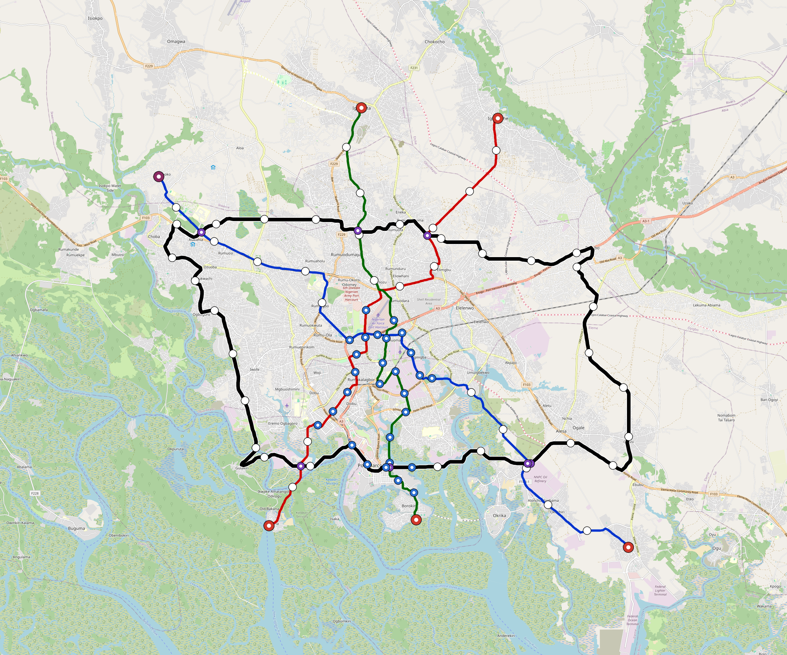

# Port-Harcourt — Urban Rail Network

**Country:** NG · **Population:** 3,000,000 · [National brief](../NATIONAL-BRIEF.md)

This page contains only Port-Harcourt-specific results. Shared routing, service, energy, civil, cost, finance, QA and validation methods are defined once in the [deployment planning reference](../../../../docs/deployment-planning-reference.md).

> [!IMPORTANT]
> **Foreign-capital advantage:** against the default equivalent foreign-turnkey sensitivity, this local plan avoids **$2.66 bn (86.8%) of external capital** and **$3.34 bn of external interest**. Capital plus saved interest totals **$6.00 bn**. See the common reference for interpretation and limitations.

Auto-planned by the OpenSourceRail design pipeline from the controlled city catalogue, source-locked geospatial inputs and shared templates.

## Network



| Local measure | Value |
|---|---:|
| Lines / unique stations / interchanges | 5 / 69 / 12 |
| Route length | 193.8 km double track |
| Coverage / transfer reachability | 48.1% / 50% |
| Estimated station catchment | 1,443,000 residents |
| Service span / peak headway | 05:30–02:00 / 3 min |
| Fleet | 232 × 4-car `metro-4car` trainsets (208 peak revenue) |
| Peak network throughput | 96,000 passengers/hour |
| Practical service capacity | 803,520 passenger-trips/day |
| Annual paid-trip planning range | 146.6–234.6 M |

### Lines

| Line | Length | Stations | Trainsets | Termini |
|---|---:|---:|---:|---|
| line-1 | 38.7 km | 12 | 60 | SE Outer ↔ NW Outer |
| line-2 | 28.7 km | 11 | 47 | NE Mid ↔ SW Mid |
| line-3 | 29.9 km | 12 | 49 | S Mid ↔ N Outer |
| line-4 | 30.6 km | 11 | 50 | SE Mid ↔ N Outer |
| line-5 | 66.0 km | 23 | 26 | NW Mid ↔ NW Mid |
| **Total** | **193.8 km** | **69 unique** | **232** | |

## Energy

| Local measure | Value |
|---|---:|
| Scheduled service | 2,092 one-way journeys / 74,789 train-km/day |
| Annual traction demand | 471.7 GWh |
| Station/depot PV / storage | 23.6 MW / 133.0 MWh |
| Aggregate charging power | 94.5 MW |
| Dedicated solar plant | 282.5 MW |
| Residual grid/PPA import | 0.0 GWh/yr |
| Worst powered-stop gap | line-3: 11.8 km / 118 kWh |
| Lowest traversal charging margin | line-4: 240 kWh |

## Capital And Funding

| Local CAPEX bucket | Planning value |
|---|---:|
| Civil works | $690 M |
| Stations | $392 M |
| Depots | $8.0 M |
| Rolling stock | $260 M |
| Dedicated solar plant | $226 M |
| Residual train control | $9.7 M |
| Charging microgrids | $21 M |
| EPC / project services | $97 M |
| **Total city programme** | **$1.70 bn** |

| Local funding measure | Planning value |
|---|---:|
| Imported / external capital | $404 M (23.7%) |
| Domestic / local capital | $1.30 bn (76.3%) |
| Annual public construction commitment | $196 M / yr for 7 years |
| Annual post-grace debt service | $166 M / yr |
| External capital saved vs default turnkey sensitivity | $2.66 bn |
| Capital + lifetime external interest saved | $6.00 bn |
| Annual OPEX | $39 M / yr |

## Local Evidence

| Package | Current status | Evidence |
|---|---|---|
| Finance | pass | [`summary.json`](engineering/finance/summary.json) |
| Native simulation + degraded cases | pass | [`validation-summary.json`](engineering/simulation/validation-summary.json) |
| SUMO timetable | pass | [`summary.json`](engineering/sumo/summary.json) |
| GIS package | pass | [`summary.json`](engineering/gis/summary.json) |
| Grid/charging/solar | pass | [`summary.json`](engineering/energy/summary.json) |
| Operations, QA and maintenance | 618 assets / 2,671 tasks | [`port-harcourt-operations-manifest.json`](operations/port-harcourt-operations-manifest.json) |

## Local Files And Regeneration

| File | Local role |
|---|---|
| [`design.toml`](design.toml) | Authoritative generated city design |
| [`port-harcourt.toml`](port-harcourt.toml) | Expanded simulator scenario |
| [`port-harcourt.corridor.geojson`](port-harcourt.corridor.geojson) | GIS corridor and stations |
| [`port-harcourt.design-quality.yaml`](port-harcourt.design-quality.yaml) | Coverage, source and civil-quality gates |

```bash
scripts/regenerate-city.sh port-harcourt
```
