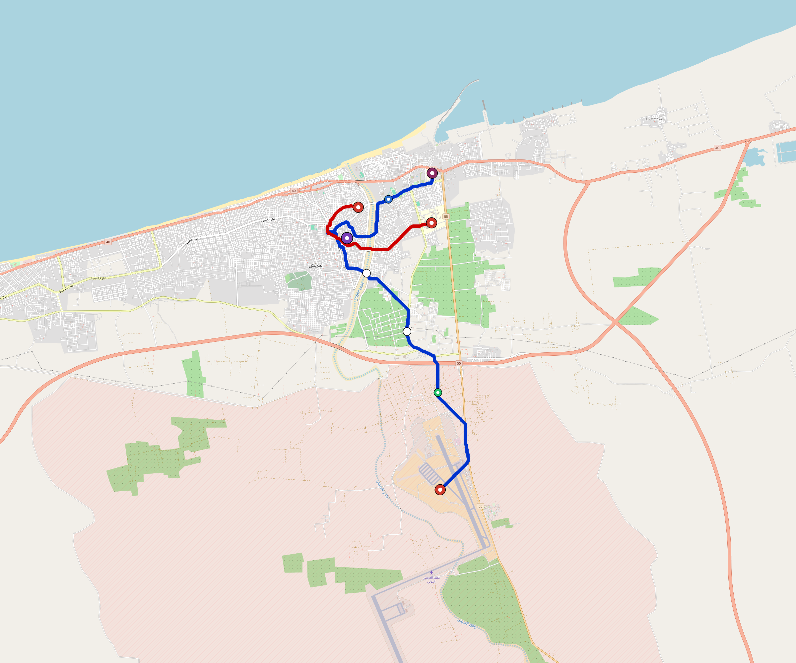

# Arish — Urban Rail Network

**Country:** EG · **Population:** 300,000 · [National brief](../NATIONAL-BRIEF.md)

This page contains only Arish-specific results. Shared routing, service, energy, civil, cost, finance, QA and validation methods are defined once in the [deployment planning reference](../../../../docs/deployment-planning-reference.md).

> [!IMPORTANT]
> **Foreign-capital advantage:** against the default equivalent foreign-turnkey sensitivity, this local plan avoids **$264 M (88.4%) of external capital** and **$325 M of external interest**. Capital plus saved interest totals **$589 M**. See the common reference for interpretation and limitations.

Auto-planned by the OpenSourceRail design pipeline from the controlled city catalogue, source-locked geospatial inputs and shared templates.

## Network



| Local measure | Value |
|---|---:|
| Lines / unique stations / interchanges | 2 / 8 / 1 |
| Route length | 17.3 km double track |
| Coverage / transfer reachability | 61.7% / 100% |
| Estimated station catchment | 185,100 residents |
| Service span / peak headway | 05:30–02:00 / 3 min |
| Fleet | 38 × 2-car `tram-2car` trainsets (33 peak revenue) |
| Peak network throughput | 19,200 passengers/hour |
| Practical service capacity | 178,560 passenger-trips/day |
| Annual paid-trip planning range | 32.6–52.1 M |

### Lines

| Line | Length | Stations | Trainsets | Termini |
|---|---:|---:|---:|---|
| line-1 | 12.9 km | 5 | 26 | S Outer ↔ NE Mid |
| line-2 |  4.3 km | 3 | 12 | NE Inner ↔ NW Inner |
| **Total** | **17.3 km** | **8 unique** | **38** | |

## Energy

| Local measure | Value |
|---|---:|
| Scheduled service | 930 one-way journeys / 8,026 train-km/day |
| Annual traction demand | 25.3 GWh |
| Station/depot PV / storage | 7.1 MW / 43.5 MWh |
| Aggregate charging power | 4.0 MW |
| Dedicated solar plant | 5.1 MW |
| Residual grid/PPA import | 0.0 GWh/yr |
| Worst powered-stop gap | line-1: 6.7 km / 36 kWh |
| Lowest traversal charging margin | line-2: 40 kWh |

## Capital And Funding

| Local CAPEX bucket | Planning value |
|---|---:|
| Civil works | $63 M |
| Stations | $57 M |
| Depots | $8.0 M |
| Rolling stock | $21 M |
| Dedicated solar plant | $4.1 M |
| Residual train control | $863 k |
| Charging microgrids | $1.0 M |
| EPC / project services | $11 M |
| **Total city programme** | **$166 M** |

| Local funding measure | Planning value |
|---|---:|
| Imported / external capital | $35 M (20.8%) |
| Domestic / local capital | $131 M (79.2%) |
| Annual public construction commitment | $18 M / yr for 5 years |
| Annual post-grace debt service | $13 M / yr |
| External capital saved vs default turnkey sensitivity | $264 M |
| Capital + lifetime external interest saved | $589 M |
| Annual OPEX | $4.3 M / yr |

## Local Evidence

| Package | Current status | Evidence |
|---|---|---|
| Finance | pass | [`summary.json`](engineering/finance/summary.json) |
| Native simulation + degraded cases | pass | [`validation-summary.json`](engineering/simulation/validation-summary.json) |
| SUMO timetable | pass | [`summary.json`](engineering/sumo/summary.json) |
| GIS package | pass | [`summary.json`](engineering/gis/summary.json) |
| Grid/charging/solar | pass | [`summary.json`](engineering/energy/summary.json) |
| Operations, QA and maintenance | 88 assets / 388 tasks | [`arish-operations-manifest.json`](operations/arish-operations-manifest.json) |

## Local Files And Regeneration

| File | Local role |
|---|---|
| [`design.toml`](design.toml) | Authoritative generated city design |
| [`arish.toml`](arish.toml) | Expanded simulator scenario |
| [`arish.corridor.geojson`](arish.corridor.geojson) | GIS corridor and stations |
| [`arish.design-quality.yaml`](arish.design-quality.yaml) | Coverage, source and civil-quality gates |

```bash
scripts/regenerate-city.sh arish
```
