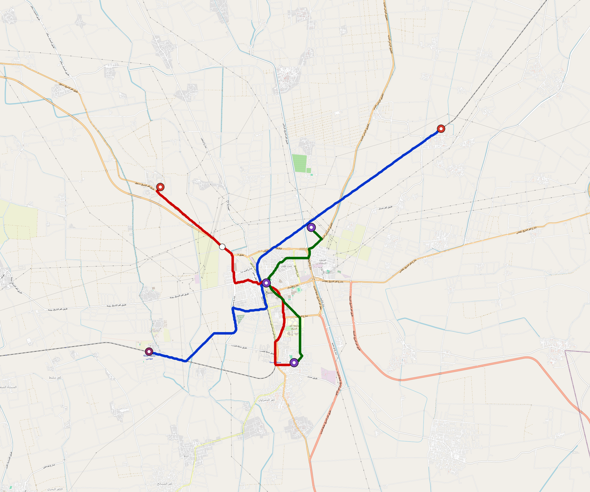

# Kafr-El-Sheikh — Urban Rail Network

**Country:** EG · **Population:** 300,000 · [National brief](../NATIONAL-BRIEF.md)

This page contains only Kafr-El-Sheikh-specific results. Shared routing, service, energy, civil, cost, finance, QA and validation methods are defined once in the [deployment planning reference](../../../../docs/deployment-planning-reference.md).

> [!IMPORTANT]
> **Foreign-capital advantage:** against the default equivalent foreign-turnkey sensitivity, this local plan avoids **$426 M (88.2%) of external capital** and **$524 M of external interest**. Capital plus saved interest totals **$951 M**. See the common reference for interpretation and limitations.

Auto-planned by the OpenSourceRail design pipeline from the controlled city catalogue, source-locked geospatial inputs and shared templates.

## Network



| Local measure | Value |
|---|---:|
| Lines / unique stations / interchanges | 3 / 11 / 3 |
| Route length | 31.6 km double track |
| Coverage / transfer reachability | 81.2% / 100% |
| Estimated station catchment | 243,600 residents |
| Service span / peak headway | 05:30–02:00 / 3 min |
| Fleet | 65 × 2-car `tram-2car` trainsets (58 peak revenue) |
| Peak network throughput | 28,800 passengers/hour |
| Practical service capacity | 267,840 passenger-trips/day |
| Annual paid-trip planning range | 48.9–78.2 M |

### Lines

| Line | Length | Stations | Trainsets | Termini |
|---|---:|---:|---:|---|
| line-1 | 15.7 km | 4 | 31 | NE Outer ↔ SW Outer |
| line-2 |  9.6 km | 4 | 20 | NW Mid ↔ S Mid |
| line-3 |  6.3 km | 3 | 14 | NE Inner ↔ S Mid |
| **Total** | **31.6 km** | **11 unique** | **65** | |

## Energy

| Local measure | Value |
|---|---:|
| Scheduled service | 1,395 one-way journeys / 14,707 train-km/day |
| Annual traction demand | 46.4 GWh |
| Station/depot PV / storage | 8.0 MW / 45.0 MWh |
| Aggregate charging power | 5.5 MW |
| Dedicated solar plant | 15.2 MW |
| Residual grid/PPA import | 0.0 GWh/yr |
| Worst powered-stop gap | line-1: 6.7 km / 36 kWh |
| Lowest traversal charging margin | line-3: 28 kWh |

## Capital And Funding

| Local CAPEX bucket | Planning value |
|---|---:|
| Civil works | $114 M |
| Stations | $78 M |
| Depots | $8.0 M |
| Rolling stock | $36 M |
| Dedicated solar plant | $12 M |
| Residual train control | $1.6 M |
| Charging microgrids | $1.4 M |
| EPC / project services | $17 M |
| **Total city programme** | **$268 M** |

| Local funding measure | Planning value |
|---|---:|
| Imported / external capital | $57 M (21.2%) |
| Domestic / local capital | $212 M (78.8%) |
| Annual public construction commitment | $29 M / yr for 5 years |
| Annual post-grace debt service | $22 M / yr |
| External capital saved vs default turnkey sensitivity | $426 M |
| Capital + lifetime external interest saved | $951 M |
| Annual OPEX | $6.8 M / yr |

## Local Evidence

| Package | Current status | Evidence |
|---|---|---|
| Finance | pass | [`summary.json`](engineering/finance/summary.json) |
| Native simulation + degraded cases | pass | [`validation-summary.json`](engineering/simulation/validation-summary.json) |
| SUMO timetable | pass | [`summary.json`](engineering/sumo/summary.json) |
| GIS package | pass | [`summary.json`](engineering/gis/summary.json) |
| Grid/charging/solar | pass | [`summary.json`](engineering/energy/summary.json) |
| Operations, QA and maintenance | 136 assets / 625 tasks | [`kafr-el-sheikh-operations-manifest.json`](operations/kafr-el-sheikh-operations-manifest.json) |

## Local Files And Regeneration

| File | Local role |
|---|---|
| [`design.toml`](design.toml) | Authoritative generated city design |
| [`kafr-el-sheikh.toml`](kafr-el-sheikh.toml) | Expanded simulator scenario |
| [`kafr-el-sheikh.corridor.geojson`](kafr-el-sheikh.corridor.geojson) | GIS corridor and stations |
| [`kafr-el-sheikh.design-quality.yaml`](kafr-el-sheikh.design-quality.yaml) | Coverage, source and civil-quality gates |

```bash
scripts/regenerate-city.sh kafr-el-sheikh
```
