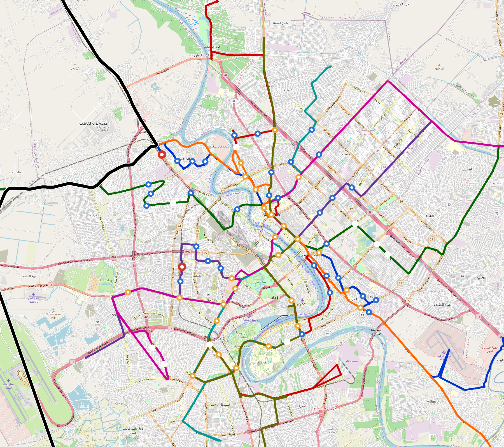

# Baghdad — Urban Rail Network

**Country:** IQ · **Population:** 9,780,429

Auto-planned by [`osr_planner`](../../../design-py/src/osr_planner/) using the linear-logic algorithm on Overpass-verified OpenStreetMap data. Every station sits on an aggregated POI cluster; every line polyline follows the OSM arterial graph (trunk / primary / secondary / tertiary — residential streets excluded, so lines cannot zigzag through a residential grid).

## Network maps

### Suburban / regional map — full network

*Every line visible end-to-end — radials out to the city edge, forced-coverage suburbs, and the ring line if present. Auto-fit zoom based on the network's actual bounding box.*

### Inner-Baghdad map — urban core detail

*8 km radius around the city centre at a legible street-grid zoom. Shows interchange density, central-business-district stations, and where the radial lines converge on the hub.*

Corridor polylines + stations as GeoJSON for GIS / alignment tooling: [`baghdad-corridor.geojson`](baghdad-corridor.geojson).

## At a glance

| Metric | Value |
|---|---|
| Lines | 9 |
| Unique stations | 288 |
| Interchange stations | 2 |
| Multi-line transfer reachability | 0% (line-pairs sharing ≥ 1 station) |
| Anchor-weighted coverage | — (set `[stats] coverage` in design.toml) |
| Route length (double track) | 470.2 km |
| Revenue fleet | 340 × 6-car trainsets |
| Spare + cold-reserve | 39 × 6-car trainsets |
| Peak headway | 5 min |
| Service hours | 05:30 – 23:30 (≈ 18 h/day) |

## Lines

| Line | Length | Stations | Trainsets | Termini |
|---|---|---|---|---|
| line-1 | 47.9 km | 30 | 39 | عرب خيط ↔ مستشفى الدكتور قيصر |
| line-2 | 47.0 km | 30 | 38 | شارع حارث ابن كلده ↔ معهد الكوكب للتدريس الخصوصي ودورات التقوية |
| line-3 | 46.5 km | 29 | 38 | مدارس أكاديمية التجمع الابتدائية و الثانوية الأهلية ↔ مدرسة الغصون الابتدائيه للبنات في ابو عظام |
| line-4 | 47.3 km | 30 | 38 | Багдад ↔ مركز صحي الشاعورة |
| line-5 | 47.9 km | 27 | 39 | مركز صحي الباجة جي ↔ مدرسة سكينة الابتدائية للبنات /الكرخ ٢ |
| line-6 | 43.9 km | 26 | 36 | مجمع دار الشفاء الطبي ↔ line-6-0326-2070 |
| line-7 | 44.9 km | 26 | 37 | مركز صحي سبع البور الجديد ↔ line-7-1088-2164 |
| line-8 | 39.1 km | 22 | 32 | مجمع الأنوار الطبي ↔ معهد الحبيب لدروس التقوية |
| line-9 | 105.7 km | 70 | 82 | اعدادية الشعلة للبنين ↔ اعدادية الشعلة للبنين |
| **Total** | **470.2 km** | **288 unique** | **340** | |

## Rolling stock

| Property | Value |
|---|---|
| Consist | 6-car, 138 m |
| Max speed | 90 km/h |
| Onboard battery | 720 kWh per trainset |
| Nominal capacity | 200 pax (seated + standing) |

## Ridership capacity

- **Per-train capacity:** 200 passengers
- **Peak frequency:** 12 trains/hour/direction (5-min headway)
- **Peak capacity per line per direction:** 200 × 12 = **2,400 pphpd**
- **Network peak throughput (all lines, both directions):** 9 lines × 2 directions × 2,400 = **43,200 passengers/hour**
- **Daily theoretical capacity (peak × 10):** ≈ **432,000 passenger-trips/day**
- **Practical daily ridership estimate** (10–15 % of catchment): *(requires a coverage score)*

## Catchment

- City population: **9,780,429**
- Anchor-weighted coverage: — (set `[stats] coverage` in design.toml)
- Catchment population: *(run the planner with a fresh coverage score)*

## Energy infrastructure (solar + battery)

On-site trackside + depot PV and battery storage. Per-tier sizing (from [`../../../lib/templates/energy-sites.toml`](../../../lib/templates/energy-sites.toml)):

| Tier | Sites | PV each | Battery each |
|---|---|---|---|
| Depot-Main | 1 | 5000 kW | 40000 kWh |
| Interchange | 59 | 500 kW | 3000 kWh |
| Major | 77 | 400 kW | 2500 kWh |
| Standard | 130 | 300 kW | 2000 kWh |
| Terminal | 15 | 500 kW | 3000 kWh |
| **Total installed** | **282** | **111,800 kW** | **714,500 kWh** |

Aggregate station-rail charging power: **84,000 kW**. Trains opportunity-charge during station dwell per RFC 0002; onboard 720 kWh battery covers running.

## CAPEX (planning grade)

All figures come from the `[costs]` block in `design.toml` — emitted by the `osr-design` Rust planner per RFC 0011 §9. **OSR-discipline unit costs**: prefab portal-frame canopies (no bespoke architectural cladding), at-grade depots without overhead bridge cranes, commodity Na-ion cells + tier-2 PMSM motors + DIY SiC inverters in rolling stock, open-source CBTC on commodity SBCs (no proprietary signalling vendor), no overhead catenary, and self-EPC overhead. Conventional metro budgets land 2–3× higher because of the line items OSR has architected away. `country-costs.toml` applies the per-country labour/material multiplier downstream.

### Civil works

| Bucket | Value |
|---|---|
| At-grade (436.6 km @ €3.5 M/km) | €1.53 bn |
| Elevated (31.9 km @ €18 M/km) | €574 M |
| Elevated-interchange premium (19 sites @ €20 M) | €380 M |
| **Civil subtotal** | **€2.48 bn** |

### Stations

Prefab portal-frame canopy + factory-bonded PV sandwich panel (RFC 0010 §3, ~11 t / 13-bay canopy delivered on two lorries, 3–5 day erection). Precast L-unit platform edge. Vertical circulation per archetype.

| Archetype | Count | Unit | Subtotal |
|---|---|---|---|
| `halt` | 8 | €0.4 M | €3.2 M |
| `standard` | 130 | €1.5 M | €195 M |
| `major` | 77 | €3.0 M | €231 M |
| `terminal` | 15 | €2.5 M | €38 M |
| `depot-terminal` | 1 | €3.0 M | €3.0 M |
| `interchange` | 2 | €4.5 M | €9.0 M |
| `interchange-elevated` | 57 | €4.5 M | €256 M |
| **Stations subtotal** | | | **€735 M** |

### Depots

At-grade portal-frame workshop sheds; pit tracks with stinger + portable wheel lathe (no overhead bridge crane); on-site PV array; Na-ion stationary storage; no traction substation.

| Archetype | Count | Unit | Subtotal |
|---|---|---|---|
| `main-heavy` | 1 | €25 M | €25 M |
| `layup-minimal` | 15 | €3.0 M | €45 M |
| **Depots subtotal** | | | **€70 M** |

### Rolling stock

Per-trainset BOM at OSR-discipline pricing: commodity Na-ion cells (~$80/kWh, RFC 0021), tier-2 PMSM motors + SiC inverters (RFC 0022 §10, RFC 0008 §3.2), DIY safety electronics (~$5 680/trainset, RFC 0019), aluminium-extrusion or steel space-frame body.

| Item | Count | Unit | Subtotal |
|---|---|---|---|
| `metro-6car` (revenue + spare + cold reserve) | 379 | €4.5 M | €1.71 bn |

### Systems

| Item | Basis | Subtotal |
|---|---|---|
| Signalling (open-source CBTC on commodity SBCs, RFC 0019) | 470.2 km × €0.4 M/km | €187 M |
| Traction power (distributed PV + Na-ion, no OCS, RFC 0002) | 470.2 km × €0.8 M/km | €375 M |
| EPC integration + project management (7%) | on subtotal | €389 M |

### Total

| Bucket | Value |
|---|---|
| Civil works | €2.48 bn |
| Stations | €735 M |
| Depots | €70 M |
| Rolling stock | €1.71 bn |
| Signalling + power | €562 M |
| EPC overhead (7%) | €389 M |
| **CAPEX total** | **€5.94 bn** |
| Per-route-km | €13 M / km |
| Per-capita (city pop) | €608 / person |

## Files

| File | Role |
|---|---|
| [`design.toml`](design.toml) | Authoritative design |
| [`baghdad.toml`](baghdad.toml) | Expanded simulation scenario (input to `osr-sim`) |
| [`baghdad-network-map.png`](baghdad-network-map.png) | City-wide network map |
| [`baghdad-network-map-detail.png`](baghdad-network-map-detail.png) | Detail-zoom render |
| [`baghdad-corridor.geojson`](baghdad-corridor.geojson) | Line polylines + stations (GeoJSON) |

## Reproducibility

Run `python -m osr_planner --slug <slug> --bbox ... --population ...` to re-plan, then `python -m osr_scenario --design …/design.toml` + `python -m osr_scenario.render_map --design …/design.toml` + `python -m osr_scenario.network_readme --design …/design.toml --scenario …/scenario.toml --out …/README.md --population N` to regenerate this README.
