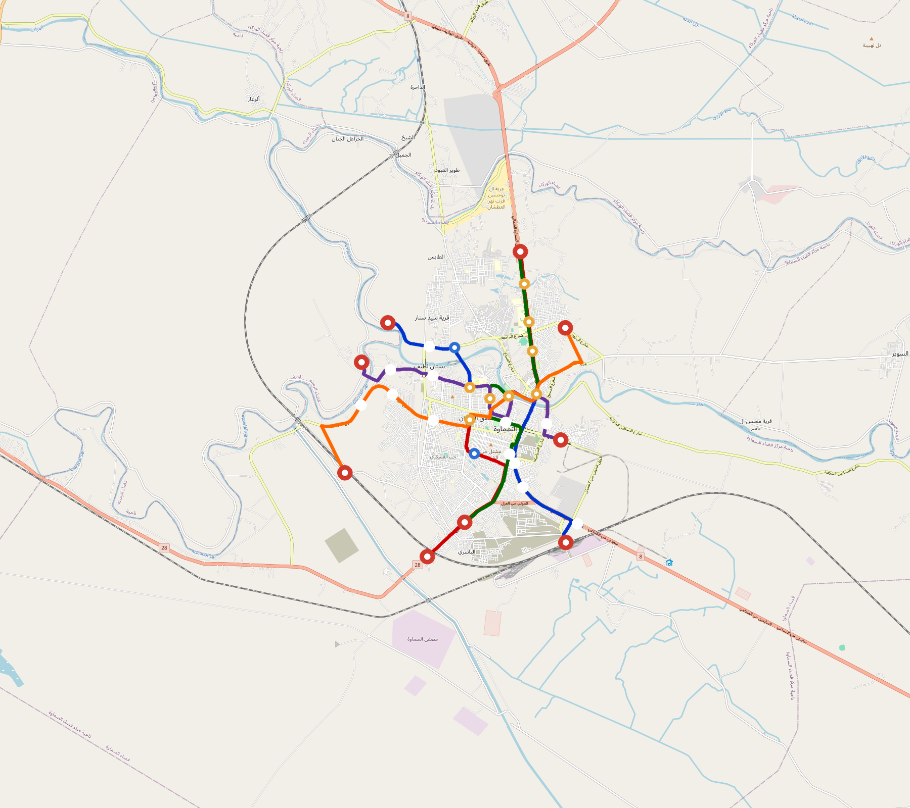

# As-Samawah — Urban Rail Network

**Country:** IQ · **Population:** 220,000

Auto-planned by [`osr_planner`](../../../design-py/src/osr_planner/) using the linear-logic algorithm on Overpass-verified OpenStreetMap data. Every station sits on an aggregated POI cluster; every line polyline follows the OSM arterial graph (trunk / primary / secondary / tertiary — residential streets excluded, so lines cannot zigzag through a residential grid).

## Network maps

### Suburban / regional map — full network

*Every line visible end-to-end — radials out to the city edge, forced-coverage suburbs, and the ring line if present. Auto-fit zoom based on the network's actual bounding box.*

### Inner-As-Samawah map — urban core detail

*8 km radius around the city centre at a legible street-grid zoom. Shows interchange density, central-business-district stations, and where the radial lines converge on the hub.*

Corridor polylines + stations as GeoJSON for GIS / alignment tooling: [`samawah-corridor.geojson`](samawah-corridor.geojson).

## At a glance

| Metric | Value |
|---|---|
| Lines | 5 |
| Unique stations | 31 |
| Interchange stations | 8 |
| Multi-line transfer reachability | 100% (line-pairs sharing ≥ 1 station) |
| Anchor-weighted coverage | — (set `[stats] coverage` in design.toml) |
| Route length (double track) | 53.2 km |
| Revenue fleet | 19 × 3-car trainsets |
| Spare + cold-reserve | 10 × 3-car trainsets |
| Peak headway | 5 min |
| Service hours | 05:30 – 23:30 (≈ 18 h/day) |

## Lines

| Line | Length | Stations | Trainsets | Termini |
|---|---|---|---|---|
| Line 1 | 12.0 km | 11 | 4 | Samawah Train Station ↔ Abwjwylanh |
| Line 2 | 12.1 km | 10 | 4 | Al M'aly Khlf Alskh ↔ Jam'h Sawh |
| Line 3 | 10.7 km | 10 | 4 | Al M'aly ↔ Jam'h Sawh |
| Line 4 |  7.6 km | 9 | 3 | Dwr Alshrkh ↔ Am Al'kf |
| Line 5 | 10.8 km | 8 | 4 | Rail Station 1 ↔ Al Zwyd |
| **Total** | **53.2 km** | **31 unique** | **19** | |

## Rolling stock

| Property | Value |
|---|---|
| Consist | 3-car, 68 m |
| Max speed | 80 km/h |
| Onboard battery | 320 kWh per trainset |
| Nominal capacity | 200 pax (seated + standing) |

## Ridership capacity

- **Per-train capacity:** 200 passengers
- **Peak frequency:** 12 trains/hour/direction (5-min headway)
- **Peak capacity per line per direction:** 200 × 12 = **2,400 pphpd**
- **Network peak throughput (all lines, both directions):** 5 lines × 2 directions × 2,400 = **24,000 passengers/hour**
- **Daily theoretical capacity (peak × 10):** ≈ **240,000 passenger-trips/day**
- **Practical daily ridership estimate** (10–15 % of catchment): *(requires a coverage score)*

## Catchment

- City population: **220,000**
- Anchor-weighted coverage: — (set `[stats] coverage` in design.toml)
- Catchment population: *(run the planner with a fresh coverage score)*

## Energy infrastructure (solar + battery)

On-site trackside + depot PV and battery storage. Per-tier sizing (from [`../../../lib/templates/energy-sites.toml`](../../../lib/templates/energy-sites.toml)):

| Tier | Sites | PV each | Battery each |
|---|---|---|---|
| Standard | 19 | 500 kW | 3000 kWh |
| **Total installed** | **19** | **9,300 kW** | **56,000 kWh** |

Aggregate station-rail charging power: **14,000 kW**. Trains opportunity-charge during station dwell per RFC 0002; onboard 320 kWh battery covers running.

## Cost estimate

Rule-of-thumb unit rates (see [`CostAssumptions`](../../../design-py/src/osr_scenario/network_readme.py) to override per-country):

| Component | Unit cost | Quantity | Estimate |
|---|---|---|---|
| Civil track (at-grade, double-track) | $2.0 M/km | 45.2 km (85 % of route) | **$90.4 M** |
| Bridges / viaducts (elevated, river + highway crossings) | $20.0 M/km | 8.0 km (15 % of route) | **$159.6 M** |
| Solar PV (installed) | $1.00/W | 9,300 kW | **$9.3 M** |
| Battery (power rating, 56,000 kWh ÷ 4 h) | $1.00/W | 14,000 kW | **$14.0 M** |
| Rolling stock (29 trainsets × 3 cars) | $1.0 M/car | 87 cars | **$87.0 M** |
| Stations (civil + fit-out) | $1.0 M/station | 31 stations | **$31.0 M** |
| Depots | $5.0 M/depot | 2 depots | **$10.0 M** |
| **Total capex (planning-grade)** | | | **$401.3 M** |

**Exclusions:** signalling / OCC / comms / cybersecurity, land acquisition, contingency reserve (typically 15–25 % of the above), design + engineering fees, financing. The above is a planning-grade bracket for sizing and stakeholder conversations, not a bid-ready estimate.

## Files

| File | Role |
|---|---|
| [`design.toml`](design.toml) | Authoritative design |
| [`samawah.toml`](samawah.toml) | Expanded simulation scenario (input to `osr-sim`) |
| [`samawah-network-map.png`](samawah-network-map.png) | City-wide network map |
| [`samawah-network-map-detail.png`](samawah-network-map-detail.png) | Detail-zoom render |
| [`samawah-corridor.geojson`](samawah-corridor.geojson) | Line polylines + stations (GeoJSON) |

## Reproducibility

Run `python -m osr_planner --slug <slug> --bbox ... --population ...` to re-plan, then `python -m osr_scenario --design …/design.toml` + `python -m osr_scenario.render_map --design …/design.toml` + `python -m osr_scenario.network_readme --design …/design.toml --scenario …/scenario.toml --out …/README.md --population N` to regenerate this README.
