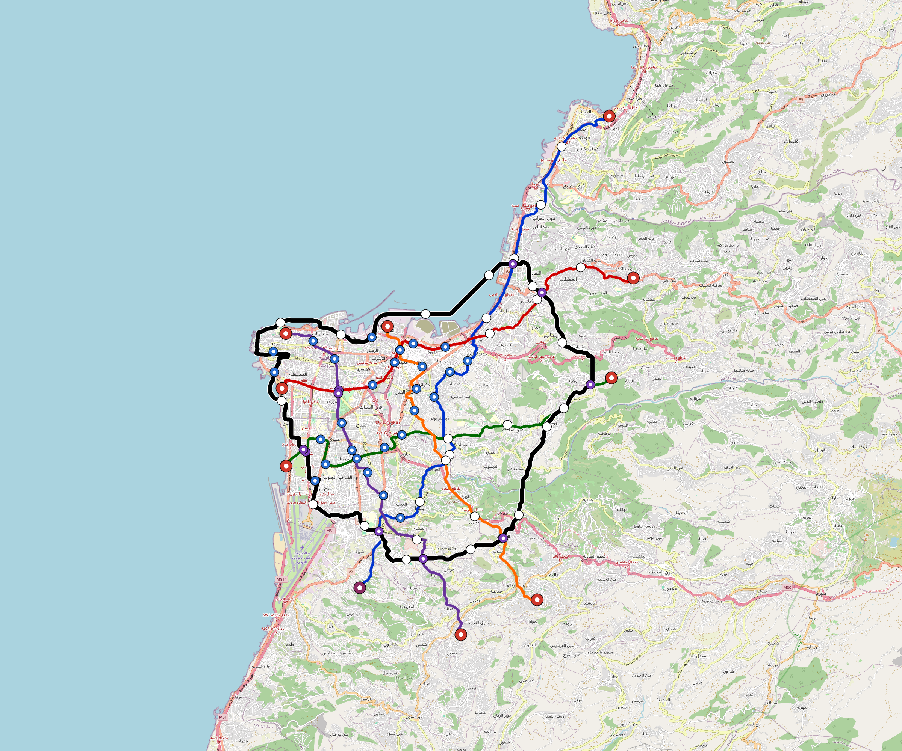

# Beirut — Urban Rail Network

**Country:** LB · **Population:** 2,200,000 · [National brief](../NATIONAL-BRIEF.md)

This page contains only Beirut-specific results. Shared routing, service, energy, civil, cost, finance, QA and validation methods are defined once in the [deployment planning reference](../../../../docs/deployment-planning-reference.md).

> [!IMPORTANT]
> **Foreign-capital advantage:** against the default equivalent foreign-turnkey sensitivity, this local plan avoids **$2.09 bn (86.9%) of external capital** and **$2.65 bn of external interest**. Capital plus saved interest totals **$4.74 bn**. See the common reference for interpretation and limitations.

Auto-planned by the OpenSourceRail design pipeline from the controlled city catalogue, source-locked geospatial inputs and shared templates.

## Network



| Local measure | Value |
|---|---:|
| Lines / unique stations / interchanges | 6 / 50 / 11 |
| Route length | 142.6 km double track |
| Coverage / transfer reachability | 59.8% / 60% |
| Estimated station catchment | 1,315,600 residents |
| Service span / peak headway | 05:30–02:00 / 3 min |
| Fleet | 189 × 4-car `metro-4car` trainsets (168 peak revenue) |
| Peak network throughput | 115,200 passengers/hour |
| Practical service capacity | 982,080 passenger-trips/day |
| Annual paid-trip planning range | 179.2–286.8 M |

### Lines

| Line | Length | Stations | Trainsets | Termini |
|---|---:|---:|---:|---|
| line-1 | 31.9 km | 10 | 50 | SW Mid ↔ NE Outer |
| line-2 | 18.1 km | 9 | 35 | NW Mid ↔ S Mid |
| line-3 | 20.3 km | 8 | 34 | W Mid ↔ NE Outer |
| line-4 | 17.4 km | 6 | 27 | E Mid ↔ W Mid |
| line-5 | 18.5 km | 6 | 29 | NW Inner ↔ SE Mid |
| line-6 | 36.4 km | 11 | 14 | NE Mid ↔ NE Inner |
| **Total** | **142.6 km** | **50 unique** | **189** | |

## Energy

| Local measure | Value |
|---|---:|
| Scheduled service | 2,558 one-way journeys / 57,837 train-km/day |
| Annual traction demand | 364.8 GWh |
| Station/depot PV / storage | 19.1 MW / 110.5 MWh |
| Aggregate charging power | 72.0 MW |
| Dedicated solar plant | 187.0 MW |
| Residual grid/PPA import | 0.0 GWh/yr |
| Worst powered-stop gap | line-1: 11.5 km / 111 kWh |
| Lowest traversal charging margin | line-5: 135 kWh |

## Capital And Funding

| Local CAPEX bucket | Planning value |
|---|---:|
| Civil works | $489 M |
| Stations | $377 M |
| Depots | $8.0 M |
| Rolling stock | $212 M |
| Dedicated solar plant | $150 M |
| Residual train control | $7.1 M |
| Charging microgrids | $16 M |
| EPC / project services | $78 M |
| **Total city programme** | **$1.34 bn** |

| Local funding measure | Planning value |
|---|---:|
| Imported / external capital | $314 M (23.5%) |
| Domestic / local capital | $1.02 bn (76.5%) |
| Annual public construction commitment | $244 M / yr for 8 years |
| Annual post-grace debt service | $223 M / yr |
| External capital saved vs default turnkey sensitivity | $2.09 bn |
| Capital + lifetime external interest saved | $4.74 bn |
| Annual OPEX | $32 M / yr |

## Local Evidence

| Package | Current status | Evidence |
|---|---|---|
| Finance | pass | [`summary.json`](engineering/finance/summary.json) |
| Native simulation + degraded cases | pass | [`validation-summary.json`](engineering/simulation/validation-summary.json) |
| SUMO timetable | pass | [`summary.json`](engineering/sumo/summary.json) |
| GIS package | pass | [`summary.json`](engineering/gis/summary.json) |
| Grid/charging/solar | pass | [`summary.json`](engineering/energy/summary.json) |
| Operations, QA and maintenance | 476 assets / 2,086 tasks | [`beirut-operations-manifest.json`](operations/beirut-operations-manifest.json) |

## Local Files And Regeneration

| File | Local role |
|---|---|
| [`design.toml`](design.toml) | Authoritative generated city design |
| [`beirut.toml`](beirut.toml) | Expanded simulator scenario |
| [`beirut.corridor.geojson`](beirut.corridor.geojson) | GIS corridor and stations |
| [`beirut.design-quality.yaml`](beirut.design-quality.yaml) | Coverage, source and civil-quality gates |

```bash
scripts/regenerate-city.sh beirut
```
