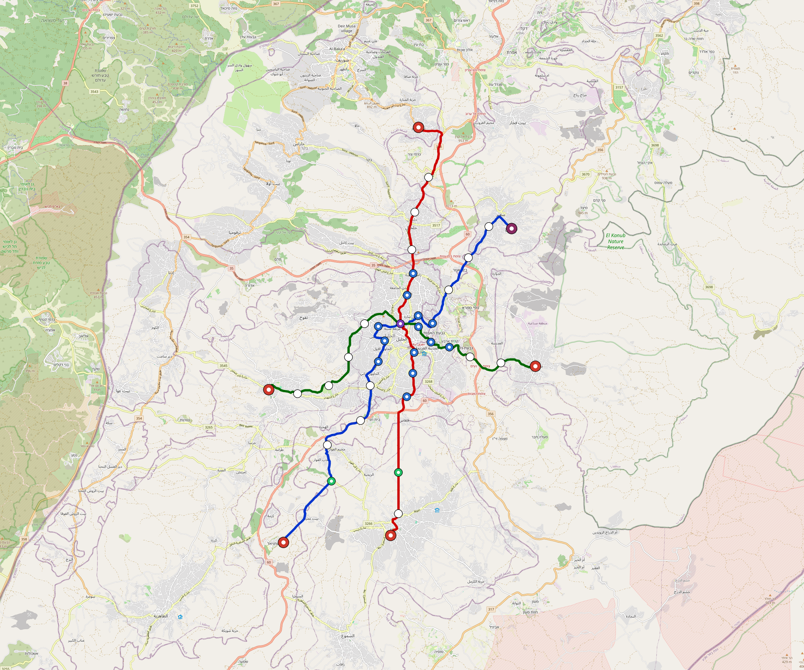

# Hebron — Urban Rail Network

**Country:** PS · **Population:** 800,000 · [National brief](../NATIONAL-BRIEF.md)

This page contains only Hebron-specific results. Shared routing, service, energy, civil, cost, finance, QA and validation methods are defined once in the [deployment planning reference](../../../../docs/deployment-planning-reference.md).

> [!IMPORTANT]
> **Foreign-capital advantage:** against the default equivalent foreign-turnkey sensitivity, this local plan avoids **$743 M (86.4%) of external capital** and **$931 M of external interest**. Capital plus saved interest totals **$1.67 bn**. See the common reference for interpretation and limitations.

Auto-planned by the OpenSourceRail design pipeline from the controlled city catalogue, source-locked geospatial inputs and shared templates.

## Network



| Local measure | Value |
|---|---:|
| Lines / unique stations / interchanges | 3 / 22 / 1 |
| Route length | 60.3 km double track |
| Coverage / transfer reachability | 73.3% / 100% |
| Estimated station catchment | 586,400 residents |
| Service span / peak headway | 05:30–02:00 / 3 min |
| Fleet | 127 × 3-car `light-metro-3car` trainsets (114 peak revenue) |
| Peak network throughput | 43,200 passengers/hour |
| Practical service capacity | 401,760 passenger-trips/day |
| Annual paid-trip planning range | 73.3–117.3 M |

### Lines

| Line | Length | Stations | Trainsets | Termini |
|---|---:|---:|---:|---|
| line-1 | 19.5 km | 7 | 41 | S Outer ↔ N Mid |
| line-2 | 17.5 km | 8 | 37 | SW Mid ↔ NE Mid |
| line-3 | 23.3 km | 7 | 49 | E Mid ↔ NW Outer |
| **Total** | **60.3 km** | **22 unique** | **127** | |

## Energy

| Local measure | Value |
|---|---:|
| Scheduled service | 1,395 one-way journeys / 28,045 train-km/day |
| Annual traction demand | 132.7 GWh |
| Station/depot PV / storage | 11.0 MW / 50.0 MWh |
| Aggregate charging power | 10.5 MW |
| Dedicated solar plant | 63.3 MW |
| Residual grid/PPA import | 0.0 GWh/yr |
| Worst powered-stop gap | line-3: 10.4 km / 75 kWh |
| Lowest traversal charging margin | line-2: 58 kWh |

## Capital And Funding

| Local CAPEX bucket | Planning value |
|---|---:|
| Civil works | $170 M |
| Stations | $102 M |
| Depots | $8.0 M |
| Rolling stock | $114 M |
| Dedicated solar plant | $51 M |
| Residual train control | $3.0 M |
| Charging microgrids | $2.3 M |
| EPC / project services | $28 M |
| **Total city programme** | **$478 M** |

| Local funding measure | Planning value |
|---|---:|
| Imported / external capital | $117 M (24.5%) |
| Domestic / local capital | $361 M (75.5%) |
| Annual public construction commitment | $40 M / yr for 7 years |
| Annual post-grace debt service | $33 M / yr |
| External capital saved vs default turnkey sensitivity | $743 M |
| Capital + lifetime external interest saved | $1.67 bn |
| Annual OPEX | $13 M / yr |

## Local Evidence

| Package | Current status | Evidence |
|---|---|---|
| Finance | pass | [`summary.json`](engineering/finance/summary.json) |
| Native simulation + degraded cases | pass | [`validation-summary.json`](engineering/simulation/validation-summary.json) |
| SUMO timetable | pass | [`summary.json`](engineering/sumo/summary.json) |
| GIS package | pass | [`summary.json`](engineering/gis/summary.json) |
| Grid/charging/solar | pass | [`summary.json`](engineering/energy/summary.json) |
| Operations, QA and maintenance | 260 assets / 1,229 tasks | [`hebron-operations-manifest.json`](operations/hebron-operations-manifest.json) |

## Local Files And Regeneration

| File | Local role |
|---|---|
| [`design.toml`](design.toml) | Authoritative generated city design |
| [`hebron.toml`](hebron.toml) | Expanded simulator scenario |
| [`hebron.corridor.geojson`](hebron.corridor.geojson) | GIS corridor and stations |
| [`hebron.design-quality.yaml`](hebron.design-quality.yaml) | Coverage, source and civil-quality gates |

```bash
scripts/regenerate-city.sh hebron
```
