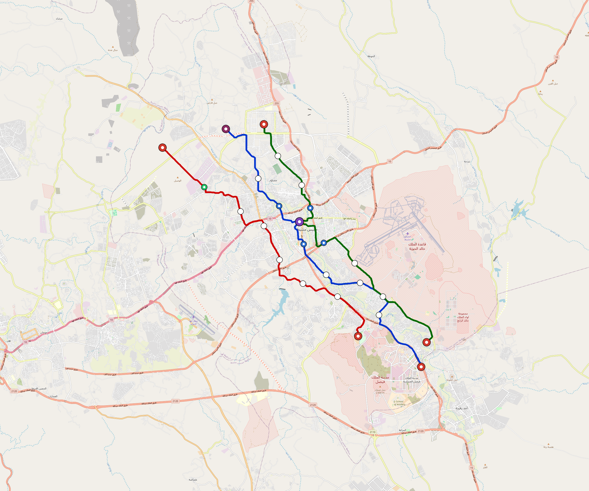

# Khamis-Mushait — Urban Rail Network

**Country:** SA · **Population:** 600,000 · [National brief](../NATIONAL-BRIEF.md)

This page contains only Khamis-Mushait-specific results. Shared routing, service, energy, civil, cost, finance, QA and validation methods are defined once in the [deployment planning reference](../../../../docs/deployment-planning-reference.md).

> [!IMPORTANT]
> **Foreign-capital advantage:** against the default equivalent foreign-turnkey sensitivity, this local plan avoids **$983 M (85.9%) of external capital** and **$1.21 bn of external interest**. Capital plus saved interest totals **$2.19 bn**. See the common reference for interpretation and limitations.

Auto-planned by the OpenSourceRail design pipeline from the controlled city catalogue, source-locked geospatial inputs and shared templates.

## Network



| Local measure | Value |
|---|---:|
| Lines / unique stations / interchanges | 3 / 26 / 1 |
| Route length | 81.2 km double track |
| Coverage / transfer reachability | 44.9% / 33% |
| Estimated station catchment | 269,400 residents |
| Service span / peak headway | 05:30–02:00 / 3 min |
| Fleet | 217 × 3-car `light-metro-3car` trainsets (195 peak revenue) |
| Peak network throughput | 43,200 passengers/hour |
| Practical service capacity | 401,760 passenger-trips/day |
| Annual paid-trip planning range | 73.3–117.3 M |

### Lines

| Line | Length | Stations | Trainsets | Termini |
|---|---:|---:|---:|---|
| line-1 | 29.1 km | 9 | 78 | SE Outer ↔ NW Outer |
| line-2 | 25.5 km | 8 | 69 | SE Mid ↔ NW Outer |
| line-3 | 26.5 km | 9 | 70 | N Outer ↔ SE Outer |
| **Total** | **81.2 km** | **26 unique** | **217** | |

## Energy

| Local measure | Value |
|---|---:|
| Scheduled service | 1,395 one-way journeys / 37,742 train-km/day |
| Annual traction demand | 178.5 GWh |
| Station/depot PV / storage | 12.2 MW / 52.0 MWh |
| Aggregate charging power | 12.5 MW |
| Dedicated solar plant | 79.7 MW |
| Residual grid/PPA import | 0.0 GWh/yr |
| Worst powered-stop gap | line-2: 8.6 km / 69 kWh |
| Lowest traversal charging margin | line-3: 59 kWh |

## Capital And Funding

| Local CAPEX bucket | Planning value |
|---|---:|
| Civil works | $230 M |
| Stations | $95 M |
| Depots | $8.0 M |
| Rolling stock | $195 M |
| Dedicated solar plant | $64 M |
| Residual train control | $4.1 M |
| Charging microgrids | $2.6 M |
| EPC / project services | $37 M |
| **Total city programme** | **$636 M** |

| Local funding measure | Planning value |
|---|---:|
| Imported / external capital | $161 M (25.3%) |
| Domestic / local capital | $475 M (74.7%) |
| Annual public construction commitment | $43 M / yr for 5 years |
| Annual post-grace debt service | $31 M / yr |
| External capital saved vs default turnkey sensitivity | $983 M |
| Capital + lifetime external interest saved | $2.19 bn |
| Annual OPEX | $29 M / yr |

## Local Evidence

| Package | Current status | Evidence |
|---|---|---|
| Finance | pass | [`summary.json`](engineering/finance/summary.json) |
| Native simulation + degraded cases | pass | [`validation-summary.json`](engineering/simulation/validation-summary.json) |
| SUMO timetable | pass | [`summary.json`](engineering/sumo/summary.json) |
| GIS package | pass | [`summary.json`](engineering/gis/summary.json) |
| Grid/charging/solar | pass | [`summary.json`](engineering/energy/summary.json) |
| Operations, QA and maintenance | 382 assets / 1,931 tasks | [`khamis-mushait-operations-manifest.json`](operations/khamis-mushait-operations-manifest.json) |

## Local Files And Regeneration

| File | Local role |
|---|---|
| [`design.toml`](design.toml) | Authoritative generated city design |
| [`khamis-mushait.toml`](khamis-mushait.toml) | Expanded simulator scenario |
| [`khamis-mushait.corridor.geojson`](khamis-mushait.corridor.geojson) | GIS corridor and stations |
| [`khamis-mushait.design-quality.yaml`](khamis-mushait.design-quality.yaml) | Coverage, source and civil-quality gates |

```bash
scripts/regenerate-city.sh khamis-mushait
```
