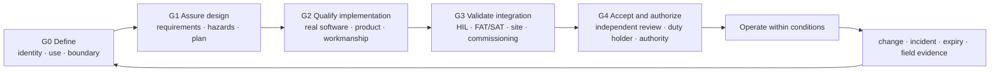

# Assurance, conformity and authorization

OpenSourceRail does not treat “certification” as one certificate or one final test. A railway is accepted through several different decisions: the design is verified, real products are qualified, installed subsystems are validated, the system safety argument is independently assessed, and legally competent organizations authorize the stated use.

> [!IMPORTANT]
> The repository has **no power to certify, approve or authorize a railway**. It can make evidence complete, reproducible, traceable and difficult to misstate. Suppliers, competent engineers, independent assessors, operators, infrastructure managers and national/local authorities retain their own decisions and liability.

## The short answer

OpenSourceRail now uses one simplified model for every controlled item:

**one passport per item → five gates → route-specific evidence → subsystem roll-up → one deployment safety/authorization decision**

The generated [all-component assurance register](component-assurance-register.md) currently covers **286 items**:

- 120 train products and 26 train assemblies;
- 45 station products and 10 station assemblies;
- 19 reusable civil types;
- 59 Rust crates; and
- 7 owner/operator platform services covering Workbench, ERP/HR, supervision, FUXA, Ops Core, the AI council and lifecycle/QR identity.

All 286 have a controlled identity and source baseline at G0. Item-specific G1–G4 evidence is deliberately open, and **zero items are represented as certified or released**.

## The five gates



| Gate | The decision | Typical evidence | Who decides |
|---|---|---|---|
| **G0 — Define** | Is the reference item, intended function, boundary, owner and configuration known? | Stable ID, parent/interface, source revision/hash, reference-use statement | Configuration manager |
| **G1 — Assure design** | Are deployment use, applicable rules, classification, requirements, hazards, interfaces and V&V plan complete? | Applicability record, requirements, ICDs, item FMEA/FMEDA, calculations/test plan | Design authority plus independent reviewer |
| **G2 — Qualify implementation** | Does the actual software, manufactured item or construction product meet the frozen design? | Released artifact/drawings, supplier/material records, raw analysis/tests, calibration, NCR closure | Quality and technical authorities with required independence |
| **G3 — Validate integration** | Does the installed item work with the real vehicle, route, environment, people and procedures? | HIL/FAT/SAT/site tests, as-built/deployed configuration, degraded modes, commissioning, maintenance information | Integrator, operator and project safety authority |
| **G4 — Accept and authorize** | Have independent and legally competent parties accepted the exact evidence and conditions of use? | Independent assessment, closed actions, accepted residual risk, operator acceptance, permits/authorization | Assessor, duty holder and competent authority |

A later gate cannot hide an earlier gap. A pass belongs only to the exact configuration, use, environment, evidence revision and conditions recorded in the passport. A significant change, incident, expiry or adverse field result reopens the affected gate and every dependent gate.

## Five assurance routes—not five separate systems

All routes use the same gates and passport fields. Their evidence differs because a bridge, brake controller and finance application are not certified in the same way.

| Route | Items | Main qualification question | Final acceptance route |
|---|---:|---|---|
| Rolling stock and onboard equipment | 146 | Are supplier configuration, materials/processes, structure, fire, electrical, EMC, environmental, endurance and first-article evidence adequate? | Applicable product/type and vehicle route |
| Stations, charging and wayside | 55 | Do the site interfaces, FAT, installation, SAT, accessibility, emergency modes and handover satisfy project and local rules? | Project, utility, building/fire and railway acceptance as applicable |
| Civil infrastructure | 19 | Do surveyed ground/water conditions, calculations, temporary works, materials, inspection and as-built geometry support this site? | Competent-engineer, project and construction/rail authority acceptance |
| Software and control | 59 | Is safety classification explicit, and are lifecycle, traceability, proof/test, target timing/resources, HIL and cyber evidence complete? | Exact target/system safety acceptance within a frozen authority boundary |
| Business, supervision and administration | 7 | Are non-safety boundaries, access control, integrity, recovery, support and operator acceptance proven? | Organizational production acceptance—never movement authority or safety release |

Candidate standards in a passport are prompts for applicability review, not conformity claims. G1 must freeze the jurisdiction, intended use, safety classification, standard editions/national adoptions, contractual rules and assessment bodies for the deployment.

## “Certified” is too vague—name the actual decision

| Decision | What it means here | What it does not mean |
|---|---|---|
| Digital design gate | Tracked inputs and deterministic evidence are internally coherent | Physical qualification or approval |
| Product conformity/type evidence | A defined manufactured configuration met its applicable assessment route | Every installation or route is accepted |
| Construction/installation acceptance | The site-specific work and as-built state meet project/local requirements | The complete railway may operate |
| Independent safety assessment | An independent body reviewed the safety process, evidence and findings | The assessor becomes the operator or regulator |
| Placing-in-service/operating authorization | The competent party permits a stated use subject to conditions | Unlimited approval after later change |
| Organization/SMS or management-system acceptance | The duty holder can manage risk, competence, change and operation | A product is technically qualified merely because the organization is certified |

This distinction follows the current RAMS lifecycle principle that assurance applies from complete systems down to subsystems and components, while the RAMS standard itself does not define product certification or stakeholder approval. See the official [IEC 62278-1:2025 record](https://webstore.iec.ch/en/publication/68933). EU terminology also separates constituent/subsystem conformity, vehicle or fixed-installation authorization and safety authorization; the [EU declaration/certificate templates](https://eur-lex.europa.eu/legal-content/EN/TXT/?uri=CELEX:32019R0250) are an example, not a default legal route for non-EU deployments.

## How to close a component passport

1. **Name the claim.** State the exact item, revision, intended use, environment, parent system and requested decision.
2. **Freeze applicability.** Record jurisdiction, standards/rules, safety significance, assessment route, duty holders and required independence.
3. **Plan evidence before building.** Link requirements, hazards/FMEA, interfaces, analyses, tests, acceptance criteria, tools, specimens and responsible people.
4. **Capture raw results.** Retain supplier submissions, calculations, model/input versions, calibration, test data, failures, NCRs, concessions and hashes—not only a summary PDF.
5. **Check configuration and independence.** Evidence must match the item; authors cannot silently act as their own independent verifier or approver.
6. **Roll up without averaging.** A subsystem cannot pass while a safety-significant child, interface, common-cause risk or operating dependency is open or stale.
7. **Record the decision.** Name the decision maker, scope, basis, date, expiry, limitations, residual risk and conditions of use.
8. **Control change and service evidence.** Preserve superseded records and reopen affected gates after modifications, incidents, expiry or adverse trends.

## Worked examples

### Battery/HVAC module

- **G1:** freeze thermal duty, fire hazards, coolant/refrigerant separation, electrical interfaces and applicable battery/rolling-stock rules.
- **G2:** qualify the selected compressor, heat exchangers, pumps, hoses, pack interfaces and controller using supplier data, thermal chamber/calorimeter, leakage, EMC, shock/vibration and fault tests.
- **G3:** validate the installed vehicle at maximum climate, aged-battery and degraded-cooling duties, including protection/derate behavior.
- **G4:** independent review and vehicle/type acceptance retain conditions and limits. Passing the Rust thermal model alone never closes G2–G4.

### Safety-related Rust evaluator

- **G1:** classify its safety role, allocate requirements/hazards and freeze its interface and target assumptions.
- **G2:** retain reviewed source/toolchain, unit/property/formal results, coverage, vulnerabilities, reproducible binary, WCET/stack/heap and target-hardware evidence.
- **G3:** run HIL, communications/clock/power faults, vehicle/wayside integration and representative commissioning cases.
- **G4:** obtain independent safety acceptance for the exact binary, hardware, configuration and authority boundary. A crate test cannot authorize a train.

### Bridge or viaduct type

- **G1:** replace open-map screening with surveyed alignment, levels, hydraulics, ground, loads, durability and site-code applicability.
- **G2:** release checked calculations/drawings, materials, fabrication/placement procedures, temporary works and inspection/test plans.
- **G3:** validate foundations, concealed work, geometry, bearings/joints, drainage and as-built/load evidence on the actual site.
- **G4:** competent engineering and construction/railway authorities accept the structure for its stated use.

### ERP, FUXA or AI administration

- **G1:** freeze its non-safety authority boundary, data ownership, permissions, retention, privacy, cyber and business-continuity requirements.
- **G2:** verify configuration, authentication/authorization, audit, backup, recovery, dependencies and fail-closed behavior.
- **G3:** validate real organizational roles, operating procedures, outage/recovery and human approval paths.
- **G4:** the organization may accept it for production administration. It still cannot gain movement authority, certify engineering, pay, contract, hire/fire or approve itself.

## One evidence chain

```text
component passport
  → subsystem assurance case
    → train / station / civil / software validation
      → integrated railway safety case
        → independent assessment
          → operator, project and competent-authority decisions
```

Hashes show which bytes were reviewed; they do not show that the content is correct. Simulation reduces redesign and physical-test risk; it does not replace mandatory type, routine, environmental, site, commissioning or operational evidence.

## Current position

| Layer | Repository position | Release meaning |
|---|---|---|
| Component identities | 286 G0 baselines recorded | Traceable, not approved |
| Cross-domain digital checks | Deterministic report passes 13 checks and screens 279 engineering items | Pre-build coherence only |
| Item design assurance | 286 G1 plans/open reviews | No item-specific design release claimed |
| Implementation qualification | 286 G2 gates open | No supplier/physical/target qualification claimed |
| Integration validation | 286 G3 gates open | No HIL/site/commissioning release claimed |
| Independent acceptance/authorization | 286 G4 gates open | No certification or permission to operate claimed |

The detailed closure work is in the [release-gap register](release-gap-register.md). The concise status view is [evidence-status.md](evidence-status.md).

## The assurance pack

Read only what your decision needs:

1. **All items:** [component assurance register](component-assurance-register.md) and its complete [JSON passports](component-assurance-register.json).
2. **System and boundary:** [system description](system-description.md) and [standards baseline](standards-baseline.md).
3. **Safety intent:** [safety requirements](safety-requirements.md), [hazard log](hazard-log.md) and compiled [GSN safety case](../safety-case/README.md).
4. **Evidence:** [evidence register](evidence-register.md), generated [digital assurance](digital-assurance-report.md), [software resilience](software-resilience-report.md) and [multi-day soak](software-soak-report.md).
5. **Open work:** [evidence status](evidence-status.md), [release gaps](release-gap-register.md) and [component RFC readiness](../component-rfc-readiness.md).
6. **Control profiles:** [pilot signalling](pilot-signalling-profile.md) and the research-only [distributed onboard profile](distributed-onboard-control-profile.md).
7. **Clause mapping:** [EN/IEC 62267 compliance matrix](compliance-matrix.md), after the deployment confirms the applicable adoption and edition.

## Deterministic checks

```bash
python3 tools/automation/component_assurance.py --check
python3 tools/automation/digital-assurance.py --check
python3 engineering/subsystem_control_register.py --check
./osr test
```

These commands detect missing identities, routes, sources, hashes and stale generated evidence. They cannot authenticate a signatory, judge engineering adequacy, witness a physical test or grant approval.

## Deployment dossier handover

A deployment should export a controlled dossier containing the selected passports, frozen applicability/standards record, configuration index, requirements and hazard trace, supplier and construction files, raw verification/validation evidence, NCR/deviation log, competence and calibration records, safety case, independent assessment report, decisions/conditions and change history. The national or contractual submission format wraps this evidence; it must not create a second uncontrolled technical baseline.

The worked Samawah package is an example deployment evidence structure, not a special certification route and not an Iraqi approval claim.
