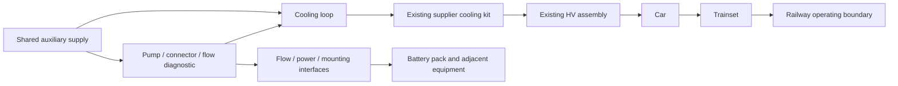

# Connected engineering assurance

The [connected engineering source](../../lib/templates/connected-engineering.json)
extends the Digital Standards Thread with configuration-bound engineering
relationships. The [compiler](../../tools/automation/connected_assurance.py)
imports the trainset product manifest, adds a battery-cooling decomposition,
and emits a [review report](connected-engineering-report.md) and
[machine-readable graph](connected-engineering-report.json). Digital standards
reports embed the same graph; component passports link their design revisions,
failure modes, occurrences and deployment decisions.

This is the first vertical example. `DEMO` asset serials, batches, production
records and incidents are synthetic. Supplier choices, physical results,
licensed clause selection and accountable reviewers remain open.

## Physical structure and configuration

The existing product manifest owns the assembly hierarchy. Imported revisions
are SHA-256 identities of individual manifest definitions, the CAD baseline and
referenced CAD source bytes; the full manifest hash is also retained. The overlay decomposes the cooling supplier kit into
pump, connection, flow diagnostic and loop definitions, with their own IDs and
revisions. It preserves the manifest's layer names and adds the railway
operating boundary explicitly.



Design definitions and occurrences are separate records. Each occurrence has
its installed design revision, configuration, position, serial, supplier batch,
parent occurrence and maintenance history. Changing the design retains those
installed revisions and reports reassessment gaps. It does not silently replace
the installed equipment. Configuration snapshots enumerate exact applicable
design revisions; stale analysis and mismatched occurrences remain visible.

## Executable record schema

`osr-connected-engineering/1` uses globally unique IDs across these collections.
The compiler validates reference types, required fields and cycle constraints.

| Collection | Controlled information |
|---|---|
| `design_items`, `functions`, `interfaces` | Design revision, decomposition rationale, containment, function allocation, shared dependencies, interface endpoints and parameters |
| `configurations`, `occurrences` | Deployment, exact item revisions, initial state, installed serial/batch/position and maintenance history |
| `failure_modes`, `hazards` | Item/revision/configuration/function, operating context, mechanisms, local/higher/system effects, downstream modes, diagnostic coverage/delay/exposure, response/recovery, severity, likelihood basis, uncertainty, hazard, owner/action/deadline/reviewer and residual risk |
| `requirements`, `obligations` | Allocation, authored acceptance criteria, review, deployment applicability, clause identifier, verification class and decision links |
| `models`, `scenarios` | Hashed model sources/version, calibration/validation/envelope/limitations, exact configuration, initial inputs, fault location/onset/duration/magnitude, requirement-derived criteria and physical-validation relationship |
| `evidence`, `decisions` | Verification class, configuration, requirement/scenario scope, provenance, independent-review metadata, validity, child/dependency/prior gates and physical integration evidence |
| `production_records`, `incidents` | Affected designs and serials, torque operation, calibration and inspection hold point, failure diagnosis, corrective action, effectiveness check and engineering handback |

Relationships include `part_of`, `implements_function`, `depends_on`, interface
endpoints, `installed_as`, failure propagation, scenario/requirement/evidence
links and dependent gate decisions. Containment and failure propagation cycles
are rejected. Shared dependencies and interface traversal can contain cycles;
impact traversal visits each record once.

Severity 5 always retains mandatory safety review. Unknown occurrence is stored
as `unknown`; the legacy FMEA compiler emits a null RPN for it and an occurrence
evidence gap for unsupported ratings. Multiplication cannot waive a safety
review.

## Run and inspect the example

```bash
# Execute four declared cases through the existing Rust thermal controller.
python3 tools/automation/connected_assurance.py --run-scenarios

# Generate reviewable records, then check drift.
python3 tools/automation/connected_assurance.py
python3 tools/automation/digital-assurance.py
python3 tools/automation/component_assurance.py
python3 tools/automation/connected_assurance.py --check

# Follow every recorded dependant of a safety-significant design.
python3 tools/automation/connected_assurance.py --changed-item OSR-COOL-PUMP

# Limit a defective-batch investigation to applicable occurrences and records.
python3 tools/automation/connected_assurance.py --batch DEMO-BATCH-A

# Compare a saved graph before and after changing the pump revision/interfaces.
python3 tools/automation/connected_assurance.py --impact-from /tmp/before.json
```

The pump query reaches requirements, failure propagation through the railway
boundary, controller scenarios, planned physical tests, production instructions,
both demo cars and their serials, FRACAS and dependent G1–G4 decisions. The batch
query reaches one demo car, its affected serials, production record and incident.
Impact outputs include a traversal path for each affected record. Comparisons
use both old and new relationships so a deleted link cannot hide a former
dependant. Interface traversal is intentionally conservative; an engineer must
review applicability rather than interpret every path as a proven failure.

## What the controller evidence establishes

The [Rust runner](../../crates/osr-hvac/examples/cooling_fault_evidence.rs)
receives declared initial conditions and injected diagnostic inputs. It returns
actual controller outputs; the Python runner compares them against separately
authored requirement criteria. It records the raw output, tool version,
configuration identity and source hashes in the
[execution bundle](../../engineering/assurance/battery-cooling/controller-execution.json).
Source changes invalidate this evidence.

| Executed case | Observed requirement |
|---|---|
| Reported pump unavailable | Isolation and derating requested; pump command zero |
| Reported pressure loss | Isolation requested; pump command zero |
| Reported hottest cell at 55 °C reference threshold | Isolation and derating requested |
| Reported pump unavailable and hottest cell at 60 °C | Isolation and derating requested; pump command zero |

These are single controller evaluations. Physical pump seizure must first be
detected and reported; detection coverage and delay remain unknown. The model
does not calculate coolant flow, heat transfer, hotspots, thermal inertia,
physical actuator response or target timing. High ambient is an input without
calibrated physical thermal response. The masked pump/flow-sensor fault,
charging/fouling and unavailable-recovery cases remain explicit plans. No bench,
HIL or deployment result is invented. Acceptance criteria still need independent
engineering review before they can support a deployment decision.

## Evidence and gate behavior

Malformed/orphan records, missing effects, cycles, unsupported accepted states
and contradictory scenario criteria fail the compiler. Missing verification,
unknown likelihood, stale configurations, expired evidence, changed input/result
hashes and open handback appear as blockers in an otherwise structurally valid
report.

Reviewed evidence requires separate author/reviewer identities, a review
reference, validity date, configuration fingerprint and hashed inputs/results.
Local metadata cannot authenticate a competent person's acceptance. Decision
records therefore permit `open`, `proposed`, `rejected` and `superseded`; the
compiler never manufactures `accepted`. Earlier gates, significant children,
shared dependencies and reviewed physical integration evidence remain explicit
parent blockers. A controller run remains `generated-unreviewed` and does not
advance any passport beyond G0.

The torque-process failure links to a controlled requirement, production
operation, calibration gap, inspection hold point and affected serials. The
synthetic incident keeps administrative closure separate from engineering
handback and corrective-action effectiveness review.

## Expansion

The [subsystem qualification workflow](subsystem-qualification.md) now provides
quantitative screens, rig/measurement definitions, production-equivalence checks
and six separate Workbench readiness states. Physical evidence remains open.

Next, obtain the supplier's pump, connection and diagnostic definitions; review
measurable flow, temperature and timing criteria; execute calibrated bench and
HIL cases; and bind genuine manufacturing and installed records. Apply the same
schema to brakes, doors, localisation and train protection, then charging,
structures, civil occurrences and emergency operations. Add reviewed top-down
fault trees and common-cause analyses to complement the recorded bottom-up
propagation. Software defect rates are not inferred from hardware statistics.

ERPNext, IFC/FreeCAD, FUXA and Workbench can consume these stable identities and
JSON records. The qualification workflow adds a Workbench readiness interface;
these compilers do not write to external systems. The obligation example deliberately leaves licensed
clause selection and deployment applicability unresolved.
