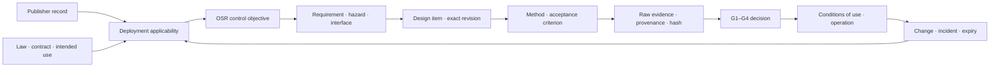

# Digital Standards Thread

OpenSourceRail turns standards work from a late document exercise into a live,
version-controlled engineering thread. Every applicable rule can be connected to
a control objective, requirement, hazard, design item, verification method, raw
evidence object and named decision. When a hashed input changes, the affected
controls can be found and reopened before fabrication or site work repeats the
mistake.

This is a core product capability: **design once, show the evidence chain, and
know exactly what must be reassessed after change**. It is digital assurance and
approval preparation—not self-certification.

> [!IMPORTANT]
> A green OpenSourceRail report means the repository evidence is present,
> current, mapped and internally coherent. Only the applicable duty holder,
> competent engineer, accredited laboratory, independent assessor,
> certification body or public authority can make the corresponding real-world
> decision.

## What is implemented

The machine-readable source is
[`digital-assurance.toml`](../../lib/templates/digital-assurance.toml). The
compiler produces the current [digital standards report](digital-assurance-report.md),
[JSON evidence graph](digital-assurance-report.json) and
[standards baseline](standards-baseline.md). CI fails when an output, source
hash, evidence mapping or standards-review deadline is stale.



The implementation provides:

- a reviewed registry of international, European and management-system
  publisher records with edition status, jurisdiction boundary and a mandatory
  next-review date;
- five reusable profiles for system safety, control/software, vehicle
  equipment, civil/BIM and quality/assets;
- cross-domain control objectives covering concept through retirement;
- mandatory deployment inputs for jurisdiction, intended use, law, contract,
  classification and assessment route;
- deterministic links from controls to repository checks and evidence hashes;
- complete preliminary FMEA screening of the controlled engineering inventory;
- one G0–G4 assurance passport per controlled item;
- a path-level impact index that identifies the controls, checks, standards and
  failure modes affected by changed bytes; and
- fail-closed states: generated evidence cannot silently become reviewed,
  accepted, certified or released.

## The three layers of truth

| Layer | Question answered | Current machine authority |
|---|---|---|
| Publisher and applicability | Which edition and legal/contractual route might apply here? | Metadata and open applicability prompts only |
| Engineering evidence | Is the exact claim connected to current, reproducible evidence? | Deterministic coherence result |
| Acceptance and authorization | Is that evidence adequate for this product, site and use? | Named human/organizational decision only |

This separation prevents two common errors: treating a list of standards as a
compliance matrix, and treating a passing simulation as approval of a physical
railway.

## Deployment workflow

### 1. Freeze the claim and system boundary

Identify the city, railway, subsystem or item; intended use; operating concept;
interfaces; environment; configuration; owner; and requested decision. A claim
without an exact subject and use cannot enter G1.

### 2. Freeze applicability

Record national and local law, adopted standards and editions, National Annexes,
contractual rules, funder requirements, safety/security classification,
conformity route, competent authorities and independence requirements. Obtain
licensed normative text where required. A publisher catalogue page is evidence
of metadata, not evidence that every clause applies.

### 3. Build the clause-to-control overlay

The public registry stores no copyrighted normative text. A deployment overlay
may store permitted clause identifiers, a locally authored obligation summary,
applicability rationale, owner, verification method, evidence type, acceptance
criterion and decision gate. Each clause is classified as applicable,
not-applicable-with-rationale, informative or superseded; silence is an open
gap.

### 4. Plan evidence before design release

Connect each control to requirements, hazards/FMEA, interfaces, design objects,
calculations, simulations, reviews and physical tests. Define specimens,
sampling, environments, instruments, calibration, competence, independence and
pass/fail criteria before executing the work.

### 5. Capture an evidence object

Every evidence object needs, at minimum:

| Field group | Required content |
|---|---|
| Identity | Stable evidence ID, claim, controlled item and configuration |
| Method | Procedure/model, acceptance criterion, tool and version, environment |
| Provenance | Source revision, raw result, SHA-256, author and creation time |
| Review | Reviewer, independence, disposition and limitations |
| Validity | Stated use, validity/expiry trigger and supersession relationship |

Repository evidence begins as `generated-unreviewed`. Only an accountable
workflow can move it to `reviewed` or `accepted-for-stated-use`. Rejection,
expiry and supersession are retained rather than overwritten.

### 6. Roll up through G0–G4

The [component assurance model](README.md#the-five-gates) keeps definition,
design assurance, implementation qualification, integration validation and
acceptance/authorization separate. A parent cannot pass while a significant
child, interface, common-cause dependency or required independent decision is
open. Scores and percentages never average away a release blocker.

### 7. Reopen on change

Compare a previous JSON report with the current tree:

```bash
python3 tools/automation/digital-assurance.py \
  --impact-from path/to/previous-digital-assurance-report.json
```

The result lists changed paths and affected controls, checks, standards and
failure modes. The engineering change record then decides which requirements,
analyses, tests and G1–G4 decisions must repeat. The algorithm finds impact; it
does not decide technical adequacy.

## Worked use cases

### Alignment or station change

A revised route invalidates its source hash. The impact review reaches terrain,
water, clearance, civil structure, station, vehicle compatibility, evacuation,
BIM, quantity, cost and delivery evidence. Open DEM and mapped water may rerun
immediately; survey, geotechnical, hydraulic and competent structural decisions
stay open.

### Battery/HVAC component substitution

A changed compressor, chiller, pump or battery module reopens the exact product
passport, thermal model assumptions, interface requirements, FMEA, supplier
evidence and vehicle integration controls. Digital duty-cycle and fault tests
reduce redesign risk; calorimeter, chamber, leakage, EMC, environmental and
vehicle tests remain physical evidence.

### Rust control release

A source, dependency, compiler or target change invalidates the relevant
software and provenance hashes. Unit, property, differential, formal,
resilience and soak checks can rerun deterministically. Target timing/resources,
HIL, production communications, cybersecurity, commissioning and independent
safety acceptance remain separate gates.

### Supplier and first article

The supplier receives the applicable requirements, interface baseline, evidence
schema and acceptance plan rather than an ambiguous standards list. Returned
drawings, certificates, raw measurements, NCRs and test records bind to the
exact item and revision. A catalogue page, declaration or summary PDF cannot
silently close first-article qualification.

### Operational modification

An altered maintenance interval, procedure, competence scope or software patch
is treated as a controlled system change. The thread links asset performance,
work records, hazard controls, training/authorization and any assessor or
authority condition that must be reconsidered.

## Standards maintenance and licensing

The tracked baseline uses authoritative publisher or legal records and records
when each was checked. CI deliberately expires the metadata review. It does not
download or reproduce copyrighted standards, monitor every national adoption,
or infer local law.

Known transition points are explicit. ISO 9001:2026 replaced ISO 9001:2015 in
September 2026. ISO 22163:2023 remains the current railway QMS record but still
references ISO 9001:2015, so a deployment must agree and document its transition
basis. EN 50716:2023 is the current OSR European software baseline while legacy
EN 50128/EN 50657 references require a recorded national or contractual reason.

## Claims suitable for proposals

OpenSourceRail may accurately say:

- “standards-aware evidence is generated and checked on every controlled
  change”;
- “the system exposes missing, stale, unreviewed and physical evidence instead
  of hiding it”;
- “change impact is traced before manufacture and site work”; and
- “the dossier is structured for supplier, assessor and authority review.”

It must not say “certified,” “compliant,” “approved,” “type-approved” or
“physical tests are unnecessary” unless the exact scope, edition, configuration,
use, evidence and competent decision genuinely support that statement.

## Handover dossier

A real submission exports the frozen applicability overlay, licensed-clause
working record, configuration index, requirements and hazard trace, passports,
supplier and construction files, model/tool validation, raw V&V evidence,
calibration and competence records, deviations/NCRs, safety case, independent
assessment, decisions, conditions of use and change history. National forms
wrap this evidence; they do not create a second uncontrolled baseline.

## Run the gate

```bash
python3 tools/automation/digital-assurance.py --check
python3 tools/automation/component_assurance.py --check
python3 engineering/subsystem_control_register.py --check
./osr test
```

The JSON output is intended for Workbench, ERP, supplier portals and future
authority-specific exporters. The Markdown output is the review and marketing
view of the same deterministic data.
