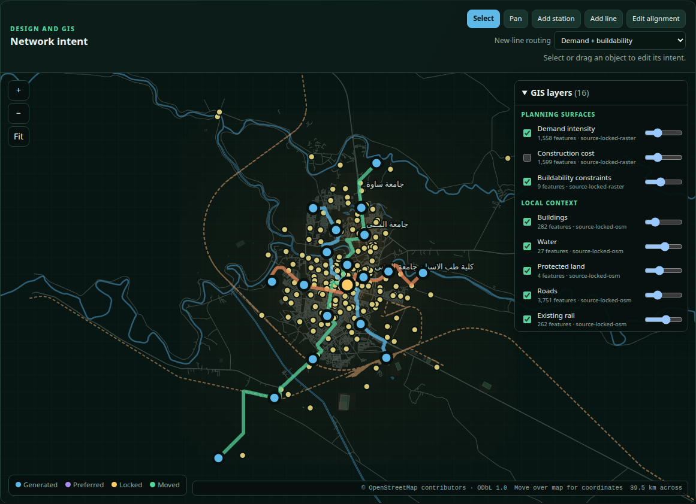

# OSR City Studio

OSR City Studio is the Git-backed design and service-planning interface for
OpenSourceRail. The initial vertical slice loads Samawah, displays its
geographic corridors and stations, records station locks or movements,
configures service by line/day/time, calculates fleet and capacity screens,
authors period-specific origin–destination demand and screens it against
scheduled line capacity,
persists civil construction-system choices and their derived bearing/joint
interfaces,
compiles a deterministic candidate, and materializes a revision for GitHub
review.

The civil panel controls the 20/25 m standard span, four/five-span expansion
unit, reinforced-soil approach height, long-open slipform and constrained ST6
methods, maturity-controlled mould-cycle target, and comparison of road
grade-separation alternatives. Values are validated, stored in
`project.osr.toml`, included in the candidate revision hash, and restored after
restart. The Studio displays the shared design-derived civil cost contract.
Authoritative CAD quantity changes can regenerate that contract and every
downstream city price; changing project method intent alone does not claim a
new rate unless the calibrated driver model maps that input to a quantity.

The controlling design decision is
[RFC 0031](rfcs/0031-city-studio-git-revisions.md).

## Interface

## Run

From the repository root:

    cargo run -p osr-city-studio -- serve

Open http://127.0.0.1:8090/.

Use another project or port with:

    cargo run -p osr-city-studio -- \
      --project cities/workspaces/samawah serve --port 8091

The server binds only to localhost by default. The initial interface has no
authentication and must not be exposed as a shared or public service.

To carry revisions into simulation, OCC training and Ops Core, use the
[same-origin Workbench](workbench/README.md) instead of starting Studio
alone.

## Command line

Validate source locks, station intent, calendars, all line/day plans, and OD
demand references:

    cargo run -p osr-city-studio -- validate

Write a deterministic working snapshot under build/city-studio/samawah/:

    cargo run -p osr-city-studio -- compile

Write cities/workspaces/samawah/revisions/osr-<hash>.json:

    cargo run -p osr-city-studio -- revision

Inspect the branch, parent commit, and uncommitted paths:

    cargo run -p osr-city-studio -- git-status

List immutable project revisions or compare one with the working candidate:

    cargo run -p osr-city-studio -- revisions
    cargo run -p osr-city-studio -- compare osr-1f41358e43a86600

Validate every committed city project:

    python3 tools/automation/validate-city-projects.py

Install through the root [one-command setup](../README.md#one-command-linux-setup),
then run every browser front end with `npm run test:frontend`.

For the 122-check Studio-only workflow, use
`node tools/automation/test-city-studio-gui.mjs`. Playwright uses one worker, a fixed
viewport, locale and timezone, and a disposable project. Its JSON report and
screenshot are written to `build/gui-acceptance/`; committed Samawah inputs are
not edited.

## Revision workflow

1. Create a branch.
2. Use the Studio to edit station intent, service plans, and OD demand.
3. Compile and resolve every validation error.
4. Materialize a revision.
5. Review the Git diff, including semantic changes in the revision JSON.
6. Commit the project inputs and revision together.
7. Push and open a GitHub pull request.
8. Append the reviewer decision with its PR/evidence reference.
9. After approval and merge, create the suggested protected or signed tag.

Materializing a revision does not run git add, commit, push, or contact GitHub.
Remote repository changes always remain an explicit user action.

## Current editing scope

Implemented:

- source hash locks;
- an offline layered GIS workspace with pan, zoom, fit, coordinates, scale,
  feature inspection, visibility and opacity controls;
- content-hashed local roads, buildings, water, protected land, existing rail,
  demand, construction-cost, buildability, destination, civil, energy, depot,
  interchange, issue, published-network and live-candidate layers exposed
  through a deterministic GIS API;
- stable station ids;
- generated/preferred/locked/retired station intent;
- drag-to-move stations;
- click-to-create manual stations with stable content-derived ids;
- manual station naming, archetypes, movement, and retirement;
- two-click manual line creation with stable endpoint-derived ids;
- automatic terminal platforms and day-type service plans for new lines;
- coordinated manual-line naming, alignment editing, and retirement;
- selectable source-locked demand/buildability routing or explicit direct
  planning chords for new manual lines;
- line-level routing provenance, demand weight, and raster source ids in the
  candidate, GIS export, and immutable revision;
- locked-anchor-aware local corridor regeneration after station movement;
- click-to-create and drag-to-edit alignment control points;
- weekly day-type calendars;
- per-line contiguous time windows and headways;
- one-operation headway adjustment across every time window for the current
  line or every active route, using one validated atomic write, plus complete
  service-plan copying between day types;
- indicative cycle, fleet, capacity, daily and weekly service metrics;
- source-controlled planning periods and OD flows with deterministic stable
  IDs, active-station/day-type validation, create/edit/delete controls, and a
  conservative capacity/utilization screen over every overlapping service
  window;
- validation findings;
- deterministic candidate and revision hashes;
- in-GUI semantic comparison of station, line, service, demand, coordination,
  per-line IFC survey control, and summary changes;
- append-only approval/changes-requested decisions tied to existing immutable
  revisions, including reviewer role, decision date, rationale, and review or
  pull-request reference;
- day-type-specific simulator scenarios and a hash-addressed artifact manifest;
- allowlisted field-evidence brief, GIS compilation, one-hour simulator, and
  LandXML/railML alignment jobs plus IFC4.3 civil federation with persistent progress, command display,
  captured logs, exit state, and SHA-256 artifact records;
- an integrated evidence viewer for GeoJSON, alignment JSON, LandXML, railML,
  stakeout CSV, civil IFC object indices/raw STEP, simulator JSON, manifests,
  snapshots, and captured logs;
- searchable IFC asset inspection and deterministic coordination topics that
  can select several civil assets in one issue;
- reusable IFC type counts and stable type identity in the civil artifact
  metrics, search, and object detail;
- native IFC material-family counts, source authority, and visibly unresolved
  grade/design status in the civil artifact inspector;
- native section-profile counts, profile-derived rail extrusion coverage, and
  review-versus-mill geometry status in the artifact inspector;
- native IFC presentation-layer and coordination-group catalogues, membership,
  semantic boundaries, and visibility filters;
- native qualitative interface-constraint intent, current evaluation, source,
  scope, and explicit no-fabricated-metric boundary;
- native OSR property/quantity dictionaries, applicability, typed fields,
  definition linkage, and custom-versus-standard naming boundary;
- native IFC4.3 horizontal and vertical planning segments, gradient-curve
  representation, stationing, and explicit unresolved transition/cant status;
- a native USD `SCHEDULEOFRATES` containing the generated at-grade, elevated,
  and bridge planning rates, source hash, cost drivers, and no-estimate boundary;
- hash-verified 4D sequence loading alongside the IFC object index, with
  federation rotation, native layer visibility, stage scrubbing/playback,
  and task/QA-hold context;
- visibility of existing GIS, engineering, simulation, operations, and release
  artifacts.

Next:

- native 3D IFC geometry streaming and IDS editing (projected IFC object
  picking, IDS inspection, multi-asset BCF topic creation, and controlled
  BCF status, assignment, resolution, and reviewer decisions are implemented);
- passenger assignment and platform/interchange pedestrian capacity (the
  deterministic OD intent and scheduled line-capacity screen are implemented);
- object-aware Git merge assistance.

## Approval records

The Git review panel can append an **Approved** or **Changes requested** record
for an existing `osr-…` revision. Records are stored in
`cities/workspaces/<slug>/approvals/reviews.toml` and receive deterministic
`approval-…` IDs. Submitting identical content is idempotent. Decisions cannot
refer to a missing revision and are not edited or deleted through City Studio;
a later decision is appended as additional history.

Approval metadata is deliberately excluded from the design content hash. The
record refers to an already immutable revision, so adding the decision does
not manufacture a different design merely because that design was reviewed.
The approval file, review/PR reference, and revision remain ordinary GitHub
review material.

## Map authoring

The map has five explicit tools. **Select** inspects and drags existing
objects or reads GIS properties. **Pan** moves the viewport; wheel or +/−
controls zoom and **Fit** restores the project extent. **Add station** inserts a manual station where a line is clicked,
assigns a stable id, and opens its name/archetype inspector. **Add line** takes
two endpoints and uses the selected routing strategy. **Demand + buildability**
snaps each endpoint to the nearest feasible cell and runs deterministic
least-cost search over the project's locked planning bundle. **Direct planning
chord** remains an explicit fallback. Both strategies create two terminal
platforms and copy the existing day-type policy into editable service plans.
**Edit alignment** adds a local corridor control point to either generated or
manual lines. Manual station/line additions and retirements
rebuild both the candidate GeoJSON and the station, line, fleet, dispatch, and
ordered topology records in every generated simulator scenario.

The layer catalogue comes from `/api/gis/manifest`; each layer is retrieved by
stable ID from `/api/gis/layers/<id>` with a SHA-256 digest, feature count,
provenance class and default presentation. Planning rasters are aggregated into
500 m display cells without changing the locked 100 m routing inputs. The map
does not call a public tile service, so a revision or test cannot drift with a
remote basemap. Deployment teams may add survey, parcel, utility, terrain or
licensed local basemap extracts to the same locked project workflow; the
included place anchors and planning surfaces are not survey evidence.

The tracked Samawah context is regenerated from the pipeline's processed OSM
snapshot with `python3 tools/automation/export-gis-context.py
.cache/osr-pipeline/osm/samawah.json cities/workspaces/samawah/gis`. The exporter writes
stable GeoJSON, ODbL attribution and fetch provenance, then refreshes the five
matching entries in `sources.lock.json`.

The Samawah routing bundle is a committed 100 m planning surface derived from
the pipeline's 20 m cost, demand, and buildability rasters. Every component and
its derivation record is SHA-256 locked. This is appropriate for comparing
planning alternatives, not survey or detailed civil design. Designers can
shape either route strategy further with alignment control points.

The revision comparison panel compares any committed revision JSON with the
current working candidate. It reports object additions, removals, movements,
line length/station-count changes, and service/fleet/capacity deltas before a
new revision is materialized. It also reports OD flow additions, removals, and
passenger-rate changes.

## Demand planning

`cities/workspaces/<slug>/demand/od-matrix.toml` defines named periods by service day
type and clock interval, followed by optional station-to-station passenger
flows. The GUI creates a stable `od-…` ID from the period, origin, and
destination, while passengers/hour remains editable without changing object
identity. Changes are written atomically, included in the candidate hash, and
survive process restart.

For each valid flow, the compiler finds the origin and destination lines and
uses the lower scheduled passengers/hour/direction capacity across every
service window overlapping the period. Cross-line records receive an
indicative one-transfer screen. The resulting utilization and
within/near/over-capacity status are useful for early scenario comparison, but
they do not aggregate flows onto segments, predict ridership, or replace a
passenger-assignment, interchange, platform-flow, or egress study.

## Controlled engineering jobs

The engineering hub exposes five fixed adapters:

- **Issue field-evidence brief** locks the current candidate revision and
  generates survey, utility, land, flood, geotechnical, workshop/fleet and
  reality-capture requirements plus an explicitly unaccepted receipt manifest;
- **Compile GIS package** publishes the candidate snapshot, GeoJSON, day-type
  scenarios, and manifest;
- **Run network simulation** executes a fixed one-hour compact `osr-sim` run
  for the selected day type and rejects invariant violations;
- **Export LandXML and railML** converts the selected candidate line to local
  engineering coordinates and runs `osr-alignment-export`, producing review
  JSON, stakeout CSV, LandXML, and railML;
- **Generate Bonsai civil IFC4.3** combines the selected immutable line
  reference with the checked civil kit and produces native IFC4.3 objects,
  quantities, provenance, an object index, two typed
  `IfcVehicle/ROLLINGSTOCK` trainsets, 18 linked 4D construction tasks with
  134 physical outputs and 45 separately identified virtual review interfaces, a
  twenty-specification IDS 1.0 audit, 36 native typed bearings and explicit
  virtual foundation/jacking interfaces, 27 native support connections with 60
  bearing realizations, an internal 15-reference OSR asset
  classification, five native source-zone coordination groups, 15 hash-locked
  native source-document records including a native link to nine objectives and
  six numeric metrics, a nine-item external engineering decision register,
  six native functional systems (three
  specialized as `IfcBuiltSystem`), seven system-to-railway-part references,
  four native presentation layers, nine native interface constraints with six
  numeric `IfcMetric` benchmarks, three qualitative-only gates, and 107 scoped
  project/asset/group/system evidence links, 16 native property/quantity dictionaries,
  native planning alignment layouts and stationing,
  one native schedule containing three generated planning rates,
  and a BCF 3.0 package of open release
  issues with IFC GUID selections. If the selected line has accepted survey
  control in `[[civil.ifc_georeferencing]]`, the job also emits its native
  `IfcProjectedCRS` and `IfcMapConversion`; unmatched lines remain explicitly
  on the unresolved local grid. OSR remains the alignment/geometry authority;
  Bonsai is the downstream federation and detail-review environment.

Jobs serialize through one engineering slot. Their records, immutable evidence
copies, and full logs live
under `build/city-studio/<slug>/jobs/<job-id>/`; the browser displays status,
progress, the effective command, a bounded log tail, and every output hash.
Project edits serialize against the running job, and a queued job fails if its
recorded revision has become stale. Interrupted records are marked failed when
the server restarts. Adapter ids, arguments, durations, and binaries are
allowlisted in Rust—the API never accepts an executable name or arbitrary shell
text.

Portfolio delivery generation is exposed one level above this project editor:
**Workbench → Generate a city digital twin** can select any catalogue city and
open its assembly, CPM, order, costing and cashflow result in Operations. City
Studio remains the geometry/service editor for the currently opened workspace.

Artifact buttons open the evidence viewer. Before returning content, the server
canonicalizes the path beneath the City Studio build root, enforces a 4 MB
preview limit, rejects unknown formats, and recalculates SHA-256. GeoJSON and
alignment/stakeout geometry and isometric IFC object envelopes are plotted
directly. Individual civil objects expose their stable ID, IFC GUID, class,
discipline, bounds, detail mode, source, internal asset class, and applicable
hash-locked source documents. The searchable inspector also exposes the native
classification, property-dictionary, alignment, planning-rate,
interface-constraint and its source-document linkage, presentation-layer, coordination-group,
functional-system, and document registers, type/direct assignment mode,
semantic boundaries, repository locations, revisions, scope, and association
counts. IDS specifications and BCF topics
have selectable audit/issue cards; IFC STEP, IDS XML, BCF containers, and JSON
also receive format-specific metrics and a bounded structured-source preview.

When the civil object index is selected, City Studio also loads the companion
`civil-4d-sequence` through the same SHA-256-verifying artifact endpoint. The
reviewer can rotate the projected federation, isolate track, substructure,
above-track, or lineside native layers, toggle any native review group or
functional system, scrub the construction task sequence, or play it
automatically. The current task title and QA hold are shown beside the
visible-asset count. This is an interactive
coordination view of deterministic object envelopes; Bonsai remains the native
IFC geometry/detail environment.

BCF review decisions are written to
`cities/workspaces/<slug>/coordination/issues.toml`, not into the selected job artifact.
One or more filtered IFC assets in the object inspector can seed a new topic
with a title, description, assignee, and stable asset selection. City Studio
derives a content-addressed `custom-…` issue ID; the civil exporter derives stable BCF
topic and viewpoint UUIDs and rejects selections that do not resolve in the
new IFC federation.
Open and in-progress issues may be assigned without closure evidence. Resolved
or closed issues require a substantive resolution and reviewer. The project
compiler includes those decisions in its content hash and revision comparison;
rerunning **Generate Bonsai civil IFC4.3** creates the new immutable BCF state.

See the [Bonsai/IFC4.3 civil workflow](civil/bonsai-ifc-workflow.md) for the
engineering authority boundary, standalone generator, Blender review scene,
and construction animation.
