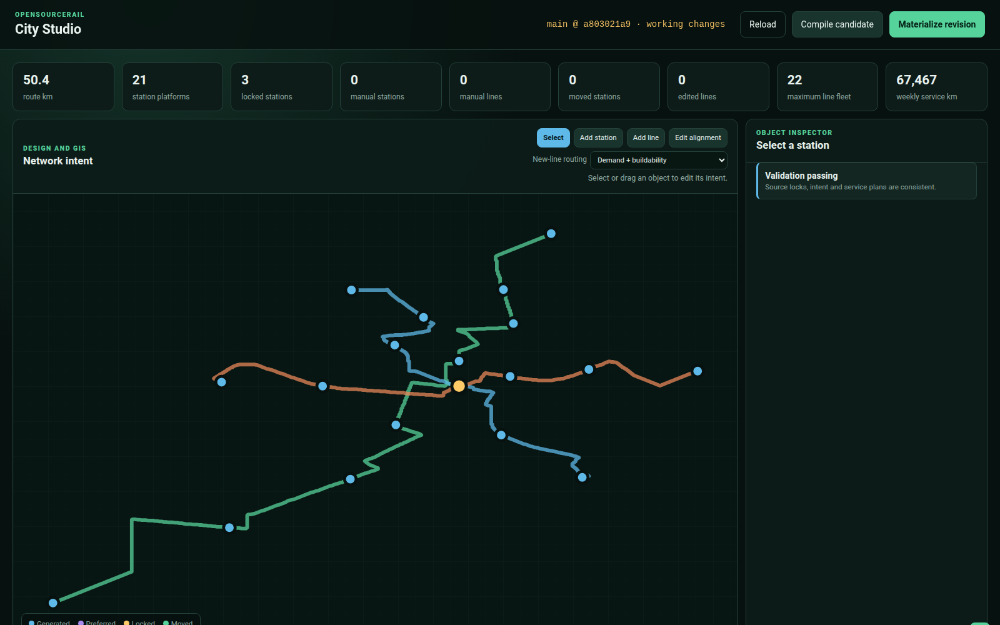
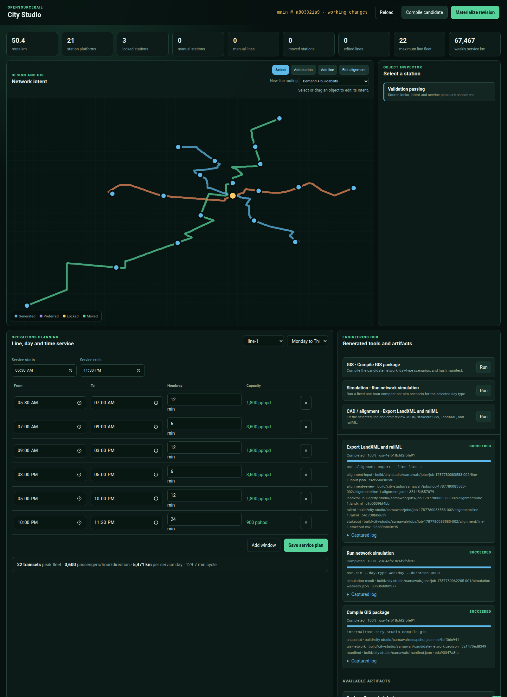
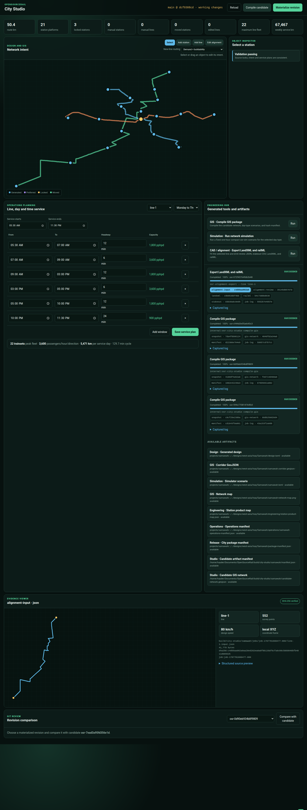
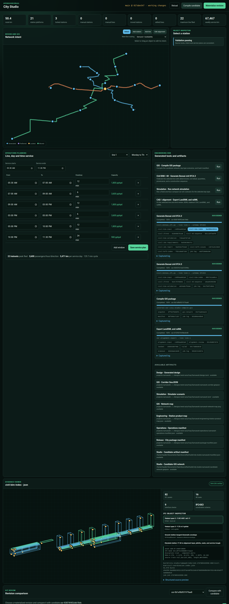
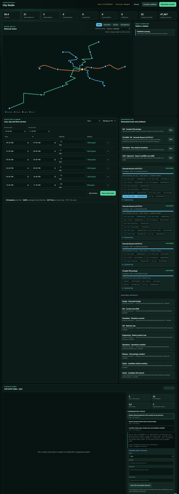

# OSR City Studio

OSR City Studio is the Git-backed design and service-planning interface for
OpenSourceRail. The initial vertical slice loads Samawah, displays its
geographic corridors and stations, records station locks or movements,
configures service by line/day/time, calculates fleet and capacity screens,
compiles a deterministic candidate, and materializes a revision for GitHub
review.

The controlling design decision is
[RFC 0031](../rfcs/0031-city-studio-git-revisions.md).

## Interface

## Run

From the repository root:

    cargo run -p osr-city-studio -- serve

Open http://127.0.0.1:8090/.

Use another project or port with:

    cargo run -p osr-city-studio -- \
      --project projects/samawah serve --port 8091

The server binds only to localhost by default. The initial interface has no
authentication and must not be exposed as a shared or public service.

## Command line

Validate source locks, station intent, calendars, and all line/day plans:

    cargo run -p osr-city-studio -- validate

Write a deterministic working snapshot under build/city-studio/samawah/:

    cargo run -p osr-city-studio -- compile

Write projects/samawah/revisions/osr-<hash>.json:

    cargo run -p osr-city-studio -- revision

Inspect the branch, parent commit, and uncommitted paths:

    cargo run -p osr-city-studio -- git-status

List immutable project revisions or compare one with the working candidate:

    cargo run -p osr-city-studio -- revisions
    cargo run -p osr-city-studio -- compare osr-1f41358e43a86600

Validate every committed city project:

    python3 scripts/validate-city-projects.py

## Revision workflow

1. Create a branch.
2. Use the Studio to edit station intent and service plans.
3. Compile and resolve every validation error.
4. Materialize a revision.
5. Review the Git diff, including semantic changes in the revision JSON.
6. Commit the project inputs and revision together.
7. Push and open a GitHub pull request.
8. After approval and merge, create the suggested protected or signed tag.

Materializing a revision does not run git add, commit, push, or contact GitHub.
Remote repository changes always remain an explicit user action.

## Current editing scope

Implemented:

- source hash locks;
- stable station ids;
- generated/preferred/locked/retired station intent;
- drag-to-move stations;
- click-to-create manual stations with stable content-derived ids;
- manual station naming, archetypes, movement, and retirement;
- two-click manual line creation with stable endpoint-derived ids;
- automatic terminal platforms and day-type service plans for new lines;
- coordinated manual-line naming, alignment editing, and retirement;
- selectable source-locked demand/buildability routing or explicit direct
  planning chords for new manual lines;
- line-level routing provenance, demand weight, and raster source ids in the
  candidate, GIS export, and immutable revision;
- locked-anchor-aware local corridor regeneration after station movement;
- click-to-create and drag-to-edit alignment control points;
- weekly day-type calendars;
- per-line contiguous time windows and headways;
- indicative cycle, fleet, capacity, daily and weekly service metrics;
- validation findings;
- deterministic candidate and revision hashes;
- in-GUI semantic comparison of station, line, service, and summary changes;
- day-type-specific simulator scenarios and a hash-addressed artifact manifest;
- allowlisted GIS compilation, one-hour simulator, and LandXML/railML alignment
  jobs plus IFC4.3 civil federation with persistent progress, command display,
  captured logs, exit state, and SHA-256 artifact records;
- an integrated evidence viewer for GeoJSON, alignment JSON, LandXML, railML,
  stakeout CSV, civil IFC object indices/raw STEP, simulator JSON, manifests,
  snapshots, and captured logs;
- visibility of existing GIS, engineering, simulation, operations, and release
  artifacts.

Next:

- native 3D IFC geometry streaming, new BCF topic authoring, and IDS editing
  (projected IFC object picking, IDS inspection, and controlled BCF status,
  assignment, resolution, and reviewer decisions are implemented);
- demand/OD matrices and platform/interchange capacity;
- project approval records and object-aware Git merge assistance.

## Map authoring

The map has four explicit tools. **Select** inspects and drags existing
objects. **Add station** inserts a manual station where a line is clicked,
assigns a stable id, and opens its name/archetype inspector. **Add line** takes
two endpoints and uses the selected routing strategy. **Demand + buildability**
snaps each endpoint to the nearest feasible cell and runs deterministic
least-cost search over the project's locked planning bundle. **Direct planning
chord** remains an explicit fallback. Both strategies create two terminal
platforms and copy the existing day-type policy into editable service plans.
**Edit alignment** adds a local corridor control point to either generated or
manual lines. Manual station/line additions and retirements
rebuild both the candidate GeoJSON and the station, line, fleet, dispatch, and
ordered topology records in every generated simulator scenario.

The Samawah routing bundle is a committed 100 m planning surface derived from
the pipeline's 20 m cost, demand, and buildability rasters. Every component and
its derivation record is SHA-256 locked. This is appropriate for comparing
planning alternatives, not survey or detailed civil design. Designers can
shape either route strategy further with alignment control points.

The revision comparison panel compares any committed revision JSON with the
current working candidate. It reports object additions, removals, movements,
line length/station-count changes, and service/fleet/capacity deltas before a
new revision is materialized.

## Controlled engineering jobs

The engineering hub exposes four fixed adapters:

- **Compile GIS package** publishes the candidate snapshot, GeoJSON, day-type
  scenarios, and manifest;
- **Run network simulation** executes a fixed one-hour compact `osr-sim` run
  for the selected day type and rejects invariant violations;
- **Export LandXML and railML** converts the selected candidate line to local
  engineering coordinates and runs `osr-alignment-export`, producing review
  JSON, stakeout CSV, LandXML, and railML;
- **Generate Bonsai civil IFC4.3** combines the selected immutable line
  reference with the checked civil kit and produces native IFC4.3 objects,
  quantities, provenance, an object index, linked 4D construction tasks, a
  three-specification IDS 1.0 audit, and a BCF 3.0 package of open release
  issues with IFC GUID selections. OSR remains the alignment/geometry
  authority; Bonsai is the downstream federation and detail-review environment.

Jobs serialize through one engineering slot. Their records, immutable evidence
copies, and full logs live
under `build/city-studio/<slug>/jobs/<job-id>/`; the browser displays status,
progress, the effective command, a bounded log tail, and every output hash.
Project edits serialize against the running job, and a queued job fails if its
recorded revision has become stale. Interrupted records are marked failed when
the server restarts. Adapter ids, arguments, durations, and binaries are
allowlisted in Rust—the API never accepts an executable name or arbitrary shell
text.

Artifact buttons open the evidence viewer. Before returning content, the server
canonicalizes the path beneath the City Studio build root, enforces a 4 MB
preview limit, rejects unknown formats, and recalculates SHA-256. GeoJSON and
alignment/stakeout geometry and isometric IFC object envelopes are plotted
directly. Individual civil objects expose their stable ID, IFC GUID, class,
discipline, bounds, detail mode, and source. IDS specifications and BCF topics
have selectable audit/issue cards; IFC STEP, IDS XML, BCF containers, and JSON
also receive format-specific metrics and a bounded structured-source preview.

BCF review decisions are written to
`projects/<slug>/coordination/issues.toml`, not into the selected job artifact.
Open and in-progress issues may be assigned without closure evidence. Resolved
or closed issues require a substantive resolution and reviewer. The project
compiler includes those decisions in its content hash and revision comparison;
rerunning **Generate Bonsai civil IFC4.3** creates the new immutable BCF state.

See the [Bonsai/IFC4.3 civil workflow](../civil/bonsai-ifc-workflow.md) for the
engineering authority boundary, standalone generator, Blender review scene,
and construction animation.
