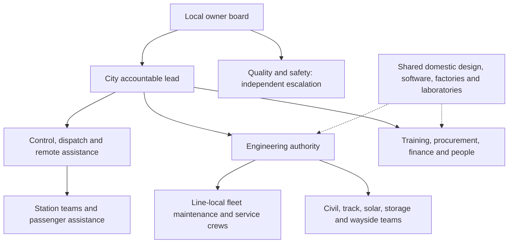

# City workforce, design refinements and remaining development

The [city index](../engineering/analysis/city-delivery-index.md) links each city's
organisation, workforce spreadsheet, construction work profile and mechanical/civil
refinement package. These are generated software outputs, tied by hashes to finance,
operations work orders, soil inputs and shared design templates. The local team can
combine functions where competence and shift cover permit; the template does not
require a separate organisation department for each function.

## Organisation and workers

The [workforce template](../lib/templates/workforce.toml) replaces obsolete
per-train driver hiring with 21 functions for GoA 4 operations: control and remote
assistance, platform accessibility, passenger service and cleaning, mechanical and
battery maintenance, civil/track, solar/storage, wayside systems, management,
assurance, training, procurement and people/finance administration. Each has a
reporting line, skills, tasks and practical competence evidence.

The generator splits the **existing** driverless financial model's six labour
groups using explicit weights, function minima and largest-remainder integer
allocation with stable role-ID tie breaking. Total FTE and annual labour cost
remain equal to the existing model. The single city-director function receives
one FTE; quality/safety has independent escalation to the owner board. Shares are
editable planning choices, not locally measured workload. Existing country-income
labour allowances remain visible; no new imported salary schedule is introduced.

The deployment register now tracks a separate workforce-duty/workload gate. It
requires a duty/leave roster, local employment/rest inputs and measured workloads,
especially simultaneous train service arrivals. The planned 12-minute turnaround
does not demonstrate that a particular cleaning crew can complete its work.
The new cleaning calculation accepts measured area, productivity, cycles and setup
time and returns person-hours. Canopy area is not substituted for floor area.

Construction work-centre profiles come from the current dated manufacturing and
civil work orders. Inclusive start/finish events calculate concurrency and
resource-days. Missing crew counts stay unknown; a scheduled task slot is not a
worker. Skills and package IDs identify exactly which crew definitions must be
completed. National rolling-stock factories, design/software and specialist
laboratories are shared domestic capabilities; their teams are not repeatedly
added to every city's permanent operating headcount. Temporary works and operating
staff are reported separately because their programmes overlap differently.

## Joints and civil interfaces

Every elevated segment receives its own semi-continuous unit and interface count.
Separate elevated fragments are never joined across an at-grade gap. The current
25 m / four-span catalogue planning arrangement supplies bearing/link-slab counts;
short fragments use their actual rounded planned unit length for movement checks.
These quantities do not locate surveyed pier foundations.

The city report computes free thermal movement using its climate preset and
explicit design overrides, including a cold-side case where a lower extreme is
available. The 8/10/12 µstrain/K expansion coefficients are declared sensitivity
cases, not measured properties. Annual mean ambient is a comparison reference,
not erection temperature. Solar-heated material temperatures, gradients,
shrinkage/creep, restraint, seismic movement and rail interaction remain required.
FHWA specifically recommends measuring concrete CTE instead of accepting generic
literature defaults. [FHWA concrete CTE guidance](https://www.fhwa.dot.gov/pavement/concrete/coefficient.cfm).

The reusable [interface calculations](../engineering/analysis/detail_checks.py)
also calculate worst-case seal compression from thickness/land tolerances and
fastener preload bounds from torque tolerance and measured nut-factor bounds.
For example, a purely illustrative 10 ±1 mm seal in an 8 ±1 mm land gives
0–36.36% compression. This exposes loss of compression margin; it does not qualify
that seal. A numeric torque requires actual joint loads, proof strength, thread and
bearing checks, lubrication/finish testing and preload-loss evidence. NASA's
public fastener manual provides background on these dependencies; it is a public
engineering reference, not a rail-specific acceptance standard or software.
[NASA Fastener Design Manual](https://ntrs.nasa.gov/api/citations/19900009424/downloads/19900009424.pdf).

Mapped soil inputs remain location-specific investigation priorities. Fine-soil,
organic, granular, moisture and acidic-soil flags identify tests and inspection
needs. They do not establish foundation capacity or chloride/sulfate corrosion
exposure. See the [soil methodology](city-deployment-evidence.md).

## Paints, finishes and cleaning

The shared [finish system](../design/component-catalogue/catalog/buildable-trainset/exterior-finish-system.md)
and [joint schedule](../design/component-catalogue/catalog/buildable-trainset/joint-control-schedule.md)
remain the controlled reference. Steel preparation/primer/stripe/topcoat, GFRP
gelcoat or qualified paint, and optional livery film require substrate-specific
qualification. Mask bond lands, seals, drains, inspection marks and active PV.
Dry-film thickness, cure windows and wash pressures follow the qualified product
and interface; no universal figure is assigned to all products or climates.
Radiative roof paint remains a trial with no assumed operating energy benefit.

Four new maintenance work packages expand onto actual trainsets, civil/station
assets and energy sites: finish/seal/joint defects, controlled vehicle washing,
civil joint/drain/finish checks and PV-soiling cleaning. They specify condition or
event triggers, owners and work-order evidence. Joint openings are recorded with
component temperature. Cleaning trials cover EPDM, gelcoat, paint, film, glazing,
connectors and PV; they record person-minutes, water, recovery and effluent handling.
PV cleaning is driven by measured soiling and safe access while preserving station
storage/top-up availability. Cleaning can itself abrade PV surfaces, which is why
material trials and before/after normalised yield matter.
[NREL soiling and cleaning research](https://www.nrel.gov/news/features/2021/scientists-studying-solar-try-solving-a-dusty-problem.html).

## Additional operating evidence

Two-day station/depot replay now includes Soroti, Sheikhupura, Sumbawanga and Tartus,
alongside the existing five cities. Soroti and Sheikhupura also received nominal
full-service and eight disruption cases each. Initial validation exposed missing
explicit component configuration in their old scenario files. The shared
rolling-stock configuration was restored and both complete validations rerun;
the service/SoC acceptance floors were unchanged.

All nine retained two-day candidates pass. The two additional full validations
pass, including all sixteen added disruption cases. These runs test software
under specified loads and weather; they do not supply a final duty roster,
physical stabling geometry or seasonal solar/storage endurance. The
[deployment index](../engineering/analysis/deployment-summary.md) remains the
current source of city-by-city open gates and stale evidence.

| New two-day replay | Trainsets | Minimum train SoC | Result |
|---|---:|---:|---|
| Soroti | 23 | 90.011% | Pass |
| Sheikhupura | 37 | 56.114% | Pass |
| Sumbawanga | 40 | 86.781% | Pass |
| Tartus | 60 | 83.757% | Pass |

The full disruption runs have different initial placement and fault conditions
from the two-day candidates. Soroti's lowest disruption SoC was 57.406%;
Sheikhupura's was 20.0048%, very close to the protected 20% floor. Sheikhupura
completed 95.09% of scheduled train-km during its ten-hour all-site grid-outage
case. This demonstrates the configured protective behaviour, with little energy
margin in that case; it does not establish weather or seasonal robustness or
justify an assumed grid upgrade. Site PV/storage replenishment and real charging
duty remain the next energy evidence to resolve.

## Remaining gaps and resources that can help

Each next artifact below addresses a real missing input or analysis. Existing
integrations are extended before adding another dependency. None requires
interline depot links, per-train drivers or a grid-led traction architecture.

| Gap | Available open resource | Existing OSR starting point | Next useful artifact and inputs |
|---|---|---|---|
| Named shift/leave cover and simultaneous cleaning/inspection workload | [OR-Tools scheduling](https://developers.google.com/optimization/scheduling/employee_scheduling) | City role spreadsheet and dated work orders | Feasible local roster with skills, shift limits, leave and measured task person-minutes; solver used offline, core dispatch remains deterministic |
| Unsized construction crews and shared factory bottlenecks | [OR-Tools scheduling](https://developers.google.com/optimization/scheduling/employee_scheduling) | Manufacturing work-centre concurrency and production plans | Named crew mixes, observed cycle times and cross-city factory order schedule; staffing and cashflow reconciliation |
| Joint contact, fatigue and assembly tolerance release | [FreeCAD FEM / CalculiX](https://freecad.github.io/Website/news/getting-started-with-fem/) | Buildable joint schedule, CAD and CalculiX thermal benchmark | Load-bound joint models with friction/preload sensitivity, mesh convergence and coupon correlation; supplier material/contact data required |
| Soil/foundation flexibility, seismic restraint and rail interaction | [OpenSees](https://opensees.github.io/OpenSeesDocumentation/) and [soilDB](https://github.com/openlandmap/soildb) | Structural screening and route-specific soil investigation plans | Route support models using received stratigraphy, groundwater, stiffness, loads and hazard inputs; maps guide investigation, not strength selection |
| Storm drainage, flood level and wash-water routing | [EPA SWMM](https://www.epa.gov/water-research/storm-water-management-model-swmm) | Retained SWMM runoff benchmark and civil readiness manifests | Surveyed catchment/outfall model with local rainfall, blockage and receiving-water scenarios; water quality/disposal evidence separate |
| Adverse-weather station PV/storage replenishment | [pvlib](https://pvlib-python.readthedocs.io/en/stable/) | Existing pvlib/microgrid screening and site controllers | Multi-day/year site PV plus train top-up duty with weather, shading, losses, soiling and storage ageing; quantify explicitly declared residual backup duty |
| Finish areas, replaceable-part quantities and asset handover | [IfcOpenShell](https://docs.ifcopenshell.org/) | Buildable station/trainset catalogues, IFC work and operations asset IDs | Measured surface/cleaning quantities linked to module IDs, substrates, finish batches and work orders; verify exclusions and openings |
| Conflict-aware passenger and service recovery acceptance | Existing [SUMO](https://sumo.dlr.de/docs/) and [JuPedSim](https://www.jupedsim.org/) | City journey-time comparisons, native replay and station-corridor benchmark | Route/station-specific conflicts, arrivals, accessible evacuation and incident cases with explicit demand and geometry; refresh stale full-service reports |

Actual corrosion exposure, material qualification, cleaning compatibility and
worker competence still require local observations and trials. Open software can
process these records; it cannot supply them. The repository now identifies the
responsible function and concrete missing evidence instead of treating a generated
document as completion.

## Reproduction

Run the normal city regeneration pipeline, or refresh finance and operations,
then run `engineering/analysis/city_delivery.py --all` and
`engineering/analysis/city_deployment.py --all`. The package manifest checks the
new report's source hashes. Existing operator receipts are preserved.
