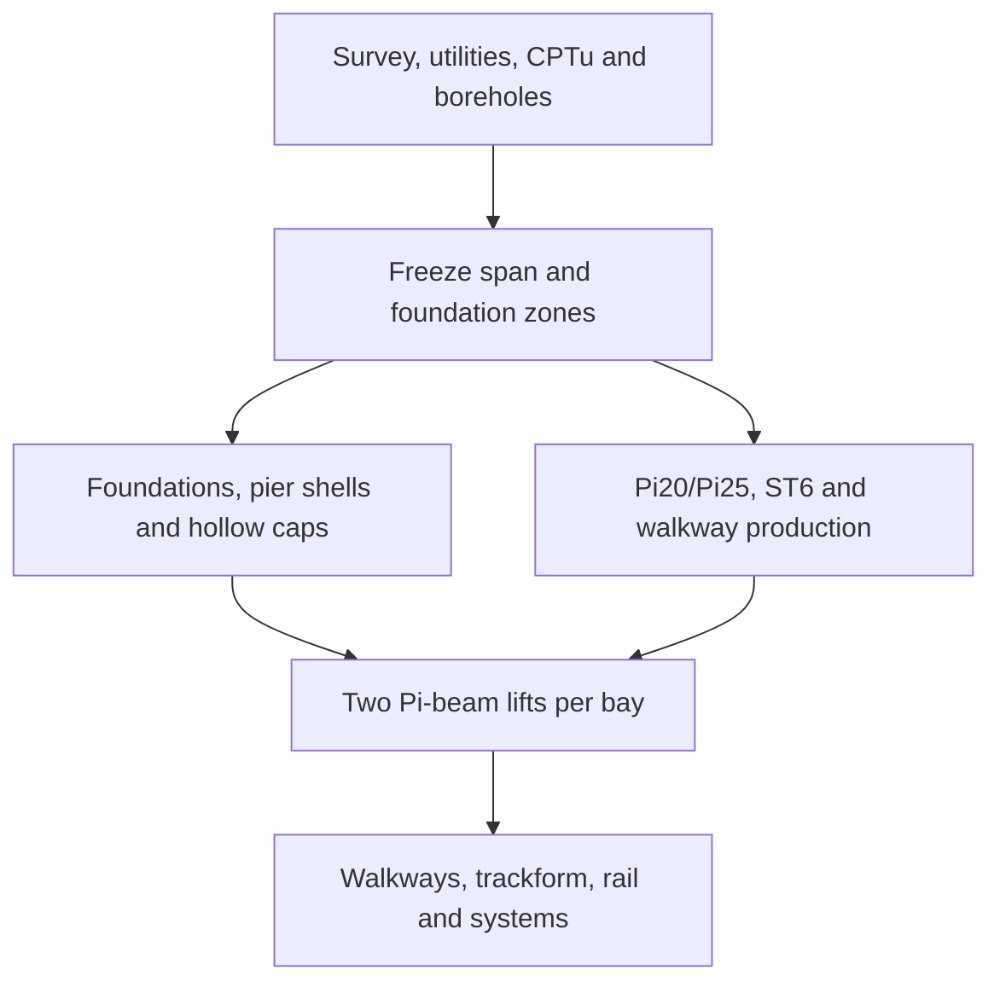

# Foundation And Civil Production System

Status: deterministic planning and release-control model; not a geotechnical
or structural design.

## Foundation selection

`lib/templates/foundation-catalog.toml` standardises the pier-to-foundation
interface and selection logic, not one universal footing. The deterministic
selector uses ground/access classes:

| Condition | Catalogue interface |
|---|---|
| Dense gravel, rock, strong cemented soil | Shallow spread footing with column socket |
| Urban alluvium or vibration restriction | Integral bored shaft |
| Uniform soft ground with clear access | Cap-free driven prestressed pile bent |
| Weak/liquefiable ground or high lateral load | Project-specific pile group and thin cap shell |
| Viaduct end or low embankment | Reinforced-soil abutment where validated |

Ground-supported at-grade and embankment zones use a separate product set:
rigid-inclusion load-transfer platforms, deep soil mixing, stone columns where
settlement permits, lightweight fill, or lime/cement formation stabilisation.
Each zone records treated geometry and verification rather than assuming
"foundation concrete per kilometre".

Deep foundations have no default pile or shaft length. Quantity and cost calls
fail until an actual project length is supplied. Each support record carries
the type, element count and length, concrete/rebar quantity, installation time,
test result and installed cost. A representative shaft or pile is load-tested
in every geotechnical zone before production piling.
`foundation_installed_record()` validates and emits this auditable per-support
record; deep-foundation records cannot be created through the quantity path
without their actual installed length.

## Resource-driven production

`osr_mech.civil.construction` calculates line programmes from route geometry:

- elevated bays = `ceil(elevated metres / selected 20 m or 25 m span)`;
- beams = `2 × elevated bays`;
- foundations = `bays + 1`;
- slipformed metres = open at-grade metres not tagged as constrained;
- ST6 panels = `2 × ceil(constrained at-grade metres / 6 m)`;
- beam days = mould cycles required × cure cycle;
- foundation, erection and panel days = quantity ÷ active resource rate;
- the elevated critical path includes a 10–15 bay foundation/beam buffer.

The controls live in `lib/templates/manufacturing-schedule.toml`. Operators can
change moulds, curing cycle, piling rigs, foundation rate, launcher count,
bay rate, panel gantries, panel rate and working calendar. Generated operations
data publishes the calculated plan separately for every line and records the
equation behind every track-section duration.

## Production and erection flow

The primary plant is one long-line Pi20/Pi25 prestressing bed with movable stop
ends, two initial beam moulds, adjustable column/cap-shell forms, small ST6 and
walkway moulds, cage jigs, dimensional survey and concrete maturity control.
The reference launcher target is one complete double-track bay per gantry per
shift after learning. These are planning assumptions until supplier and first-
article evidence release them. A 24-hour mould cycle is the maturity-controlled
target; the planning schedule stays at the validated 48-hour cycle until the
mix, sensor and production trial releases the shorter cycle.

## Cost boundary

The elevated target remains 12 million USD per route-km. It is not reduced by
the planning redesign. The combined construction-system changes carry only an
unvalidated 15–30% saving target. A project estimate still requires the supplier-designed
section, actual foundation schedule, local installed rates, erection study,
utilities/access, risk, independent checking and contingency.
