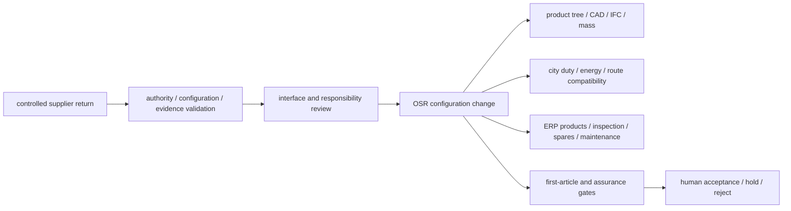

# Supplier Technical-Support Package

## Purpose

This package converts a potentially useful supplier discussion into controlled
engineering work for the LM3. It is designed for RailMac/SinoMac, a directly
authorised manufacturer, another qualified supplier, an independent engineering
house, or a combination. It does not assume that any named organisation has
committed support.

The desired outcome is not a general endorsement. It is a configuration-specific
set of reviewed requirements, component selections, interface decisions,
production information, first-article evidence, quotations and local-capability
demonstrations that can update OpenSourceRail's existing source-of-truth records.

Use the machine-checked
[supplier technical-support readiness record](supplier-technical-support-readiness.md)
to control the engagement. The public template is deliberately unfilled; copy it
to a controlled opportunity workspace for legal names, confidential drawings,
prices, signatures and test records.

The [coordinated industrialisation programme](../../engineering/industrialisation/README.md)
links vehicle interfaces, staged bogie localisation and the viaduct production
chain. Its [possible vendor register](../../engineering/industrialisation/vendor-candidates.json)
adds official-source component and equipment leads, including HÜBNER and CRRC
as proposed partners. These candidates use this same configuration-specific
engagement process; a public product listing does not select a part or grant
manufacturing rights.

## What The Public Information Establishes

[RailMac's current site](https://rail-mac.com/) describes a SinoMac railway
offering spanning pre-design, component selection and supply, installation,
commissioning and after-sales support. It also presents train, traction, battery,
bogie, brake, component and maintenance-equipment categories. The
[tourism-transport site](https://tourist-train.com/) presents related rail-mounted
vehicles associated with CRRC Special Purpose Equipment.

These are useful catalogue and capability leads. They do not establish:

- the exact legal entity able to contract or make an engineering commitment;
- whether a representative can bind a manufacturer or provide manufacturer
  engineers, drawings, test evidence or warranty;
- which published component or vehicle configuration is current and offered;
- compatibility with LM3 speed, loading, duty, thermal environment, geometry,
  interfaces, local manufacture or unattended operation;
- a price, delivery schedule, customer order or railway acceptance.

The public 1435 sightseeing-train material is therefore a discussion reference,
not an LM3 design input. Any inconsistency between introductory copy and a public
technical table must be resolved by a controlled supplier datasheet, drawing and
signed deviation record.

## Existing OpenSourceRail Inputs

The engagement begins from existing controlled work rather than an empty brief:

| Existing capability | Use in the supplier package |
|---|---|
| [LM3 requirements](../rolling-stock/light-metro-3car/README.md) and [interfaces](../rolling-stock/light-metro-3car/interfaces.md) | Freeze the train envelope, formation, loading, performance intent and system boundaries |
| [120-row product definition](../../design/component-catalogue/catalog/buildable-trainset/README.md) | Map offered products, assemblies, quantities, masses and supplier identities without creating a parallel BOM |
| [Supplier anchors](../../design/component-catalogue/catalog/buildable-trainset/supplier-anchors.md) and [COTS candidates](../../design/component-catalogue/catalog/buildable-trainset/cots-candidates.md) | Issue comparable configuration-specific enquiries and retain alternatives |
| [Mechanical/BIM detail register](../../engineering/models/bim/design-detail-register.md) | Connect supplier datums, loads, keep-outs and evidence to the twelve controlled vehicle interfaces and route gates |
| [First-article execution pack](../../design/component-catalogue/catalog/buildable-trainset/first-article-execution-pack.md) | Reuse the 13 evidence gates, travellers, serialized configuration, calibrated test and independent acceptance route |
| City route and duty models | Reconcile gradients, curves, ambient conditions, timetable, charging, energy reserve and degraded operation against the offered configuration |
| [Lifecycle and ERP model](../lifecycle/README.md) | Load accepted products, documents, inspections, maintenance, spares, competence and changes into owner-held identities |
| [Commercial framework](joint-development-framework.md) | Control authority, funding, IP, manufacturing rights, related-party procurement, localisation and exit |

A supplier return is useful when it closes or changes one of these records through
the normal configuration process. A detached presentation, generic brochure or
unmapped spreadsheet does not become a second engineering baseline.

## Requested Work Packages

### TS-WP-01 — Frozen LM3 System Review

Provide one review basis containing the exact repository commit, LM3 configuration,
train envelope, passenger loading, 90 km/h target, duty cycle, energy architecture,
environment and localisation objective. For every reviewed requirement, return one
of four dispositions:

1. suitable as proposed;
2. suitable with a named change;
3. a different component or engineering approach is required;
4. a test or missing input is required before conclusion.

Each disposition needs an owner, rationale, affected interface, evidence and due
decision. Silence is not acceptance.

### TS-WP-02 — Running Gear And Braking

Return exact, mutually compatible bogie, wheelset, bearing, suspension, brake and
air-supply configurations. Include order codes, controlled drawings, masses,
loads, wheel/rail compatibility, curve and speed envelope, brake allocation,
adhesion and degraded cases, thermal duty, maintenance, RAMS, spares and relevant
test evidence.

The output must name who accepts the assembled system. Individually acceptable
parts do not prove combined braking, axle load, ride, clearance or fatigue
performance.

### TS-WP-03 — Traction, Battery, Charging And Thermal System

Treat motor, gearbox, converter, battery, protection, BMS, cooling, charging and
grid interface as one configuration. Require:

- voltage, current, torque, speed, power and energy envelopes;
- efficiency, loss, derating and thermal maps rather than headline ratings;
- mounting, shaft, cooling, electrical, network and software interfaces;
- short-circuit, selectivity, earthing, isolation and HVIL coordination;
- charge, regeneration, reserve, parked-soak and degraded-cooling behavior;
- fire/propagation, vibration, EMC, ingress, RAMS and maintenance evidence.

Run the returned maps through the existing city duty and energy models before
freezing battery capacity or charging power. A related battery train at 40 km/h
does not validate the 90 km/h LM3 duty.

### TS-WP-04 — Manufacturing And Design For Production

Review chassis, carbody, GFRP modules, equipment attachments, joints, welding and
bonding access, harness/fluid routing, assembly sequence, maintenance access,
lifting, tooling, fixtures, gauges and inspection. Return a production-data gap
schedule that distinguishes:

- editable released CAD and drawings;
- interface drawings and tolerance stacks;
- weld, bond, fastener and material/process specifications;
- NC, flat-pattern, mould, jig and fixture data;
- work instructions, travellers and inspection plans;
- supplier-proprietary information that cannot be published or locally modified.

### TS-WP-05 — First Article And Test Evidence

Define what the first article is: complete train, car, body, bogie, subsystem rig
or staged combination. Price and schedule it separately. Use serialized parts,
accepted travellers, calibrated instruments, raw results, photographs, deviations,
NCR/rework records and named hold-point decisions. The existing first-article
gates remain open until independent reviewers accept their required evidence.

### TS-WP-06 — Local Workshop And Technology Transfer

Audit the intended facility and define which tasks local staff will assemble,
fabricate, inspect, test, diagnose, maintain and eventually engineer. For each
task identify delivered rights, editable information, tooling, metrology, facility
changes, training, supervised practice and independent demonstration.

Measure capability through accepted work, first-pass yield, rework, time, cost and
ability to perform without overseas intervention—not a local-content label alone.

### TS-WP-07 — Maintenance, Spares And Support

Return the serialized parts structure, maintenance and overhaul tasks, limits,
special tools, diagnostic access, consumables, initial spares, repair route,
obsolescence process, warranty response, field-support levels and training. Owner
records must remain usable after an adapter or supplier service is removed.

### TS-WP-08 — Cross-Supplier Integration

Create one signed responsibility matrix and ICD set across wheel/rail, bogie/body,
brake/control, motor/gearbox/wheelset, battery/converter/motor/charger/grid,
thermal/fire/environment, vehicle/platform/evacuation and diagnostics/ERP. Every
open interface receives an owner, due evidence and operating limitation.

## Data Intake Into The Core Platform

The intake process must preserve the supplier document identifier, revision,
configuration, issue purpose, licence/confidentiality, hash, receipt date and
review decision. Public repository changes contain only material that may lawfully
be published; controlled storage retains proprietary originals and signed records.

No supplier data crosses the existing safety or command boundary. ERP and SCADA
may display configuration, health, work and evidence; they do not convert a
supplier statement into train-control authority.

## Cost And Commercial Return

Require separate prices for:

| Cost bucket | Minimum scope statement |
|---|---|
| Non-recurring engineering | Design review, calculations, drawings, configuration, responsibility and project management |
| Tooling and workshop preparation | Jigs, fixtures, moulds, gauges, metrology, installation and facility changes |
| First article | Material, construction, inspection, tests, rework allowance and acceptance support |
| Repeat train | Exact configuration, quantity, Incoterm, production rate, validity and escalation basis |
| Training and transfer | Courses, paired work, documents, editable data, licences and task authorizations |
| Spares and support | Initial stock, special tools, warranty, field response, software and long-term support |
| Logistics and local charges | Packing, freight, insurance, duties, taxes, currency and local handling |
| Acceptance support | Independent review, type evidence, homologation interfaces and commissioning |

Every price lists inclusions and exclusions. Factory-gate repeat price must not be
compared with an all-in railway cost, and equipment sold at full commercial price
must not also be counted as an in-kind equity contribution.

## Decision Sequence

| Gate | Stop/go question |
|---|---|
| TS0 | Is the exact contracting entity authorised, with a verified path to the necessary manufacturer and engineers? |
| TS1 | Is one funded LM3 baseline frozen with duty, environment, scope and schedule? |
| TS2 | Are exact configurations supported by controlled drawings, masses, ratings, limits and evidence? |
| TS3 | Are interfaces and whole-system responsibilities accepted, with deviations controlled? |
| TS4 | Are production data, facility, people, processes, tests, hold points and funding sufficient to authorize a first article? |
| TS5 | Can named local people perform accepted tasks with delivered rights, information, tools and support? |
| TS6 | Do first-article, quality, cost, schedule and customer evidence justify repeat production? |

Passing TS6 still does not grant railway acceptance. Project engineering, safety,
independent assessment, customer acceptance and the relevant national authorities
remain separate.

## First Contact Deliverables

For an initial bounded engagement, issue only the frozen review pack and request:

1. the exact legal and technical delivery chain;
2. named engineering disciplines and available time;
3. a priced TS-WP-01 review plus options for TS-WP-02 to TS-WP-08;
4. the proposed controlled-data exchange and confidentiality route;
5. a sample component/interface return demonstrating the promised document depth;
6. separate NRE, tooling, first-article, repeat, training, spares/support and
   acceptance-support prices;
7. a clear statement of public, customer-controlled and supplier-proprietary
   outputs and local manufacturing/maintenance rights.

This package can be issued to multiple potential partners. Comparison should be
against common requirements and evidence, not the breadth of a marketing
catalogue or the identity of a proposed shareholder.
