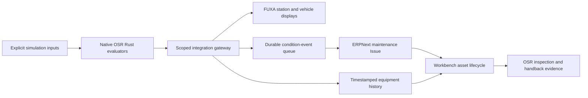

# Native embedded software, ERPNext and FUXA

The operating platform consumes existing Rust controller outputs through a
versioned simulation adapter. It preserves the distinction between controller
state, condition alarms, business maintenance and railway release.



## Implemented mappings

| Native crate | Equipment and output | Operating use |
|---|---|---|
| `osr-energy-site` | Station PV/pad power and input battery SoC | Energy supervision; temperature and lifetime counters remain explicit sensor fixtures |
| `osr-station-scada` | Effective lighting enabled state and station fault count | Bounded simulated lighting requests and station fault maintenance cases |
| `osr-bms` | Vehicle battery SoC, current limit and trip state | Battery supervision and a maintenance case on a sustained trip; no remote contactor/reset command |
| `osr-aux-power` | Comfort-branch availability and fault count | Auxiliary maintenance case; its output gates the HVAC evaluator |
| `osr-hvac` | Compressor/fan demand and reduced mode | Comfort supervision and investigation of unavailable supply |
| `osr-cbm-onboard` | Native health classification, brake remaining fraction and bearing vibration | Sustained Service classification creates one linked ERP Issue per incident |

The [Rust adapter](../../crates/osr-sim/examples/operating_bridge.rs) uses JSON
lines over stdin/stdout and keeps BMS, auxiliary-power and HVAC state per city/site
key. Battery protection therefore propagates to auxiliary/HVAC availability and
fault latches survive successive samples. Input time must increase. Each process
has a bounded key registry; restarting it resets these **simulation** states.
This harness uses explicit small-pack and comfort fixtures, not commissioned
vehicle calibration or actual sensor readings.

A [serialized frame fixture](../../tests/fixtures/operating-bridge.json) records the
normal output contract for adapter tests.

The [Python projection](../../services/integration/osr_integration/embedded.py)
checks `osr-operating-bridge/1`, requires the simulation environment, validates
enums/ranges and converts native integer units (ppt, mA and vibration thousandths)
into engineering units. Missing controller measurements are invalid, never
invented healthy zeroes. The controller process has a reply timeout. Existing
source ownership, monotonic sequence, timestamp, staleness and alarm-persistence
checks remain at the gateway.

Each equipment package names its `source_crates`; Workbench shows them with the
asset. Station/depot templates and rolling-stock templates use existing catalogue
asset IDs, so `SAM-RS-L1-001:vehicle-cbm` retains `SAM-RS-L1-001` as its parent and
OSR source identity. Engineering artifacts are shown only when their reviewed
asset binding matches the equipment or its parent; a station IFC package is not
shown as evidence for a newly added vehicle. No ERP or FUXA record becomes a
train-control authority.

## Reproduce a station and vehicle pilot

First follow [service setup](../../deployment/supervision/README.md), including
ERP project binding and scoped principals. Then:

```bash
./osr supervision prepare samawah --first-site --first-vehicle
./osr supervision prepare mosul --first-site --first-vehicle
# Initial installation: apply each generated package.
./osr supervision apply build/supervision/samawah/simulation/package.json
./osr supervision apply build/supervision/mosul/simulation/package.json
./osr supervision import-fuxa build/supervision/samawah/simulation/package.json build/supervision/mosul/simulation/package.json
./osr supervision simulate
```

For an existing installation, take `./osr supervision backup` and review the
package diff. `apply --expected PREVIOUS_SHA256` requires the previous package
hash and preserves asset identity, history and evidence. Physical mapping changes
remain blocked. FUXA import backs up the previous project before replacing it;
include every package whose displays must remain. Its generated asset links
return to the Workbench in the same browser window.

Without selection flags, preparation expands the templates across applicable
station, depot and rolling-stock assets. `--first-site --first-vehicle` deliberately
limits the local demonstration to eight equipment positions per city. Generic
rules live in [generic.json](../../deployment/supervision/config/generic.json);
city `operations/supervision.json` overrides select sites, project/company and
supplier bindings. No per-city controller fork is needed.

## Condition-to-maintenance acceptance

[verify-embedded.py](../../deployment/supervision/tests/verify-embedded.py) injects
an explicitly simulated Samawah brake-wear condition through the Rust CBM crate.
It checks Service classification, one delivered ERP Issue despite repeated
samples, isolation from Mosul and condition clearance while the Issue stays open.
It restores the previous private simulator fixture file in a `finally` block.
The resulting simulation Issue is retained as audit evidence; the test does not
close maintenance records automatically.

The private simulator control file supports `cooling_fault`, `station_fault`,
`battery_trip`, `aux_fault`, `cbm_service`, `disconnected` and
`local_remote_disabled`, with optional `cities` overrides. These are simulation
fixtures, not public control APIs. BMS trips retain their native latch; removing
a fixture is not a protection-reset command.

The installed [native UI acceptance](../../deployment/workbench/tests/verify-native.mjs)
checks ERP permissions and project filters, FUXA city displays, scoped evidence
recording and a lighting request through controller output. Controller-result
retries are idempotent for the same owner, state and result.

Revised simulation packages retain omitted equipment as retired history while
rejecting its new telemetry and commands; reactivation requires another reviewed
package. Alarm acknowledgments bind to the displayed occurrence and reset when a
cleared condition activates again.

Physical MQTT/OPC UA/Modbus or device-bus adapters, persistent commissioned
controller state, supplier calibration and independent railway acceptance remain
separate deployment work. Existing ATP/interlocking/traction/brake authority is
not routed through ERPNext or FUXA.
