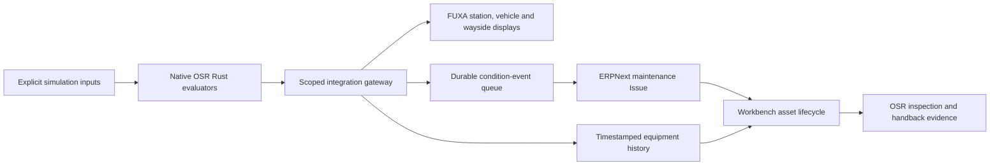

# Native embedded software, ERPNext and FUXA

The operating platform consumes existing Rust controller outputs through a
versioned simulation adapter. It preserves the distinction between controller
state, condition alarms, business maintenance and railway release.



## Implemented mappings

| Native crate | Equipment and output | Operating use |
|---|---|---|
| `osr-energy-site` | Station PV/pad power and input battery SoC | Energy supervision; temperature and lifetime counters remain explicit sensor fixtures |
| `osr-station-scada` | Effective lighting enabled state and station fault count | Bounded simulated lighting requests and station fault maintenance cases |
| `osr-bms` | Vehicle battery SoC, current limit and trip state | Battery supervision and a maintenance case on a sustained trip; no remote contactor/reset command |
| `osr-aux-power` | Comfort-branch availability and fault count | Auxiliary maintenance case; its output gates the HVAC evaluator |
| `osr-hvac` | Compressor/fan demand and reduced mode | Comfort supervision and investigation of unavailable supply |
| `osr-cbm-onboard` | Native health classification, brake remaining fraction and bearing vibration | Sustained Service classification creates one linked ERP Issue per incident |
| `osr-wayside-points` | Fused detected position and motor activity for each catalogue switch identity | A sustained fail-restrictive `Unknown` detection creates a maintenance case; no point command is exposed |
| `osr-level-crossing` | Barrier state, warning and fault state | Ready for identified `level-crossing` assets; no catalogue city currently declares one, so none is fabricated |
| `osr-afc` | Station-level aggregate gate state and grant/denial counters | Passenger-flow visibility from the fare evaluator; it is an aggregate, not an invented count of physical gates |

The [Rust adapter](../../crates/osr-sim/examples/operating_bridge.rs) uses JSON
lines over stdin/stdout and keeps BMS, auxiliary-power, HVAC, point, crossing and
fare-gate state per city/asset key. Battery protection therefore propagates to
auxiliary/HVAC availability, and native controller latches survive successive
samples. Input time must increase. Each process has a bounded key registry;
restarting it resets these **simulation** states. This harness uses explicit
small-pack, comfort, sensor, barrier and token fixtures, not commissioned
calibration, key material or actual sensor readings.

A [serialized frame fixture](../../tests/fixtures/operating-bridge.json) records the
normal output contract for adapter tests.

The [Python projection](../../services/integration/osr_integration/embedded.py)
checks `osr-operating-bridge/2`, requires the simulation environment, validates
enums/ranges and converts native integer units (ppt, mA and vibration thousandths)
into engineering units. Missing controller measurements are invalid, never
invented healthy zeroes. The controller process has a reply timeout. Existing
source ownership, monotonic sequence, timestamp, staleness and alarm-persistence
checks remain at the gateway.

Each equipment package names its `source_crates`; Workbench shows them with the
asset. Station/depot, rolling-stock and wayside templates use existing catalogue
asset IDs, so `SAM-RS-L1-001:vehicle-cbm` retains its vehicle parent and
`SAM-SW-001:points` retains its real switch identity. Selecting a station follows
the asset register's parent links to its switch children. The fare-gate view is
explicitly a station aggregate. Engineering artifacts are shown only when their
reviewed asset binding matches the equipment or its parent. No ERP or FUXA record
becomes train-control authority: point and crossing commands, resets,
`crossing_safe_for_train`, route state and movement authority remain exclusively
in the safety controllers/interlocking and consensus boundary.

## Reproduce a station, vehicle and wayside pilot

First follow [service setup](../../deployment/supervision/README.md), including
ERP project binding and scoped principals. Then:

```bash
./osr supervision prepare samawah --first-site --first-vehicle
./osr supervision prepare mosul --first-site --first-vehicle
# Initial installation: apply each generated package.
./osr supervision apply build/supervision/samawah/simulation/package.json
./osr supervision apply build/supervision/mosul/simulation/package.json
./osr supervision preview-fuxa \
  build/supervision/samawah/simulation/package.json \
  build/supervision/mosul/simulation/package.json \
  --output build/supervision/fuxa-import-review.json
./osr supervision import-fuxa \
  build/supervision/samawah/simulation/package.json \
  build/supervision/mosul/simulation/package.json \
  --review build/supervision/fuxa-import-review.json
./osr supervision simulate
```

For an existing installation, take `./osr supervision backup`, generate the
machine review and apply only that exact proposal:

```bash
./osr supervision review-package build/supervision/samawah/simulation/package.json \
  --output build/supervision/samawah/simulation/change-review.json
./osr supervision apply build/supervision/samawah/simulation/package.json \
  --expected PREVIOUS_SHA256 \
  --review build/supervision/samawah/simulation/change-review.json
```

The review names changes to source crates, measurement units/ranges/scaling,
alarm rules, command bounds/permissives, device bindings and engineering
revision. It also carries the affected installed serials, evidence, open cases
and pending commands. Apply regenerates it under the database write lock, so a
package or lifecycle-record change after review is rejected. Clock regression,
future-clock jumps, replay, wrong units, disconnects, stale data and invalid
values all have adapter/gateway regression coverage. Physical mapping changes
remain blocked. The FUXA preview binds the live project checksum to the desired
project and records included package/revision hashes plus device/view additions,
changes and removals, along with other project-setting changes. Import requires
that unchanged review, then backs up both it
and the previous project before replacement. Include every package whose displays
must remain. Untracked live display edits appear explicitly as replacements or
removals; move wanted changes into a reviewed generator input before import. The
generated asset links return to the Workbench in the same browser window.

Without selection flags, preparation expands the templates across applicable
station, depot, rolling-stock, switch and declared level-crossing assets.
`--first-site --first-vehicle` deliberately limits the Samawah and Mosul local
demonstrations to ten equipment positions each: five station views, four vehicle
views and the first station's real switch. The all-city readiness compile reuses
10,215 stations and 9,097 switches already in the asset registers. No generated
package includes a crossing until its city declares a stable `level-crossing`
asset. Generic rules live in
[generic.json](../../deployment/supervision/config/generic.json); city
`operations/supervision.json` overrides select sites, project/company and
supplier bindings. No per-city controller fork is needed.

## Condition-to-maintenance acceptance

[verify-embedded.py](../../deployment/supervision/tests/verify-embedded.py) injects
explicitly simulated Samawah brake-wear and dual-sensor disagreement conditions
through the Rust CBM and points crates. It checks native Service/Unknown results,
separate deduplicated ERP Issues, isolation from Mosul and condition clearance
while both Issues stay open. It restores the previous private simulator fixture
file in a `finally` block. The simulation Issues remain audit evidence; the test
does not close maintenance records automatically.

The private simulator control file supports `cooling_fault`, `station_fault`,
`battery_trip`, `aux_fault`, `cbm_service`, `points_detection_fault`,
`crossing_motor_fault`, `faregate_denial`, `disconnected` and
`local_remote_disabled`, with optional `cities` overrides. These are simulation
fixtures, not public control APIs. BMS, point and crossing states retain their
native behaviour; removing a fixture is not a protection-reset command.

The installed [native UI acceptance](../../deployment/workbench/tests/verify-native.mjs)
checks ERP permissions and project filters, FUXA city displays, scoped evidence
recording and a lighting request through controller output. Controller-result
retries are idempotent for the same owner, state and result.

Revised simulation packages retain omitted equipment as retired history while
rejecting its new telemetry and commands; reactivation requires another reviewed
package. Alarm acknowledgments bind to the displayed occurrence and reset when a
cleared condition activates again.

Physical MQTT/OPC UA/Modbus or device-bus adapters, persistent commissioned
controller state, supplier calibration and independent railway acceptance remain
separate deployment work. Existing ATP/interlocking/traction/brake authority is
not routed through ERPNext or FUXA.
