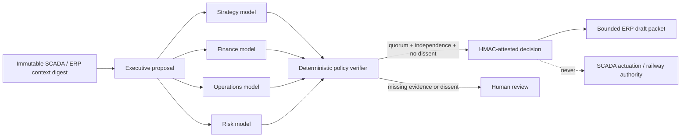

# AI executive council for ERP and supervisory decisions

OpenSourceRail now has an experimental, city-scoped governance contract for an
“AI CEO” and supporting AI finance, operations, maintenance, procurement and
workforce managers. These are **software offices**, not legal persons, company
directors, railway duty holders or substitutes for licensed and accountable
people. Their useful role is to analyse the same evidence, expose reasoning and
prepare routine ERP work at low marginal cost.

Authority does not come from a persuasive model answer. It comes from an
operator-approved delegation policy, independently authenticated model identities,
a deterministic verifier and an operator-held attestation key.



## Why this is more authoritative than “one AI decides”

Each ballot identity is taken from the authenticated service principal, not from
the submitted JSON. One principal and one model identity can cast only one
immutable ballot. The default policy requires four perspectives—strategy,
finance, operations and risk—at least two providers, at least three model
families and a 75% endorsement ratio. Any rejection records visible dissent and
forces human review. Four wrappers around the same model therefore do not satisfy
the independence test.

Every proposal is bound to a transactionally captured operational context:
accepted asset/package state, latest telemetry, alarms and ERP case status,
pending controller commands and pending ERP condition events. The context,
proposal, each ballot, policy and final decision have SHA-256 identities. A
successful terminal decision is signed with the gateway's operator-owned HMAC
key. This proves what the configured council and policy decided; it does **not**
prove that the recommendation is correct.

The gateway deliberately contains no provider client. A deployment must connect
separately secured model runners and give each one an
`executive-model` principal with fixed `model_id`, `model_family`, `provider` and
`perspective` metadata. This prevents a caller from claiming a different model
in its ballot and keeps provider credentials outside the gateway.

The repository now includes a provider-neutral
[`executive-model-runner.py`](../../tools/automation/executive-model-runner.py).
Run one process and one secret set per model identity; do not place all model
tokens in a central “council” process. A runner polls only its configured scopes,
skips proposals it has already voted on, fetches the immutable context, calls one
HTTPS (or loopback HTTP) adapter and posts the result using its own gateway token.
It never receives other ballots, so an earlier answer cannot anchor its analysis.
The gateway checks the runner's expected model/perspective against the
authenticated principal and records hashes of the exact adapter request and raw
response.

A runner configuration contains environment-variable names, never secrets:

```json
{
  "schema": "osr-executive-model-runner/1",
  "gateway_url": "http://127.0.0.1:8092",
  "adapter_url": "https://independent-risk-model.example/evaluate",
  "model_id": "deployment-risk-model-v1",
  "perspective": "risk",
  "gateway_token_env": "OSR_RISK_GATEWAY_TOKEN",
  "adapter_token_env": "OSR_RISK_ADAPTER_TOKEN",
  "cities": ["samawah"],
  "environments": ["simulation"],
  "poll_seconds": 30
}
```

The adapter receives `osr-executive-model-request/1`: the proposal, frozen
operational context, its digest and separately labelled decision rules. All
proposal/context strings are explicitly untrusted data. It must return only:

```json
{
  "schema": "osr-executive-model-response/1",
  "verdict": "endorse",
  "rationale": "Bounded explanation tied to the supplied evidence.",
  "claims": ["One independently checkable claim."]
}
```

Start a single identity with `python tools/automation/executive-model-runner.py
PRIVATE_CONFIG.json`; add `--once` for commissioning checks. The adapter is the
deployment-specific boundary to a local open-source model or hosted provider.
OSR does not assume a provider API, place provider credentials in tracked files,
or silently fall back to another model.

## Delegation constitution

| Result | What the system may do |
|---|---|
| `advisory-endorsed` | Publish a traceable recommendation only. |
| `delegated-erp-draft-authorized` | Place an attested packet in the local ERP-draft handoff queue. It remains unsubmitted. |
| `human-approval-required` | Preserve the recommendation for a named approver; create no action packet. |
| `disputed-human-review-required` | Preserve every ballot and dissent; create no action packet. |
| `insufficient-verification` | Keep collecting ballots; do not seal or act. |
| `expired-unverified` | Seal the expired record without an action packet. |

The code-level allowlist contains only reversible draft preparation:

- draft budget scenarios, maintenance plans, material requests and work orders.

Everything else is outside delegation. In particular, an AI office cannot issue
or relay SCADA commands, movement authority, signalling or safety release;
hire, dismiss, discipline or set compensation; make payments; sign contracts;
submit ERP documents; certify competence; accept engineering; or hand back an
asset. Adding one of these strings to a runtime configuration is rejected because
the configuration allowlist must itself be a subset of the compiled safe list.

This boundary makes the HR-cost proposition testable rather than rhetorical:
measure time removed from evidence collation, draft preparation and routine
coordination while retaining the legally and operationally accountable roles.
Do not book a head-count saving until a pilot has measured review time, error
rates, provider cost, exceptions and required oversight.

## API and records

The authenticated gateway provides:

| Endpoint | Role | Effect |
|---|---|---|
| `POST /executive/proposals` | `executive-secretary` | Validate a proposal and freeze its current city/environment context. |
| `POST /executive/ballots` | `executive-model` | Add one immutable ballot using the model metadata on the principal. |
| `POST /executive/finalize` | `executive-auditor` | Apply the deterministic policy and, for a terminal result, attest and seal it. |
| `GET /executive/decisions` | any scoped principal | List decisions or fetch one by `?id=` with context, ballots, dissent and action packet. |

Workbench → Connected lifecycle includes a read-only **AI executive council**
section for the selected city/environment. It shows quorum and diversity counts,
every attributed ballot and dissent, evidence/decision hashes, attestation key and
signature, the explicit authority boundary, and ERP delivery or rejection state.
The browser receives only the server-side scoped viewer capability and exposes no
secretariat, auditor, model or attestation credential.

`./osr supervision init` creates private secretary/auditor identities, a fresh
attestation key and the default council policy. It does not invent model
identities. Configure real model runners explicitly, for example:

```json
{
  "subject": "council-risk-runner",
  "role": "executive-model",
  "model_id": "deployment-model-id",
  "model_family": "deployment-family",
  "provider": "deployment-provider",
  "perspective": "risk",
  "token": "PRIVATE_RANDOM_TOKEN",
  "cities": ["samawah"],
  "environments": ["simulation"]
}
```

Create and finalize reviewed files without copying credentials into shell
history:

```bash
./osr supervision council-propose proposal.json --output received-proposal.json
# Allow the separately deployed model identities to post their ballots.
./osr supervision council-finalize PROPOSAL_ID --output decision.json
```

The ERP handoff is a durable `executive_actions` queue with bounded retry. The
ERPNext receiver independently recalculates the proposal and decision hashes,
verifies the HMAC against a privately provisioned key ID, confirms the action is
on its own compiled allowlist and checks city/project scope. It then reuses the
existing permission-checked preview/apply adapter to create or return exactly one
native draft. `OSR Executive Decision` retains the packet-to-document mapping.
A lost response is safe to retry. The receiver rejects any post-decision change,
non-draft result or non-allowlisted action and never submits the document.
Native ERP permissions remain a second gate: the integration provisioner does
not grant finance, stock, manufacturing or maintenance manager roles. Operators
must commission least-privilege access for only the enabled draft types and
referenced masters; permission or validation failures are recorded as rejected.

## Operating controls

- Keep the attestation key in the private deployment secret and rotate it with a
  new key ID. A decision retains the key ID used to sign it.
- Keep model providers in distinct security and billing accounts where possible.
  Provider diversity is weak if all providers share one upstream model or prompt.
- Pin model/version and prompt artifacts in each runner's own evidence. The
  gateway authenticates the configured identity but does not remotely attest a
  provider binary.
- Treat SCADA text, alarms, work descriptions and attachments as untrusted input.
  Model runners should isolate retrieved content from system instructions.
- Review abstentions and dissent. Do not retry models until a preferred answer
  appears; proposals and ballots are immutable, so a changed case needs a new ID.
- Monitor correlated recommendations, drift, missing perspectives, stale
  proposals, provider outages and the ratio of drafts rejected by humans.
- Back up the gateway database with the existing supervision backup. Council
  proposals, contexts, ballots, decisions, actions and audit events are included.

The approach aims for transparent institutional memory and lower administrative
cost, not the fiction that management accountability can be outsourced to a
language model.
