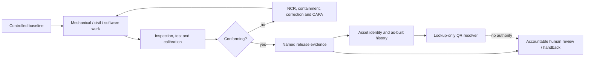

# Lifecycle governance, ERP/HR administration and QR identity

OpenSourceRail uses one evidence-routing template across mechanical production,
stations, civil construction, Rust releases, asset maintenance and management
operations. The tracked source is
[`lifecycle-governance.json`](../../deployment/erpnext/config/lifecycle-governance.json);
the generated [subsystem control register](../../engineering/assurance/subsystem-control-register.md)
shows which controls apply to every defined subsystem item.

The template does not appoint directors, employ people, release designs, accept
construction, certify competence or authorize railway operation. It prepares a
consistent record structure so the accountable operator can do those things in
its legal, contractual and regulatory context.

## Control chain



Configuration, measurement, competence, nonconformance and release evidence are
separate records. A status in one cannot silently stand in for another. In
particular, training attendance is not competence authorization, a passed
inspection is not engineering release, ERP submission is not railway handback,
and a QR scan is not permission to work.

## ERP and HR administration templates

| Template | Native ERPNext/Frappe HR records | Required additional control |
|---|---|---|
| Employee and role administration | Employee, user/role permissions, department and employment records | Verify real identity, contract, organization scope and local employment/privacy requirements; personal data stays out of Git. |
| Training and competence | Training Program, Training Event, Training Result | Record the role/scope assessment, fitness prerequisite, accountable authorizer, validity, expiry and suspension separately from attendance. |
| Shift and handover | Shift Assignment, Employee Checkin, Issue and Task | Record incoming/outgoing leads, open permits, isolations, alarms, degraded modes and explicit acceptance; live control remains elsewhere. |
| Quality inspection | Quality Inspection, Quality Inspection Template and Job Card | Bind requirement revision, method, instruments, results, inspector, verifier and disposition to a named release gate. |
| Calibration | Asset, Asset Maintenance and certificate attachment | Record range, accuracy, traceability basis, status and due date; an overdue or failed instrument invalidates dependent evidence until reviewed. |
| Nonconformance and CAPA | Quality Inspection, Issue and Task | Preserve affected IDs, containment, root cause, correction, corrective action, effectiveness review and concession authority. |
| Configuration baseline | Project, Document and Task | Freeze scope, revision, source hashes, distribution, approval evidence and supersession without claiming technical adequacy. |
| Management review | Project, Meeting, Issue and Task | Freeze objectives, performance, audits, risks/opportunities, resources, decisions, owners and due dates. |

The mappings follow native product behavior rather than creating parallel shadow
ledgers. [Frappe HR Training Events](https://docs.frappe.io/hr/training-event)
record attendance and results, while OSR deliberately keeps the railway
authorization decision separate. [ERPNext Quality Inspection](https://docs.frappe.io/erpnext/user/manual/en/quality-inspection)
provides incoming, in-process and outgoing inspection records, with engineering
release retained as an independent gate.

## Roles and management operation

The generic template defines accountable executive, design authority, quality,
configuration, asset, operations, maintenance, competence, safety assurance,
software security and data-steward roles. A deployment maps these functions to
named people and may combine roles only after checking independence, conflicts
and applicable rules. The tracked template never invents a person or approval.

Four maximum review intervals establish an operating rhythm:

| Cadence | Maximum interval | Minimum focus |
|---|---:|---|
| Shift | 1 day | Handover, alarms, isolations, service state and staffing. |
| Weekly | 7 days | Safety, service, maintenance, quality, materials and workforce actions. |
| Monthly | 31 days | Objectives, asset condition, cost, schedule, risk, competence and suppliers. |
| Quarterly | 92 days | Audit, performance, risk/opportunity, data quality, security and improvement. |

Each review records inputs, decisions, owners, resources and effectiveness. The
structure reflects the lifecycle and management-review emphasis of
[ISO 55001:2024](https://committee.iso.org/sites/tc251/home/projects/published/iso-55001.html),
the quality-management and documented-information requirements in
[ISO 9001:2026](https://www.iso.org/standard/9001),
and the project/quality controls in the
[FTA Quality Management System Guidelines](https://www.transit.dot.gov/funding/grant-programs/capital-investments/quality-management-system-guidelines).
Using those sources as a template basis is not ISO certification, contractual
conformity or regulatory acceptance.

## Mechanical, station and civil workflows

Mechanical work moves from released baseline through receipt, calibrated-tool
checks, manufacture, in-process inspection, NCR review, final inspection and
serialized as-built evidence. Material traceability, calibration status,
datum/interface acceptance and independent release are explicit hold points.

Civil work moves through released design, survey set-out, ground/material
acceptance, temporary works, construction, inspection/test, as-built survey and
asset handover. Current permits/design, accepted survey control, witnessed
concealed work and closed as-built/punch-list evidence are hold points. Open DEM,
OSM water and planning IFC are never substituted for project survey,
geotechnical, hydraulic, temporary-works or construction evidence.

The register currently covers 146 LM3 products/assemblies, seven station
variants and 19 reusable civil types. All remain `evidence-open-not-released`;
the register routes the required closure records without pretending that a
physical item exists or is accepted.

## Rust release workflow

Every workspace crate receives a software-release control record. The minimum
route is requirements and threat/hazard review, implementation, peer review,
automated verification, dependency review, reproducible build, signed release
and a separate deployment approval. The evidence list includes locked source and
toolchain, all-feature tests and Clippy, vulnerability disposition, artifact
provenance and the crate's authority boundary.

This adapts the [NIST Secure Software Development Framework](https://csrc.nist.gov/pubs/sp/800/218/final)
to repository evidence. Passing software checks demonstrates the reviewed build;
it cannot certify or commission railway use. `osr-supervision-contract` remains
observation-only, while `osr-lifecycle-identity` is lookup-only.

## QR and physical-asset identity

The canonical identity contains only:

```json
{
  "schema": "osr-asset-identity/1",
  "city": "samawah",
  "asset_id": "SAM-ST-001",
  "engineering_revision": "rev:abc123",
  "resolver_path": "/id/osr/samawah/asset/SAM-ST-001",
  "authority": "lookup-only"
}
```

No personal data, credential, token, password, command, movement authority or
approval may appear in the record or QR payload. The payload is generated only
after deployment supplies a bounded HTTPS origin. The tracked repository has no
resolver and therefore produces zero printable labels.

Deployment sequence:

1. The operator establishes the asset register, retention policy and stable ID.
2. It provisions an HTTPS resolver with access control, monitoring, backup and
   an offline/stale-state presentation rule.
3. An authorized person binds the identifier to one physical asset, records its
   class/revision/location and verifies the applied label.
4. A second check confirms the scan resolves to that asset and makes no current
   release, isolation or safety claim.
5. Replacement retains the supersession history and binds a replacement
   identity; labels are never casually re-used.

The URI pattern follows the resolver principle in
[GS1 Digital Link](https://www.gs1.org/standards/gs1-digital-link). An operator
may map a properly licensed and governed GS1 GIAI, but OSR internal IDs must not
be presented as GS1 identifiers. For IFC, the stable operator identity is kept
distinct from an IFC instance identifier, consistent with buildingSMART's
[AssetIdentifier definition](https://standards.buildingsmart.org/IFC/RELEASE/IFC4_3/HTML/property/AssetIdentifier.htm).

## AI management relationship

The [AI executive council](ai-executive-council.md) may collate this evidence and
prepare an allowlisted, attested ERP draft after independent multi-model review.
It cannot fill human names, attest competence, close a hold point, approve a
baseline, accept an NCR concession, release a product, print a QR label, hire or
dismiss, submit a transaction, pay, contract, operate SCADA or command a train.
Management accountability stays with the deployment's named officers.

## Compile and verify

```bash
python3 engineering/subsystem_control_register.py
./osr readiness
./osr test
```

`./osr readiness` compiles a deterministic governance package for every city and
every tracked asset identity. `./osr test` checks the generated register and
all-city source digest, exercises Python/Rust parity and tests authority,
resolver, tampering, duplicate and fail-closed cases.
