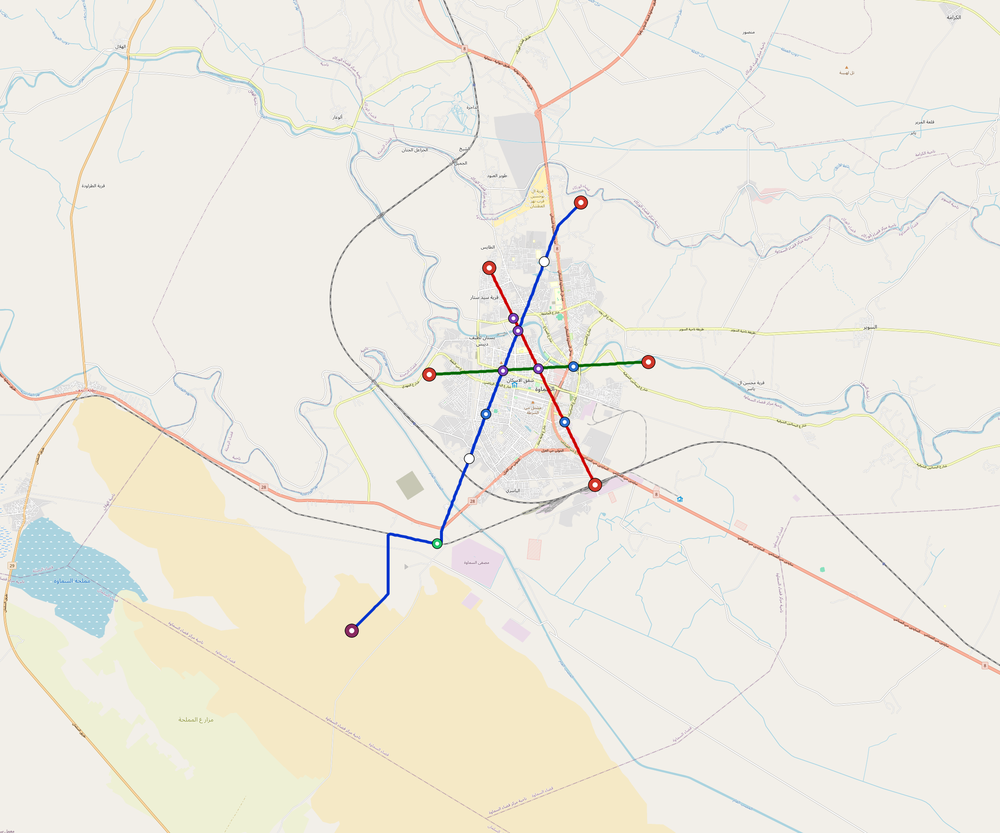

# RFC 0003 — Samawah Current Reference Deployment

**Status:** Controlled planning example; construction and operating releases remain open.
<!-- GENERATED CURRENT REFERENCE: 9e7f562e362f5fe75a90830bdd200f28f48afafde021a92b73006ad64d8487f4 -->

Regenerate with `python3 tools/automation/generate-reference-city-rfc.py`. The city design and scenario are the controlled inputs; this RFC reports their current quantities. [Earlier planning figures and brownfield observations](../reference/history/samawah-pre-core-planning.md) remain explicitly historical.

## 1. Purpose

Samawah is an Iraqi reference instance of the shared deployment model. Its retained catalogue population is 373,770; the population and income proxies are planning inputs. The example uses the same geometry, energy, fleet, staffing and factory rules as other catalogue cities. Baghdad retains its own funding programme; its government share, Chinese USD credit and IQD bond structure are not applied to Samawah.

[Current city summary](../../cities/catalogue/west-asia/Iraq/Samawah/README.md) · [Controlled design](../../cities/catalogue/west-asia/Iraq/Samawah/design.toml) · [Scenario](../../cities/catalogue/west-asia/Iraq/Samawah/samawah.toml)

## 2. Existing assets and local investigation

The earlier railway-yard and workshop observations are candidates for a site census, tooling audit, ownership/access review and material testing. They do not establish usable capacity, recovered-component acceptance or a capital saving. Any brownfield proposal must close the releases in [RFC 0027](0027-brownfield-pilot-asset-recovery.md). The current full-fleet depot requirement is retained until a verified site alternative replaces it.

## 3. Current generated network

### 3.1 Lines

| Line | Route km | Platform records | Total trainsets |
|---|---:|---:|---:|
| line-1 | 22.737 | 8 | 70 |
| line-2 | 10.481 | 5 | 34 |
| line-3 | 8.799 | 5 | 28 |

The central planning concept straightens and elevates suitable core corridors. Analytical curve controls are recorded where verified by the generator; unsuitable fragments retain explicit geometry-review gates. Outer corridors retain their controlled routing seeds. Property rights, utilities, foundations, clearances and station footprints remain project investigations.

### 3.2 Transfers and platform siting

The current design records 3 multi-line interchange groups. Platform IDs remain distinct on their own lines. Declared transfers and bounded dry-bank moves preserve the checked walking legs; they do not demonstrate a surveyed paid-area connection, accessible footprint or stable bank. [Water screen](../../cities/catalogue/west-asia/Iraq/Samawah/engineering/alignment/station-water-screen.json) · [Alignment review](../../cities/catalogue/west-asia/Iraq/Samawah/engineering/alignment/core-realignment.json).

### 3.3 Revenue and finance

Use the [current finance ledger](../../cities/catalogue/west-asia/Iraq/Samawah/engineering/finance/summary.json) for fare assumptions, commercial income, graded payroll, energy and financing sensitivities. These are planning estimates, rather than observed ridership or committed funding. Generic country finance is a fixed-price steady-state screen; Baghdad’s indexed monthly cashflow studies remain separate.

### 3.4 System totals

| Metric | Value |
|---|---|
| Route-km (double track) | 42.017 km |
| Stations (unique) | 18 |
| Lines | 3 |
| Multi-line interchanges | 3 |
| Fleet (revenue) | 118 × trainsets |
| Fleet (spare + cold-reserve) | 14 × trainsets |
| Fleet (total) | 132 × trainsets |
| Depots | 3 |
| Best peak headway | 3 min |

Station totals count the unique listed platform records, including individual interchange platforms. Revenue fleet is the controlled peak requirement; reserve roles and any service-rotation stock remain separate in the design. A full-fleet planning depot is provided for each line and sized to the actual train count and consist length.

### 3.5 Civil quantities

| Civil class | Route km |
|---|---:|
| at-grade | 7.997 |
| elevated | 31.486 |
| bridge | 2.534 |

These are route kilometres for a double-track system. Geometry and unit-cost targets do not release pi-beam prestress, complete-member lifting masses, foundations, bridge interaction or temporary works. [Civil standard](0011-civil-infrastructure-design-standard.md).

## 4. Operations, trainsets and labour

The controlled consist uses 3 cars and 675 kWh gross battery capacity. Its 20% protected reserve leaves 540 kWh above that reserve before operational derates. Climate/HVAC, ageing, charging availability and service recovery are checked separately; a static battery calculation cannot establish full-day performance.

Timetables, dwell and fleet roles come from the scenario. [Operating evidence](../../cities/catalogue/west-asia/Iraq/Samawah/engineering/simulation/validation-summary.json) records the actual model inputs, executable and outputs. Native station dispatch remains a software planning screen; full-depot access, launch throughput, local operating qualification and physical acceptance remain releases.

Each listed station/platform has two posts and two normal eight-hour shifts, plus cover for the actual service window, weekends, leave, training and sickness. Role-based wages start at 150% of the configured country income proxy, with higher technical/management grades and employer allowances. [Operating-scope controls](../../lib/templates/city-operating-scope.toml) and the finance ledger retain the reconciled headcounts and payroll.

## 5. Factories, energy and acceptance

The [factory plan](../../cities/catalogue/west-asia/Iraq/Samawah/engineering/factory/README.md) is sized to this city’s actual order and vehicle family. Facility readiness is 18 months; qualification, serial manufacture and integrated acceptance follow it. A civil completion date is not automatically an opening date. National factory sharing requires a separately committed production sequence.

Use the [current energy study](../../cities/catalogue/west-asia/Iraq/Samawah/engineering/energy/summary.json), [line-depot quantities](../../cities/catalogue/west-asia/Iraq/Samawah/engineering/line-depots/summary.json), and [operations package](../../cities/catalogue/west-asia/Iraq/Samawah/operations/samawah-operations-manifest.json). Depot PV/storage is priced once per site. Buffered snapshots, grid-only diagnostics and native duty-cycle evidence have distinct scopes. Supplier, installation, utility, maintenance, independent-check and authority approvals remain open.

[Architecture](../ARCHITECTURE.md) · [Construction QA](0028-construction-quality-assurance.md) · [Maintenance system](0029-maintenance-schedule-system.md)
