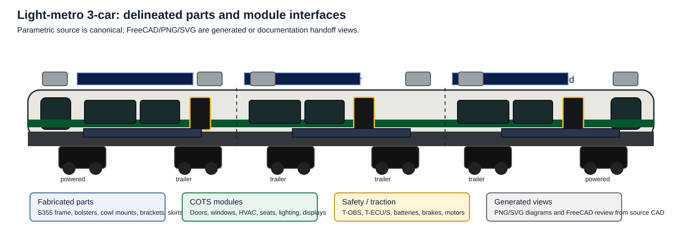
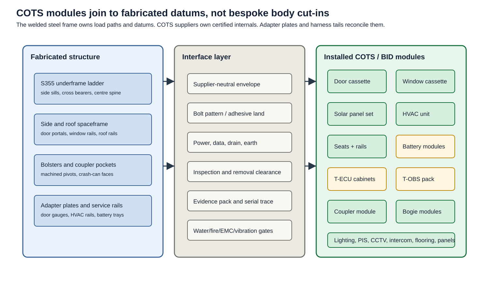
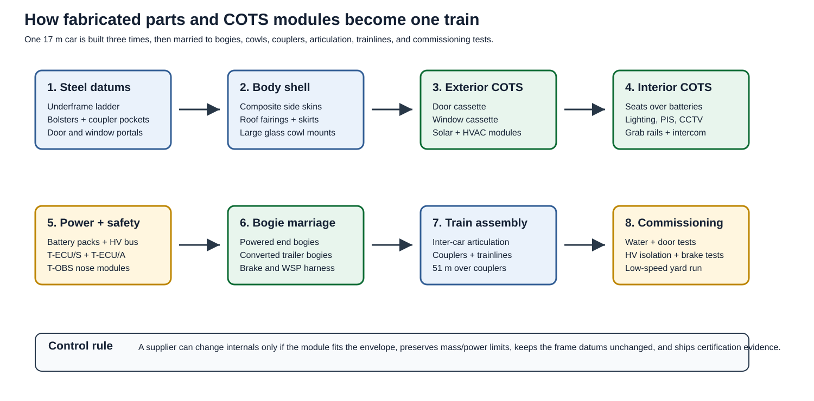

# COTS Integration And Part Delineation

This page shows how off-the-shelf rail/bus components join to the
fabricated `light-metro-3car` body, bogies, cowls, and electrical
systems. The parametric source remains the design basis; these diagrams
are the readable integration map.

## Whole-Train Part Map

The train is built from three repeated 17 m car modules:

| Zone | Fabricated parts | COTS / BID modules | Parametric source |
|---|---|---|---|
| End cowls | Steel crash frame, cowl backing ring, segmented panoramic glass carrier, LED lamp brackets | Dark RF-transparent laminated end glass panes, T-OBS LIDAR/radar/camera/ultrasonic pack, LED headlamps, marker/DRL bars, washer/heater | [`sensor_cowl.py`](../../../mechanical-py/src/osr_mech/rolling_stock/sensor_cowl.py), [`systems.py`](../../../mechanical-py/src/osr_mech/rolling_stock/systems.py) |
| Body side | S355 side frame, two door portals per side, window rail, waist rail, composite skin | Window cassettes, door cassettes, green livery band, yellow thresholds | [`car_body.py`](../../../mechanical-py/src/osr_mech/rolling_stock/car_body.py) |
| Stepped floor | Dropped ~10 m low-floor centre pan, ~3 m raised bogie-end deck supports, side plinth rails, transition steps | Phenolic/aluminium floor boards, rubber covering, step nosings, PRM floor finish | [`car_body.py`](../../../mechanical-py/src/osr_mech/rolling_stock/car_body.py), [`cad_templates/rolling_stock.py`](../../../mechanical-py/src/osr_mech/cad_templates/rolling_stock.py) |
| Roof | Roof bows, PV/HVAC rails, cable tray brackets, composite fairings | Solar panel laminates, MPPT combiner, compact HVAC units, antennas | [`car_body.py`](../../../mechanical-py/src/osr_mech/rolling_stock/car_body.py) |
| Under-seat bay | Battery tray rails, service covers, vent path, seat support rail | Na-ion modules, BMS, fuses, contactors, longitudinal seat modules | [`car_body.py`](../../../mechanical-py/src/osr_mech/rolling_stock/car_body.py), [`systems.py`](../../../mechanical-py/src/osr_mech/rolling_stock/systems.py) |
| Underframe | Side sills, centre spine, cross bearers, bolsters, jacking pads | Aux inverter, HV cabling, cooling loops, brake/WSP harnesses | [`cad_templates/rolling_stock.py`](../../../mechanical-py/src/osr_mech/cad_templates/rolling_stock.py) |
| Running gear | Bogie adapter, motor cradle, torque-link brackets | Two powered bogies, four converted freight trailer bogies, wheelsets, brakes, bearings, air springs | [`bogie/`](../../../mechanical-py/src/osr_mech/rolling_stock/bogie/) |
| Train ends and inter-car | Coupler pocket, shear plate, articulation adapter frames, underframe anchor castings, upper clevis brackets, trainline brackets | Scharfenberg Type 10 couplers, crash absorbers, lower spherical articulation joint, upper links, bellows, turntable floor, energy-guidance chains | [`systems.py`](../../../mechanical-py/src/osr_mech/rolling_stock/systems.py), [`articulation.md`](articulation.md) |

## Interface Stack

Every COTS module is installed through a supplier-neutral interface.
OpenSourceRail owns the envelope, datum, power/data/drain/earth
interfaces, maintainability clearance, and evidence requirements. The
supplier owns detailed internals, service procedure, lifecycle tests,
and certification data.

| COTS module | Fabricated datum | Interface closure | Evidence required |
|---|---|---|---|
| Window cassette | Window rail and bonded aperture | Adhesive bead or gasket, drain path, bonded earth if heated | EN 15152 or accepted equivalent, fire/smoke data for seals |
| Door cassette | Door portal, threshold tray, lock-loop bracket | Bolted frame, 24/110 V DC, Ethernet/CAN, hardwired closed/locked loop, drain | EN 14752 or equivalent, obstruction detection, lifecycle test |
| Platform/PSD interface | Door centre datum and sill edge | ATO stopping target, platform screen-door alignment, closed/locked interlock, intrusion sensor sightline | Station integration test, door-open permissive proof, degraded-mode procedure |
| Solar laminate | Roof PV rails and cable gland | Bolted/bonded laminate, isolated combiner, MPPT feed, fire disconnect | IEC PV module data, rail vibration mount evidence |
| HVAC unit | Roof equipment rails and condensate drain | Bolted rail pattern, duct adapter, 400 V AC, CAN/Ethernet diagnostics | Hot-climate curve, vibration, EMC, refrigerant record |
| Seat module | Battery-cover seat rail | M10 cantilever bracket, service-lid clearance below cushion | EN 45545 R7, static strength, vandal-resistance data |
| Battery module | Under-seat tray and vent plenum | HV connector, coolant quick-disconnect, BMS harness, side vent | Cell/pack test report, isolation, fire containment, lifting procedure |
| T-ECU cabinet | End electronics cabinet rail | DIN rail, 24/110 V DC, TCN-E, CAN-FD, EB loop, earth braid | Board spec, commissioning self-test, serial and firmware record |
| T-OBS pack | Nose cowl optical/radar datum | Heated window, service fasteners, power/data, safety verdict to T-ECU/S | Sensor calibration, 2oo2 verdict test, washer/heater test |
| Coupler | Coupler pocket and shear plate | M24 bolt pattern, drawgear carrier, brake/electric head clearance | EN 15227 absorber data, rescue procedure, inspection interval |
| Articulation/gangway | Adapter frame, lower anchor casting, upper clevis brackets | Lower spherical pivot, anti-lift keeper, upper links, bellows clamp frame, turntable floor, separated HV/data/coolant/HVAC routes | Motion-envelope test, bearing proof, EN 45545 bellows/turntable data, water ingress and drain test |
| Bogie | Bolster pivot and air-spring pads | Centre pin, PTFE slider, yaw links, brake/WSP/traction harness | Wheelset certs, brake test, frame weld records, suspension data |

## Assembly Sequence

The sequence is intentionally ordinary for a regional manufacturer:
fabricate datum structure first, preserve supplier-neutral interfaces,
install COTS modules late, then close the train with test evidence.

## Delineated Part Register

| Part family | Visible in design | Procurement line(s) | Source of truth |
|---|---|---|---|
| Windows | Dark side glazing rectangles in side walls | B10 | `car_body.py`, `cots_equipment.py` |
| Doors | Two double-leaf black doors with yellow thresholds per car side | B11, B25 | `car_body.py`, `systems.py` |
| Solar panels | Blue roof PV strip on every car | T21, T22 | `car_body.py` |
| HVAC systems | Compact grey roof modules at car ends | T14 | `car_body.py`, `cots_equipment.py` |
| Batteries | Under-seat blue module rows, eight per car in CAD | T5-T8, T16-T20 | `car_body.py`, `systems.py` |
| Seats | Longitudinal COTS benches over battery covers | B14, A1 | `cots_equipment.py` |
| Grab rails | Stainless saloon stanchions and rails | B15 | `cots_equipment.py` |
| PIS / CCTV / intercom | Saloon and doorway information/safety modules | B18, B19, E14, E15, E20 | `cots_equipment.py`, `systems.py` |
| Electronics cabinets | End-cabinet T-ECU/S, T-ECU/A, recorder modules | E1, E2, E22, E23 | `systems.py` |
| T-OBS sensor packs | Nose LIDAR/radar/camera/ultrasonic module | E18, E19 | `sensor_cowl.py`, `systems.py` |
| Couplers and crash absorbers | End coupler head, shear plate, absorber cartridge | B22, B23 | `systems.py` |
| Articulation | Lower spherical joint, drawbar, anti-lift keeper, upper links, bellows, turntable, drag-chain and service loops | B9, B24, B29 | `systems.py`, `articulation.md` |
| Powered bogies | Two end powered bogies with motors/gearboxes | G1, G18, G19, T1-T3 | `bogie/`, `trainset.py` |
| Converted trailer bogies | Four trailer bogies under remaining positions | G2-G17, G20 | `bogie/`, `trainset.py` |

## Generated Design Views

The same part families are visible in the generated screenshots:

| View | What to inspect |
|---|---|
| [`trainset-light-metro-3car.png`](../../../docs/screenshots/trainset-light-metro-3car.png) | Whole-train layout, powered end cars, trailer middle car, segmented glass-pane cowls, roof PV, bogies |
| [`trainset-car-detail.png`](../../../docs/screenshots/trainset-car-detail.png) | Complete layered car body with windows, doors, solar array, HVAC, interior, electrical, and thermal routes |
| [`trainset-car-body-structure.png`](../../../docs/screenshots/trainset-car-body-structure.png) | Primary fabricated shell, ~10 m floor, side sills, crossmembers, roof rails, window posts, end rings, bogie envelopes, and door portals |
| [`trainset-car-body-bogie-subassembly.png`](../../../docs/screenshots/trainset-car-body-bogie-subassembly.png) | Single-car body structure mounted over standard motor/trailer bogies, showing raised ~3 m end decks and the low-floor centre zone |
| [`trainset-car-body-exterior.png`](../../../docs/screenshots/trainset-car-body-exterior.png) | Exterior glazing, door leaves, livery band, skirts, solar array, and compact HVAC roof units |
| [`trainset-car-body-interior.png`](../../../docs/screenshots/trainset-car-body-interior.png) | Under-seat battery strakes, seats, wheelchair bays, grab poles, handrails, and PIS |
| [`trainset-car-body-services.png`](../../../docs/screenshots/trainset-car-body-services.png) | HVAC ducting, LV/data trays, lighting, CCTV/intercoms, HV/PV routing, coolant, and fire vent paths |
| [`trainset-interior-fit-out.png`](../../../docs/screenshots/trainset-interior-fit-out.png) | COTS passenger fit-out envelopes inside the body reservation |
| [`trainset-car-systems.png`](../../../docs/screenshots/trainset-car-systems.png) | Batteries, four door cassettes, platform safety interfaces, charging connector, wheelchair bays, systems layout |
| [`trainset-door-system.png`](../../../docs/screenshots/trainset-door-system.png) | Door leaves, operator rail, lock/release, gap filler |
| [`trainset-battery-pack.png`](../../../docs/screenshots/trainset-battery-pack.png) | Battery module set, HV contactor, fuse, BMS cabinet |
| [`trainset-electronics-cabinet.png`](../../../docs/screenshots/trainset-electronics-cabinet.png) | T-ECU/S, T-ECU/A, event recorder, power distribution |
| [`trainset-inter-car-articulation.png`](../../../docs/screenshots/trainset-inter-car-articulation.png) | Inter-car lower spherical joint, upper links, bellows, turntable floor, energy guidance, and kinematic clearance envelopes |
| [`trainset-tobs-sensor-pack.png`](../../../docs/screenshots/trainset-tobs-sensor-pack.png) | LIDAR, radar, stereo camera, ultrasonic sensors |
| [`bogie-motor.png`](../../../docs/screenshots/bogie-motor.png) | Powered bogie with motors, gearbox, suspension, brakes |
| [`bogie-trailer.png`](../../../docs/screenshots/bogie-trailer.png) | Converted trailer bogie envelope |
