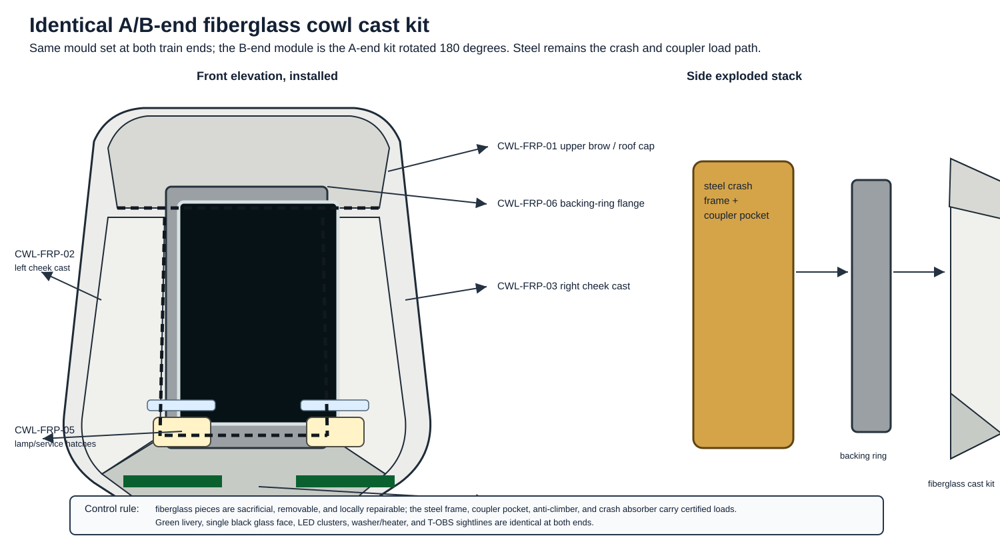

# Identical fiberglass end-cowl design

This page controls the `light-metro-3car` front/back end module. The
train is driverless and reversible, so the "front" and "back" are the
same part kit: one A/B-end fiberglass cowl assembly installed at each
outer end, with the B-end kit rotated 180 degrees about the vertical
axis. There are no handed cab moulds and no rear-only cosmetic parts.

The form language follows the README reference image: white/silver
rounded ends, one uninterrupted dark panoramic glass face, green waist
band carried onto the cowl flanks, low dark skirt, and LED head/marker
lights below the glass. The cowl is a sacrificial weather/aero/sensor fairing over a
steel crash frame; it is not the buff, collision, coupler, or
anti-climber load path.

The production shape should be authored in a surface-modelling package
suited to styled fiberglass work. The parametric `sensor_cowl.py`
geometry is an envelope and interface proxy; it is not intended to be
the final class-A exterior surface. The released cowl CAD should come
from surface/NURBS or SubD modelling, then be exported as neutral STEP
or IGES surfaces with separate mould, trim, flange, and inspection
geometry.

## Envelope

| Parameter | Value | Notes |
|---|---:|---|
| Module role | identical A-end/B-end kit | Same mould set and drawing set for both train ends |
| Along-track length | 1 800 mm | Overlay inside the 17 m end-car envelope |
| Car interface width | 2 850 mm | Matches `CarDimensions.body_width_mm` |
| Car interface height | 3 450 mm | Matches `CarDimensions.body_height_mm` |
| Leading-face width | 1 800 mm | Rounded/tapered visual face |
| Leading-face height | 2 800 mm | Allows roof cap transition into body |
| Panoramic glass opening | 1 500 mm x 1 780 mm | One heated laminated pane |
| Exterior corner target radius | >= 200 mm | Keep edges easy to laminate and repair |
| Nominal panel mass target | <= 180 kg per end kit | Excludes glass, T-OBS, coupler, and crash absorber |

## Fiberglass cast split

The end cowl is built as a multi-part fiberglass (GFRP) kit so it can
be made in modest female moulds, repaired locally, and removed after
minor collision damage without cutting the steel body.

| ID | Cast part | Qty per end | Function | Main interfaces |
|---|---|---:|---|---|
| CWL-FRP-01 | Upper brow and roof cap cast | 1 | Blends roof into the black glass surround and sheds rain above the pane | Roof bow tabs, upper backing ring, washer nozzle covers |
| CWL-FRP-02 | Left cheek side-return cast | 1 | Tapered side surface, green livery continuation, side split-line closure | Left side frame tabs, backing ring, lower apron |
| CWL-FRP-03 | Right cheek side-return cast | 1 | Mirror of CWL-FRP-02 | Right side frame tabs, backing ring, lower apron |
| CWL-FRP-04 | Lower apron and anti-climber cover cast | 1 | Lower rounded nose, lamp recess support, removable access to coupler recovery space | Lower crash-frame tabs, lamp pods, skirt edge |
| CWL-FRP-05 | Lamp/washer service hatch casts | 2 | Replaceable local covers around LED clusters, washer manifold, and service fasteners | M6 captive fasteners, gasketed edge, lamp bracket |
| CWL-FRP-06 | Sectional backing-ring flange casts | 4 | Bond/bolt land behind glass carrier and cast split lines; carries seals, not crash loads | Steel crash ring, glass carrier, EPDM seals |

The cheek casts may use mirrored moulds, but they keep the same datum
scheme and hole pattern. The full end kit is duplicated at the other
end of the train without changing sensors, lamps, glazing, wiring
exits, or maintenance access.

## Laminate and materials

| Region | Nominal construction | Notes |
|---|---|---|
| Broad brow/cheek/apron skins | Fire-rated E-glass or basalt-fibre/vinyl-ester sandwich, 16-24 mm total | Foam or honeycomb core only in broad low-load panels |
| Split-line flanges and bolt lands | Solid GFRP, 6-10 mm | No core at fasteners, seals, jacking-prone edges, or repair trim lines |
| Insert pads | Local solid laminate build-up plus potted stainless or GFRP hard points | M6/M8 service fasteners; M10 only where the steel bracket owns load |
| Exterior finish | White/silver gelcoat or paint over primer | Must accept green livery film/paint band |
| Inner finish | Light-colour fire-rated coating | Allows crack and water-ingress inspection |
| Seals | EPDM or silicone rail-rated gasket/sealant | Continuous drain path below glass and hatch seams |

All passenger-facing or exposed composite materials need EN 45545-2
HL2 or locally accepted equivalent evidence. The composite supplier
owns resin selection, laminate coupons, fire/smoke/toxicity evidence,
insert pull-out data, repair instructions, and batch traceability.

## Tooling rules

- Build the visible A-surface first in the surface modeller, using the
  README image and package envelope as references.
- Derive B-surfaces, nominal laminate thickness, return flanges, split
  flanges, hatch offsets, and trim curves from that controlled
  A-surface.
- Export neutral surface CAD for design review and mould manufacture;
  keep the parametric FreeCAD/Python model as the envelope,
  integration, and documentation proxy.
- Use female moulds with removable split flanges; no one-piece bathtub
  mould that traps the part.
- Minimum mould draft: 3 degrees on return flanges and hatch pockets.
- Minimum exterior radius: 75 mm on cosmetic edges, 125 mm preferred at
  roof and cheek transitions, 200 mm at the large outer corners.
- Keep split lines on visual shadow lines: roof-to-glass brow,
  cheek-to-front face, apron-to-skirt, and lamp hatch surrounds.
- Add 35-50 mm internal lap flanges at cast-to-cast seams.
- Provide witness holes or bond-line tell-tales where adhesive closure
  is hidden after assembly.
- First article may be hand lay-up or vacuum infusion; production
  should prefer vacuum infusion where the supplier can control resin
  fraction and repeatability.

## Structural interfaces

The steel end frame remains the certified load path. The fiberglass
kit attaches to secondary tabs and a bolted backing ring:

- M8 stainless/captive fastener grid at 180-250 mm pitch around the
  steel cowl ring.
- Slotted holes only in fiberglass flanges, never in the steel crash
  datum.
- Nylon/GFRP isolation washers where stainless fasteners meet coated
  steel or mixed-metal inserts.
- Structural adhesive or elastic sealant between fiberglass and
  secondary rails for weather sealing and vibration control.
- Separate earth straps for heated glass, lamps, washer heater, and
  T-OBS hardware; do not rely on composite continuity.
- Drain holes at the lower apron and glass carrier, routed away from
  coupler electronics and the T-OBS backplate.

## Glazing, lamps, and sensors

The cowl fitout is now separated into `LM3-FAS-P010` panoramic glass carrier,
`LM3-FAS-P020` reversible lamp cassette/aiming tray, and `LM3-FAS-P030`
seal/drain/washer closeout kit. Their checking nest and lamp aiming jig are
defined in [`dedicated-parts-and-moulds.md`](dedicated-parts-and-moulds.md).

The cowl carries one large heated RF-transparent laminated glass pane in
a dark bonded carrier. The carrier bolts to the steel-backed ring through
the fiberglass flange, so a damaged cast can be removed without
discarding the glass if the pane is intact. Any necessary structural
support, heater traces, sensor brackets, or busbars must sit behind the
black edge band or read visually as part of the dark glass, not as
visible vertical dividers.

The LED headlamp/marker-light cassette is symmetrical: either train end
can lead or trail. Software decides head/tail aspect; the physical lamp
and harness are identical. The T-OBS LIDAR, radar, stereo camera, and
ultrasonic pack sits behind the same glass/sensor aperture at both
ends, with washer nozzles and heater busbars accessible through
CWL-FRP-05 and the upper brow service covers.

## Assembly sequence

1. Survey the steel end ring and secondary cowl tabs after body
   corrosion coating.
2. Trial-fit CWL-FRP-06 backing-ring flange sections and shim to the
   steel datum.
3. Fit CWL-FRP-01, CWL-FRP-02, CWL-FRP-03, and CWL-FRP-04 dry with
   temporary fasteners; check split gaps and door/platform clearance.
4. Surface-prepare steel and fiberglass bond/seal lands.
5. Install backing-ring flanges, cheek casts, upper brow, lower apron,
   and hatch casts with adhesive/sealant and retained fasteners.
6. Install the glass carrier, laminated panes, heater/washer harness,
   LED lamp cassettes, and T-OBS module.
7. Complete water-ingress, heater, washer, lamp aspect, T-OBS
   calibration, and removable-hatch access tests.

## Making instructions

### 1. Surface and mould release

1. Freeze the LM3-BDY-155 A-surface, B-surface, split lines, trim
   curves, flange returns, glass-carrier land, hatch openings, and
   insert map.
2. Manufacture female moulds for CWL-FRP-01 through CWL-FRP-06. Use
   removable mould flanges at cheek/apron/brow split lines.
3. Polish, seal, and release each mould per the tooling-resin supplier
   procedure. Record mould ID, release system, operator, date, and
   number of pulls since last reconditioning.

Hold point: mould surface and release record accepted before lay-up.

### 2. Lay-up / infusion

1. Cut dry glass/basalt reinforcement plies and core sheets from the
   released ply book; mark fibre direction and part ID.
2. Lay gelcoat or primer-compatible surface coat where the process
   uses in-mould finish.
3. Lay outer plies, core only in broad low-load skins, solid-laminate
   flange/insert zones, and inner plies.
4. Fit potted inserts and doubler pads only into solid laminate build-up
   zones; do not place inserts into core.
5. Hand lay-up or vacuum infuse. Record resin batch, catalyst/hardener
   batch, pot life, ambient temperature, vacuum level if used, and cure
   time.
6. Cure and post-cure per resin supplier procedure. Keep one laminate
   coupon with every resin batch and cure cycle.

Hold point: coupon, cure, resin batch, and visual void/dry-fibre checks
accepted before demould.

### 3. Demould, trim, and drill

1. Demould without prying on visible A-surfaces or glass-carrier lands.
2. Trim parts in the cowl trim fixture; never freehand trim a split
   line or glass land.
3. Drill fastener, insert, drain, washer, lamp, and service-hatch holes
   from controlled drill bushes.
4. Seal all cut edges and drilled holes.
5. Dry-build CWL-FRP-01 through CWL-FRP-06 on LM3-TL-COWL-09 and
   measure split gaps, flange alignment, lamp pocket position, and
   glass-carrier land.

Hold point: trim-line survey, insert pull-out sample, edge-seal
inspection, A/B interchange check, and dry-build water path accepted.

### 4. Finish and repair sample

1. Release the qualified white/silver gelcoat or base coating. Apply the green
   waist-band continuation as pre-cut rail-use film where its substrate,
   fire, edge, cleaning and removal evidence is accepted; otherwise use the
   released paint route.
2. Fit gaskets, retained fasteners, drain sleeves, washer-nozzle covers,
   and hatch tethers.
3. Make a sacrificial cheek/apron repair coupon from the same laminate
   and demonstrate sand/fill/recoat before accepting the first article.

Hold point: finish DFT/visual record, gasket compression, repair coupon,
and removable-hatch trial accepted.

## Inspection and release evidence

| Evidence | Acceptance intent |
|---|---|
| Laminate coupon pack | Fire rating, resin/fibre fraction, cure record, material batch trace |
| Insert pull-out test | Confirms service fasteners and flange hard points survive repeated removal |
| End-ring dimensional survey | Confirms the cowl kit fits the steel datum without forcing the glass carrier |
| Split-line and water test | No water path into T-OBS, glass heater busbar, coupler head, or saloon floor |
| Lamp and sensor calibration | Both A-end and B-end kits meet identical sightline and aspect checks |
| Repair demonstration | Sand/fill/recoat of a damaged cheek/apron sample without replacing steel |

## v2 drawing outputs

The v2 drawing pack shall issue these as controlled drawings under
LM3-BDY-155:

- mould split and trim drawings for CWL-FRP-01 through CWL-FRP-06,
- controlled exterior A-surface, B-surface, flange, trim, and mould
  surface exports from the surface modeller,
- laminate schedule and ply drop/overlap maps,
- insert and fastener map,
- steel backing-ring and shim interface drawing,
- glass carrier and seal land drawing,
- lamp/sensor hatch service drawing,
- repair-zone and allowable damage map,
- first-article dimensional inspection form.
