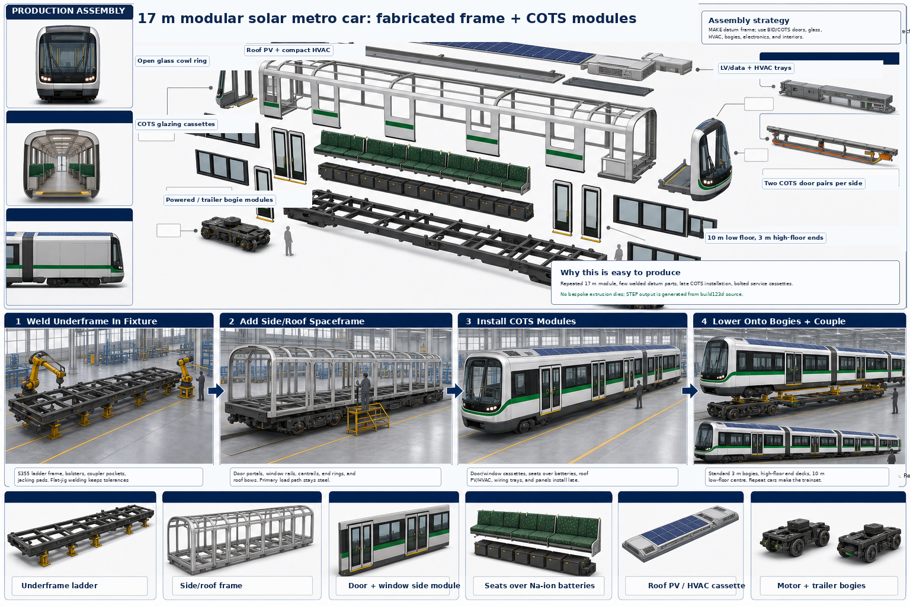
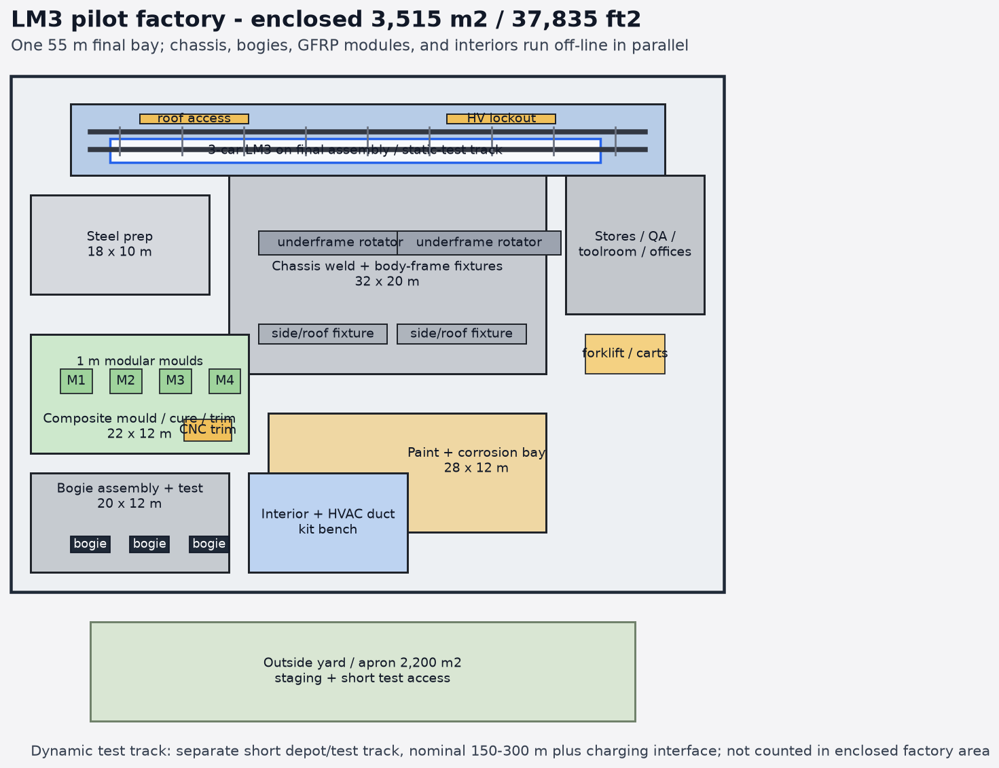
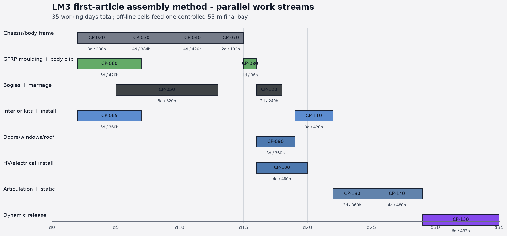
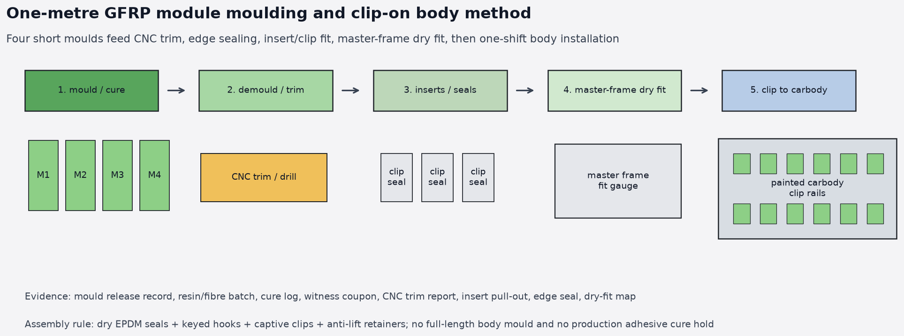
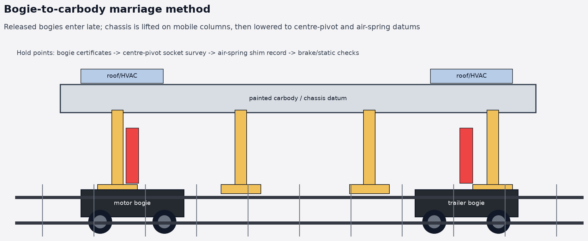

# Fabrication plan — `light-metro-3car`

This plan turns the v1 rolling-stock package into a buildable factory
route for the first `light-metro-3car` trainset. It favours ordinary
regional manufacturing capability: saw/laser/plasma cutting,
press-brake bending, MIG/MAG welding, dry clip-on fiberglass body modules,
limited qualified adhesive bonding, bolted
module installation, and COTS rail/bus subsystems.

It is not a homologated shop drawing pack. The v2 pack must add
dimensioned drawings, weld symbols, tolerances, FEA, supplier
installation manuals, and authority-approved inspection records.

The production concept is deliberately modular: make the steel datum
structure locally, install certified supplier modules late, and repeat
the same 16.5 m car body to form the trainset.

## Manufacturing doctrine

| Scope | Default decision | Reason |
|---|---|---|
| Primary structure | MAKE: cut/bend/weld S355 steel | Available in rail, truck, ship, oilfield, and bridge workshops |
| Side/roof body modules | MAKE/BID: 1 m-wide clipped fiberglass modules from reusable short moulds | No full-car mould or production adhesive cure; corrosion resistant and locally replaceable |
| Nose panels | BID/SOURCE: multi-part fiberglass end-cowl casts | Styled sacrificial shell retains its separate gasket/adhesive process over the steel crash frame |
| Doors | BID: COTS electric rail door cassette | Certified obstacle detection, locking, seals, emergency release |
| Windows | SOURCE/BID: COTS bonded/gasketed glazing | Avoids bespoke glass certification |
| HVAC | SOURCE/BID: packaged roof unit | Mature hot-climate bus/rail supply chain |
| Lighting | SOURCE: rail/bus LED modules | Commodity, low-voltage, easy replacement |
| Passenger interior | SOURCE/BID: bus/rail seats, rails, PIS, CCTV | Keeps OSR focused on interfaces and safety evidence |
| Cabin fiberglass liners/trims | MAKE/BID: fire-rated FRP or phenolic ceiling, sidewall, battery-strake, and vestibule panels | Same low-cost composite cell as the cowls; replaceable passenger-facing trim |
| Bogie frame | MAKE fresh OSR powered/trailer frames under controlled weld procedure | Structural rail part; can be local but must be qualified; recovered freight frames are not used |
| Wheelsets, bearings, brakes | BID/SOURCE | Safety-critical rotating/brake parts stay supplier-certified |
| Traction, batteries, BMS | BID/SOURCE | Supplier qualification and test evidence required |

## Factory cells

The first factory needs five cells, not a full legacy rolling-stock
plant:

The generated numeric sizing is controlled in
[`factory-plan.md`](../../../mechanical-py/catalog/buildable-trainset/factory-plan.md):
3,515 m2 enclosed pilot factory, 2,200 m2 outside yard/test apron,
13 working days for chassis/painted frame fabrication, 13 working days
for bogie build and bogie-to-carbody integration, 14 working days for
GFRP moulding plus clip-on body installation, and 13 working days for
final assembly plus static commissioning inside the first-article
35-working-day network. It also lists the rough machinery package at
about $1.02M including setup contingency, excluding building/land and
homologation laboratory equipment.

The generated layout keeps the long final track for accepted kits only:
steel cutting, chassis/body-frame fixtures, moulding, bogie assembly,
interior/HVAC kit work, paint, stores, QA, and yard staging run beside
it instead of blocking it.

The first-article method plan splits the 35-working-day build into
parallel streams so the constrained final bay receives released chassis,
GFRP, bogie, interior, door/window, roof, HV, articulation, and static
test work at the latest practical point.

1. **Steel prep cell**
   - CNC saw or tube laser for RHS.
   - Plasma/laser/waterjet table for plate.
   - Press brake for folded bolsters, coupler pockets, trays, and
     brackets.
   - Drill/mill for datum holes and bolted inserts.

2. **Weld and fixture cell**
   - Underframe rotating fixture.
   - Side-frame fixture.
   - Bogie-frame fixture.
   - Certified MIG/MAG equipment.
   - Weld fume extraction and preheat capability where WPS requires.

3. **Paint and corrosion cell**
   - Shot blast or outsourced blast booth.
   - Zinc-rich epoxy primer.
   - Seam sealing and cavity wax station.
   - Topcoat booth for exposed steel and brackets.

4. **Composite and glazing cell**
   - Reusable one-metre side-module and roof-module moulds with released
     A-surfaces, local-core maps, solid clip lands, and insert boss features.
   - One-metre module trim/drill gauge and master-frame trial-fit stand.
   - Resin, fibre, core, gelcoat/paint-primer, release-system, cure-record,
     and witness-coupon control for each moulded batch.
   - End-cowl cast trim/drill jigs or incoming-inspection fixtures for
     supplier-made fiberglass casts.
   - Clip/anti-lift proof fixture and dry-seal inspection tools.
   - Small controlled cure area for glazing and end-cowl non-service seams only.
   - Window bonding/gasket installation.

5. **Final assembly and commissioning cell**
   - Level track or assembly stands.
   - Bogie drop/lift equipment.
   - Roof access for HVAC and antennas.
   - HV isolation tools and test equipment.
   - Door calibration, lighting/PIS/CCTV checks, brake tests.

## Sheet-metal tooling package

The v2 drawing pack shall release the following tooling before first
steel cut. The tooling is intentionally ordinary: press-brake tooling,
laser-cut fixture plates, bolted datum towers, and removable clamps
rather than legacy carbody megajigs.

| Tooling ID | Tool | Purpose | Required accuracy |
|---|---|---|---|
| LM3-TL-UNDERFRAME-01 | Underframe rotating weld fixture | Holds side sills, cross-bearers, bolsters, coupler pockets, and battery trays | ±1.5 mm on bogie centres; ±2.0 mm on door datum plane |
| LM3-TL-BOLSTER-02 | Bolster box subfixture | Pre-welds folded bolster boxes, air-spring pads, and pivot boss backing plates | ±0.5 mm before line-bore |
| LM3-TL-COUPLER-03 | Coupler pocket fixture | Keeps crash-can plate, shear plate, and pocket inserts square to train centreline | ±0.75 mm on coupler face datum |
| LM3-TL-SIDE-04 | Side-wall post/rail fixture | Locates door portals, window posts, waist rail, and cant rail | ±1.0 mm at door cassette opening |
| LM3-TL-ROOF-05 | Roof bow fixture | Holds roll-formed roof bows and HVAC rail inserts | ±1.5 mm on HVAC rail pitch |
| LM3-TL-PANEL-06 | One-metre side/roof module mould and trim/drill fixture | Moulds GFRP side/roof modules, locates solid clip lands and potted inserts, then CNC trims solid/window/door/roof variants from the common datum | ±0.5 mm on clip grid; ±1.0 mm on trim edge |
| LM3-TL-DOOR-07 | Door cassette fit-up gauge | Confirms COTS door cassette envelope, threshold, and lock-loop bracket clearances | Supplier installation tolerance |
| LM3-TL-HV-08 | Battery tray/service-lid gauge | Checks tray drainage, lid gasket land, HV cable gland reach, and seat-base clearance | ±1.0 mm on service-lid gasket land |
| LM3-TL-COWL-09 | Fiberglass end-cowl cast fit-up fixture | Holds CWL-FRP-01 through CWL-FRP-06 to the steel backing-ring datum and checks split-line gaps, insert pitch, glass carrier land, and lamp/sensor hatch access | ±1.0 mm on glass-carrier land; ±2.0 mm on cast split gaps |
| LM3-TL-INT-10 | Cabin ceiling liner buck and trim fixture | Moulds/trims ceiling liners, light troughs, HVAC plenum covers, and service lids | ±1.0 mm on light/HVAC apertures |
| LM3-TL-INT-11 | Cabin sidewall/window reveal drill fixture | Locates sidewall liners, window reveals, cable covers, clips, and retained fasteners | ±0.75 mm on clip/fastener pitch |
| LM3-TL-INT-12 | Battery strake cover and hatch gauge | Checks under-seat FRP covers, service hatch removal, HV labels, and seat-base fairing clearances | Hatch removable without seat removal |
| LM3-TL-INT-13 | Door/PRM transition trim fixture | Checks vestibule kick panels, step covers, threshold trims, anti-slip strips, and contrast nosing | PRM transition accepted by gauge |

The current CAD manufacturing templates generated from `mechanical-py`
are tracked as parametric source and FreeCAD review artifacts:

| Template/source | Use |
|---|---|
| `main_frame()` | Underframe ladder, formed sills, cross-bearers, bolsters, battery trays, coupler pockets |
| `body_sheet_metal_kit()` | Whole body/chassis sheet-metal kit: underframe, side posts, door portals, waist/cant rails, roof bows, end rings |
| `fiberglass_cladding_system()` / `modular_fiberglass_body.py` | One-metre GFRP side/roof module grid, clip hardware, EPDM joints, module numbering, and one-shift installation route |
| `sandwich_panel()` | Legacy sandwich-panel aperture and retainer template retained only as a detail reference for non-structural local panels |
| Surface-modelled LM3-BDY-155 cowl CAD | Final fiberglass cowl A-surface, B-surface, flanges, trim curves, and mould surfaces |
| `sensor_cowl()` | Identical A/B-end fiberglass cowl envelope, single panoramic glass, lamp/service hatches, and T-OBS visual interface |
| `door_leaf()` | COTS-style door leaf shell, bonded glazing, EPDM seals, hanger rollers |
| `chassis_interface_assembly()` | Bolster, bogie adapter, motor cradle, guide blocks, fasteners, service strut, connector interfaces |

For a visual map of which COTS modules bolt, bond, plug, or slide into
these fabricated datums, see
[`cots-integration.md`](cots-integration.md).

## Build sequence per car

### 1. Kitting

- Issue tube cut list, plate flat patterns, brackets, inserts, and
  supplier interface drawings.
- Export NC data directly from the v2 flat-pattern drawings; each
  part receives a QR/etched part ID before forming.
- Mark every primary steel member with heat/batch traceability.
- Stage COTS modules by car number: doors, windows, HVAC, lighting,
  seats, intercom, CCTV, PIS, battery pack, inverter, auxiliaries.
- If a brownfield deployment proposes donor axles or axlebox hardware,
  quarantine them in a separate incoming-inspection lot until cleaning,
  dimensional survey, UT/MT inspection, and supplier acceptance are
  complete.

Hold point: material certificates and supplier certificates accepted
before cutting.

### 2. Underframe

- Cut side sills, centre spine, cross bearers, battery rails, and
  folded plate boxes.
- Press-brake side sills, bolster webs, coupler-pocket plates,
  battery-tray lips, and service-lid gutters using matched V-dies.
- Tack in underframe fixture from centre datum outward.
- Weld side sills, cross bearers, bolster boxes, coupler pocket, and
  battery/equipment supports.
- Fit temporary anti-pull bars across door openings and side sills
  before long weld runs.
- Stress-relieve or controlled-cool where required by WPS.
- Machine or line-bore centre-pivot and critical mounting inserts
  after welding.

Hold point: dimensional survey, visual weld inspection, MT/UT on
CL1/CL2 joints, bogie-centre datum report.

### 3. Side frame and roof frame

- Weld door posts, window posts, waist rail, cant rail, and roof bows
  on the side-frame fixture.
- Trial-fit a COTS door cassette gauge before welding the portal
  reinforcement closed.
- Lift side frames onto underframe datum pads.
- Weld/bolt side frames to underframe as specified by v2 drawings.
- Install roof equipment rails and cable tray brackets.

Hold point: door aperture survey against chosen COTS door cassette;
window aperture survey against chosen glazing cassette.

### 4. Corrosion protection

- Blast exposed steel to Sa 2.5.
- Apply zinc-rich primer and topcoat system.
- Seal lap joints and composite bond interfaces.
- Apply cavity wax after all hot work and inspection is complete.

Hold point: dry-film thickness report and sealed-drain checklist.

### 5. One-metre composite exterior

- Before final assembly, fabricate each 1 m side and roof module in the
  released mould: clean and inspect the mould, apply release system and
  UV-stable gelcoat/paint-primer, cut glass-fibre plies and local core, lay
  up solid clip lands and insert bosses, infuse or wet-lay the laminate, cure,
  demould, retain witness coupons, CNC trim/drill the selected solid/window/
  door/roof variant, and seal all cut edges.
- Fit potted/captive inserts, keyed hooks, anti-lift features, drain details,
  and EPDM seals to each module, then dry-fit against the master frame before
  kitting by car side, roof bay, and serial number.
- Stage 96 numbered side modules and 48 roof modules for the three-car
  trainset. Verify all CNC-trim variants against the common 1,000 mm gauge.
- Put all three painted, dimensionally released frames in the body cell and
  assign two two-person crews per car.
- Fit dry EPDM seals, hang each module from its asymmetric keyed hook, close
  captive over-centre clips, and engage the independent anti-lift retainer.
- Record visible witness marks against the digital module map; do not use a
  clip to pull an out-of-tolerance frame or panel into position.
- Complete the three-car side/roof installation, water test, rattle check,
  and snag release inside one eight-hour shift per LM3-BDY-160.
- Separately trial-fit skirts and the identical A/B-end fiberglass cowl kit.
- Dry-build CWL-FRP-01 upper brow, CWL-FRP-02/03 cheek casts,
  CWL-FRP-04 lower apron, CWL-FRP-05 lamp/service hatches, and
  CWL-FRP-06 backing-ring flanges on the end-cowl fit-up fixture.
- Use the module drill jig to install captive clip receptacles and anti-lift
  hardware. Side/roof body-to-frame joints receive no production adhesive.
- Fit removable skirt panels with quarter-turn or captive fasteners.
  Fit cowl hatches with retained fasteners and continuous gasketed
  drain paths.

Hold point: signed module/clip map, laminate coupons, insert and clip proof,
edge-seal record, mould release and cure records, eight-hour route record, water/rattle test, split-line cowl water test,
applicable cowl/glazing adhesive cure records, and removable-panel access check.

### 6. COTS doors and windows

- Install door cassette into prepared structural bay.
- Install threshold, drainage, seals, and emergency release hardware.
- Install fixed or vented glazing cassettes.
- Connect door power, hardwired closed-and-locked loop, Ethernet/CAN,
  and local service connector.

Hold point: water ingress test, door obstruction test, emergency
release test, closed-and-locked circuit test.

### 7. Roof systems

- Install packaged HVAC units onto roof rails.
- Install antennas, marker lights, CCTV housings, and regen resistor.
- Connect ducting to interior cassette.
- Fit removable composite roof fairings around service envelopes.

Hold point: roof leak test, HVAC condensate drain test, lifting and
fall-arrest access check.

Roof and side modules locate on precision keyed datums. The asymmetric hook
prevents reversal; captive clips provide clamping and the separate anti-lift
feature provides fail-safe retention. Record the locator survey, latch witness
map, earth-bond resistance, water test, and timed module removal. Active
services are installed in moulded empty routes and are never laminated into
the composite.

### 8. Interior cassette

- Install floor boards and removable hatches.
- Install fire-rated FRP/phenolic ceiling liners, light troughs,
  sidewall/window reveals, cable covers, under-seat battery strake
  covers, vestibule kick panels, PRM ramp/step covers, and door-pocket
  trims from [`cabin-fiberglass.md`](cabin-fiberglass.md).
- Install under-seat battery enclosure covers and service locks.
- Install seats, grab rails, lighting, PIS, speakers, CCTV, intercom,
  emergency signage, and fire extinguishers if locally required.
- Install cable harnesses as pre-terminated looms, not loose field
  wiring.

Hold point: egress width check, sharp-edge check, service-panel removal
trial, rattle check, lighting lux test, fire-material certificate pack
complete.

### 9. Power and traction equipment

- Install battery packs in under-seat cassettes.
- Install six motor controllers, isolated LV DC/DC converters, HV
  contactors, cooling loops, temperature/off-gas detection, outward module
  vents, and the per-car battery water-mist reservoir/pump/pipe/nozzles.
- Pressure-test coolant loops before energisation.
- Perform insulation resistance and HV interlock loop tests.

Hold point: HV safety sign-off before first energisation.

### 10. Bogie marriage and commissioning

- Assemble powered and trailer bogies separately.
- Build one powered bogie and one trailer bogie through full weld,
  dimensional, NDT, wheelset, brake, suspension, and harness inspection
  before committing the remaining four bogies.
- Reject recovered freight bogie frames. Only accepted donor axles or
  axlebox hardware may enter the OSR bogie build, and only with the
  inspection records linked to the vehicle serial file.
- Drop carbody onto bogies using surveyed bolster datums.
- Connect traction, brake, WSP, tachometer, bearing-temperature, and
  suspension interfaces.
- Run static brake test, door test, HVAC test, lighting/PIS/CCTV test,
  battery charge/discharge test, and low-speed yard movement test.

Hold point: first-article inspection release before dynamic testing.

## COTS interface rules

The carbody must reserve supplier-neutral interfaces:

| Module | OSR fixes | Supplier owns |
|---|---|---|
| Door cassette | Opening envelope, structural datum, power, data, hardwired lock loop, drainage path | Door mechanics, controller, seals, obstacle detection, emergency release |
| Window cassette | Opening envelope, bond/gasket land, drainage, replacement access | Glass laminate, frame, adhesive/gasket, certification |
| HVAC | Roof rail pattern, power budget, duct opening, condensate route, service clearance | Refrigerant circuit, controls, compressor, fans, fire certificate |
| Battery mist | Reservoir/pump bracket, stainless-pipe route, nozzle datums, drain and service access | Qualified pump/nozzle hardware, flow/pressure sensors, component certificates |
| Lighting | 24 V DC rail, mounting pitch, lux target, emergency mode input | Luminaire, diffuser, driver electronics |
| Seats/grab rails | Floor/sidewall insert grid, strength target, envelope | Seat shell, upholstery, rail clamps, fire certificates |
| PIS/CCTV/intercom | Power/data connector, field of view or visibility target | Device hardware, firmware, certificates |

No primary steel member should be redesigned when a COTS supplier is
changed. Supplier changes should require only adapter plates, harness
tails, software configuration, and certification paperwork updates.
The detailed envelopes and incoming-inspection evidence are maintained
in [`hardware/trainset-interiors/cots-catalogue.md`](../../../hardware/trainset-interiors/cots-catalogue.md).

## Inspection gates

| Gate | Evidence |
|---|---|
| G0 material release | Mill certificates, supplier certificates, incoming inspection |
| G0B recovered-component release | Quarantine record, cleaning record, dimensional report, UT/MT/NDT evidence, supplier sign-off for any donor axle/axlebox item |
| G1 frame complete | Dimensional survey, weld map, NDT report, traceability register |
| G2 corrosion complete | Blast record, coating DFT report, cavity wax checklist |
| G3 shell complete | Composite cure records, water test, removable-panel access report |
| G4 COTS systems fitted | Door/window/HVAC/lighting supplier acceptance records |
| G5 electrical safe | Insulation resistance, bonding/earthing, HVIL, functional safety I/O |
| G6 static complete | Brake, door, HVAC, lighting, battery, communications, fire detection |
| G7 dynamic ready | Weighing, ride-height, bogie alignment, low-speed movement release |

## First-article constraints

- Build one carbody first, not a full three-car batch.
- Build one powered bogie and one trailer bogie first, not all six
  bogies as an uncontrolled batch.
- Do not commit to production tooling until G1 and G3 are passed on
  the first carbody.
- Freeze COTS supplier envelopes only after fit-up review with actual
  door, window, HVAC, and seat samples.
- Treat every locally made structural weld procedure as a certifiable
  manufacturing process, not a prototype craft operation.
- Keep composite panels sacrificial and replaceable. They should fail
  cheaply without damaging the steel load path.
