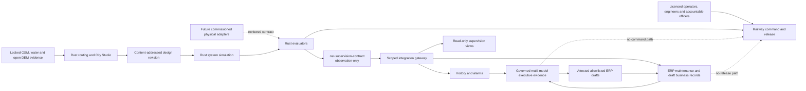

# Rust codebase review and OpenSourceRail integration plan

**Review date:** 2026-09-27
**Scope:** the complete Cargo workspace, its Python/GIS and supervision
boundaries, CI, formal-evidence hooks, and the ERP/SCADA/AI architecture.

## Executive assessment

The Rust workspace stands up well as a deterministic engineering, simulation
and controller-evaluation codebase. It does not yet stand up as a commissioned
or certified railway control product. Those statements are compatible: the
repository has meaningful fail-restrictive logic, property tests, integration
tests, differential tests and selected bounded proofs, while still lacking the
physical I/O, persistent service deployment, calibration, independent safety
assessment and operating evidence required for live authority.

At the start of this review the workspace contained 56 crates and about 72,000
lines of Rust under `src/` and `tests/`. The workspace test suite and Clippy
with warnings denied passed. The review therefore concentrated on incorrect
trust assumptions and integration seams rather than rewriting stable evaluator
logic.

This review added a 57th crate, `osr-supervision-contract`, to make the
Rust-to-operating-platform boundary explicit and observation-only. The follow-on
lifecycle-control pass adds the 58th, `osr-lifecycle-identity`, so Rust and the
ERP compiler enforce the same lookup-only physical-asset identity contract.

## What is credible now

| Area | Evidence in the repository | Current credible use |
|---|---|---|
| Pure control evaluators | Integer-oriented ATP, brake, BMS, points, door, fire, obstacle and related evaluators with unit and property tests | Simulation, design review, shadow execution and HIL preparation |
| Interlocking and consensus | Deterministic replay, partitions/healing tests, authenticated ingress, Python differential checks and selected Kani harnesses | Research and bounded pilot/shadow evidence; not certified movement authority |
| Integrated simulation | Cross-crate train, station, wayside, energy, fare, condition and OCC scenarios | Software-in-the-loop regression and city design validation |
| Design and topography | Source-locked routing rasters, open DEM elevation/slope, water masks, civil classification, station exclusions and City Studio layers | Reproducible planning screening; not survey or construction release |
| Security primitives | HMAC/Ed25519 primitives, authenticated envelopes, replay/freshness checks and unsafe-code prohibition | Building blocks and simulation evidence; not a deployed PKI or key ceremony |
| Assurance tooling | Structured safety cases, source/result hashes, Kani result capture and explicit evidence acceptance | Evidence management; not independent certification |
| Operator interfaces | OCC and simulation GUIs plus a local City Studio server | Demonstration and training, not a resilient production OCC |
| Business integration | A scoped gateway connects observations to history, FUXA and ERP maintenance; ERP cannot release the railway | Demonstration and bounded business workflow |

## Findings from scrutiny

### Strengths

1. The workspace centrally forbids unsafe Rust and pins a minimum toolchain.
2. Safety-oriented evaluators are generally pure and deterministic, which
   makes replay, property testing and formal analysis practical.
3. The simulation exercises real crate APIs rather than parallel mock control
   laws.
4. Failure behavior is frequently conservative: unknown positions, stale
   authority, sensor disagreement and lost quorum restrict operation.
5. The documentation usually distinguishes research, planning and simulation
   evidence from certification and field acceptance.
6. City inputs and generated engineering evidence have extensive content-lock
   and provenance mechanisms.

### Defects and trust gaps found in this review

| Priority | Finding | Consequence | Resolution in this plan |
|---|---|---|---|
| P0 | Routing bounds were inferred from a flattened index | An out-of-range column could alias into a later row | Explicit row and column checks plus regression/property tests |
| P0 | Penalty length was only a debug assertion | A malformed caller could panic in an optimized build | Runtime shape/value validation and typed errors |
| P0 | Release arithmetic used Rust's default unchecked-overflow profile | Optimized builds could wrap accidental integer overflow | Workspace release overflow checks enabled |
| P1 | The raster loader ignored the sidecar's declared file path | Metadata and consumed bytes were not one enforced contract | Safe declared-path loading with traversal rejection |
| P1 | Raster/grid/topography/anchor semantics were weakly validated | NaN, invalid coverage, malformed dimensions or bad anchors could leak into planning | Bounds, finiteness, domain, overflow and identity validation |
| P1 | City Studio GIS reads could call the bundle loader without enforcing project source locks | A layer could be called source-locked while loading tampered bytes | One verified routing-bundle method for routing, compilation and GIS |
| P1 | The Rust bridge exposed an ad hoc serialization of internal controller types | Python depended on implementation layout and authority was implicit | A strict normalized observation contract with exact units and source crates |
| P1 | CI did not test all features, doc tests or dependency advisories | Feature-specific drift and known vulnerable dependencies could escape the normal gate | All-feature Clippy/tests, doc tests and pinned RustSec audit |
| P1 | The first RustSec run found vulnerable GUI transitive dependencies and unmaintained `bincode`/font-parser dependencies | Known denial-of-service, argument-injection, unsoundness and maintenance risks were present in the lockfile | Rust 1.92 and egui 0.34 migration, patched transitive versions, and `postcard` wire serialization; the strict audit now passes without exceptions |
| P2 | The long-horizon simulator check was ignored in normal CI and there was no recurring coverage artifact | Slow regressions and unexercised areas were less visible | Tracked two-day/four-mode CI evidence, weekly seven-day soak and workspace LLVM coverage artifact |

## Target integration architecture

The critical rule is structural, not promotional: the observation crate has no
command, reset, movement-authority, protection, ERP-action or executive-decision
type. AI models see an immutable gateway snapshot derived from observations.
They cannot call a Rust controller. Even a quorum decision can only prepare an
allowlisted, unsubmitted ERP draft. Human and independently assessed railway
paths retain command, protection, engineering release and legal accountability.

## Executed implementation plan

### Phase 1 — establish the baseline and maturity boundary

Actions:

- inventory every workspace member and its tests;
- run all-target workspace tests before modification;
- run all-feature Clippy with warnings denied;
- inspect architecture, SBC allocation, City Studio, topography, simulation,
  supervision, ERP and executive-council documentation;
- distinguish defects from acknowledged physical/certification work.

Exit criterion: a review based on executable behavior and documented claims,
not crate names. **Completed.**

### Phase 2 — harden topography and route synthesis

Actions:

- reject empty, overflowing or internally inconsistent grids;
- validate demand weights and penalty rasters before Dijkstra execution;
- check row and column bounds independently;
- consume the safe relative paths declared by raster sidecars;
- validate grid geography, raster byte counts, cost/demand/buildability,
  0–100 water coverage, finite elevation, non-negative slope and anchors;
- use one source-lock-verifying City Studio bundle loader for routing and GIS;
- retain the planning boundary: open DEM and OSM water identify likely
  viaduct/bridge/station-exclusion areas but do not become surveyed alignment.

Exit criterion: malformed or tampered routing inputs fail with an error rather
than aliasing, panicking, silently drifting or being shown as locked.
**Completed.**

### Phase 3 — create a stable Rust-to-supervision contract

Actions:

- introduce `osr-supervision-contract` with strict Serde fields;
- require schema, simulation environment, observation-only authority, bounded
  identity/time and a bounded unique observation set;
- attach units and originating Rust crates to every measurement;
- normalize nine evaluator families into the contract in the native bridge;
- make the Python gateway require the exact identities, ranges, integer enums,
  units and source-crate mappings;
- remove Python's dependency on serialized internal Rust state layouts;
- retain a shared JSON fixture asserted by both Rust and Python tests.

Exit criterion: an extra command field, altered authority, missing or duplicate
reading, wrong unit/source, non-finite value, fractional enum or physical frame
fails closed. **Completed.**

### Phase 4 — integrate with ERP, SCADA and governed AI

Actions:

- feed only validated observations into the existing scoped gateway;
- keep FUXA as a read-only view of gateway state;
- keep condition-to-ERP delivery in the durable, idempotent maintenance path;
- let executive proposals reference the gateway's immutable context digest;
- prohibit council outcomes from entering the controller command queue;
- document that source-crate names are provenance, not proof of commissioning;
- preserve native ERP permissions and independent railway handback.

Exit criterion: Rust data improves operating and management evidence without
granting ERP, FUXA or AI a safety or release capability. **Completed in the
software architecture; physical adapters remain a commissioning activity.**

### Phase 5 — broaden verification and release gates

Actions:

- add routing property tests for path bounds/connectivity and water semantics;
- execute every population archetype plus greedy topology synthesis against a
  connected, bounded route contract;
- add malformed-grid, path-traversal, topography-domain and source-lock tests;
- reject mismatched raster dtype/shape/byte order/length, unpaired DEM layers,
  invalid geographic references and duplicate anchors in regression fixtures;
- add observation-contract unit tests and adversarial Python projection tests;
- bind the Rust output byte structure to the cross-language fixture;
- pin a representative `postcard` entry to exact bytes so a serializer or enum
  layout change cannot silently alter the replicated-log wire format;
- run Clippy and tests with all features and add doc tests;
- add a pinned `cargo-audit` RustSec gate;
- pin Rust 1.92 in the workspace, installer, CI and `rust-toolchain.toml`;
- upgrade the GUI dependency chain and replace unmaintained `bincode` with
  `postcard`, then require the advisory audit to pass without an allowlist;
- compile both operator GUI libraries for their no-default-feature WebAssembly
  target as a distinct CI gate;
- enable checked arithmetic in optimized releases;
- run a tracked two-day normal/peak/degraded/recovery resource-bound profile in CI and a seven-day release profile on the weekly schedule;
- generate a recurring LLVM source-coverage artifact.

Exit criterion: fast PR checks cover structure and contracts; expensive soak
and coverage work runs recurringly and can be invoked manually. **Completed.**

### Phase 6 — documentation and reproducible handoff

Actions:

- update the Rust workspace map and embedded-integration contract;
- update architecture diagrams to show the observation boundary and AI
  non-authority path;
- record exact remaining deployment gates below;
- run repository-wide Rust and Python regression suites and hygiene checks.

Exit criterion: documentation describes the implementation that tests execute,
and does not imply certification or a physical deployment. **Completed, subject
to final regression results recorded in the change handoff.**

## Test strategy after this review

| Layer | Harness | Purpose |
|---|---|---|
| Function | Rust unit tests | Exact evaluator and validation behavior |
| Invariant | Proptest suites | Broad input-space determinism, bounds and fail-restrictive properties |
| Cross-crate | `osr-sim` integration tests | Real subsystem composition and fault propagation |
| Differential | Interlocking Rust/Python comparison | Independent reference agreement |
| Formal | Kani workflow | Bounded selected safety properties with preserved results |
| Cross-language | Rust bridge fixture plus Python rejection tests | Schema, unit, provenance and authority compatibility |
| Long horizon | Tracked two-day four-mode report plus scheduled release-mode seven-day simulation | Energy reserve, invariant health, degraded/recovery behavior and bounded retained state over time |
| Supply chain | RustSec audit of `Cargo.lock` | Known dependency advisories |
| Static | rustfmt and all-feature Clippy with warnings denied | Consistency and lint debt prevention |
| Coverage | Scheduled LLVM LCOV artifact | Identify unexercised Rust paths without inventing an arbitrary safety threshold |

Coverage percentage is not a safety claim. A high line-coverage number cannot
replace requirements traceability, boundary-value analysis, fault injection,
formal arguments, HIL or independent assessment.

## Verification snapshot after follow-through

The final local tree was exercised again after the review changes:

- `cargo clippy --workspace --all-features --all-targets -- -D warnings`
  passed;
- `cargo test --workspace --all-features --all-targets` passed; the explicitly
  deterministic two-day report is checked in CI and the seven-day profile is covered by the scheduled release workflow
  and was also run successfully during the main review;
- `cargo llvm-cov 0.9.1 --workspace --all-features --all-targets` passed and
  reported 28,075/37,209 instrumented lines, or **75.45%**. This increased from
  the pre-follow-through 72.12% snapshot. The deliberately targeted changes
  moved routing topology from 1.78% to 76.05%, raster validation to 95.68%, and
  both `osr-proto` and `osr-supervision-contract` to 100%;
- the source-bound Kani 0.67.0 runner executed **39 tractable declared
  properties and all 39 passed**, with a 600-second timeout and 4096 MiB
  per-process address-space cap. The manifests cover ATP, brake, points,
  obstacle detection, intrusion detection, secure bus, four bounded odometry
  properties and three bounded interlocking properties;
- the remaining nine of 48 declared properties are not closed: odometry
  determinism retains its recorded 1,800-second timeout and all eight
  interlocking non-overlap partitions retain their recorded memory exhaustion.
  These are open proof obligations, not observed counterexamples and not
  implicit passes.

The generated LCOV file and eight execution manifests are under
`build/assurance/rust-review-final/`. They are ignored local working artifacts,
identify the runner as `local-unattested`, set independent acceptance to false,
and must not be presented as certified or independently accepted evidence.

## Remaining work that cannot be honestly completed by repository code alone

These are deployment and assurance gates, not deferred software TODOs to hide:

1. Commission physical MQTT/OPC UA/Modbus/device-bus adapters against named
   suppliers, exact firmware, units, scaling, freshness and local permissives.
2. Replace process-lifetime demonstration state with qualified persistent
   controller/service state where the deployment safety concept requires it.
3. Establish device identity, PKI, key injection/rotation/revocation, secure
   boot, measured update and incident-response ceremonies.
4. Run processor, bus, sensor, actuator, timing, EMC, environmental and degraded
   communications HIL campaigns on the selected hardware.
5. Complete requirements-to-test traceability and the deployment-specific
   hazard log with an independent safety assessor.
6. Prove or qualify the selected compiler, target, RTOS/OS, build pipeline and
   reproducible binary/signing process for the claimed safety integrity.
7. Receive licensed survey, geotechnical, hydrology, utilities, land,
   navigation and structural evidence before bridge/viaduct/station release.
8. Commission resilient production event storage, disaster recovery,
   observability, capacity and cyber monitoring for the OCC and historian.
9. Appoint human statutory directors, accountable railway managers, safety
   authorities and employment/finance/legal signatories. The AI council remains
   advisory and policy-bound; it is not a legal person or safety authority.

Until these gates close, the correct description remains: serious open
engineering and simulation software with explicit pilot/shadow paths—not a
certified autonomous railway or an autonomous corporate officer.
