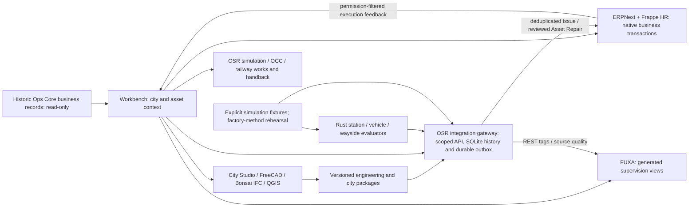
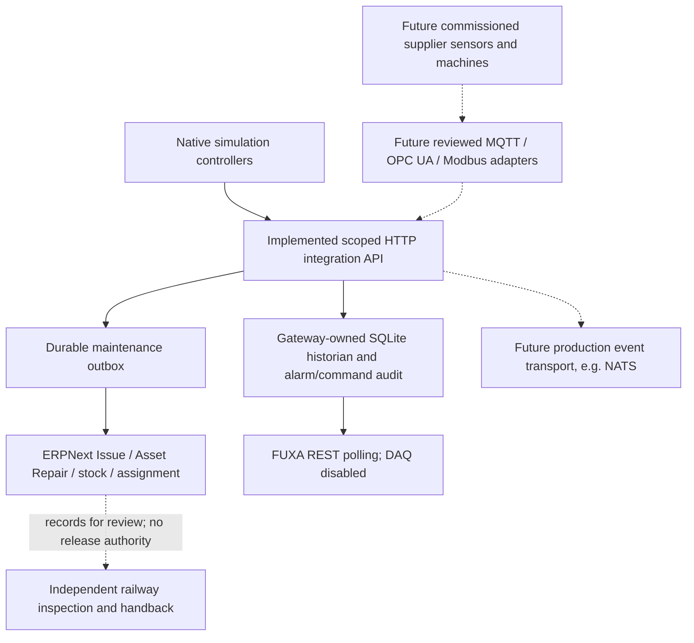
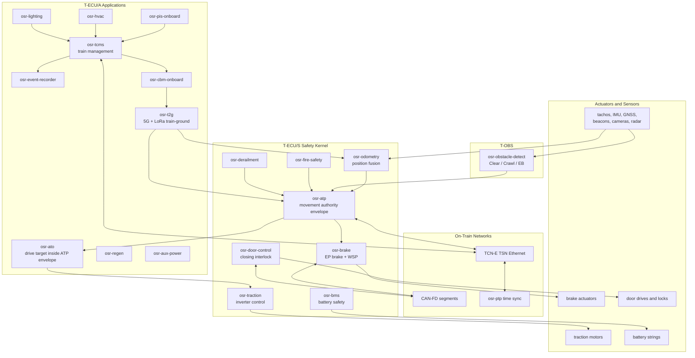
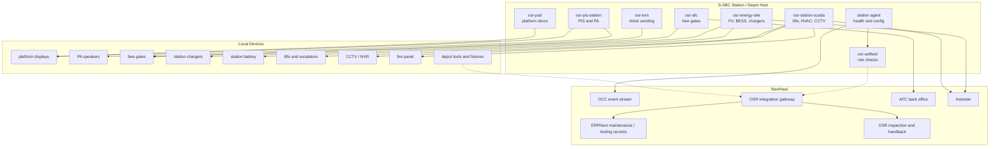
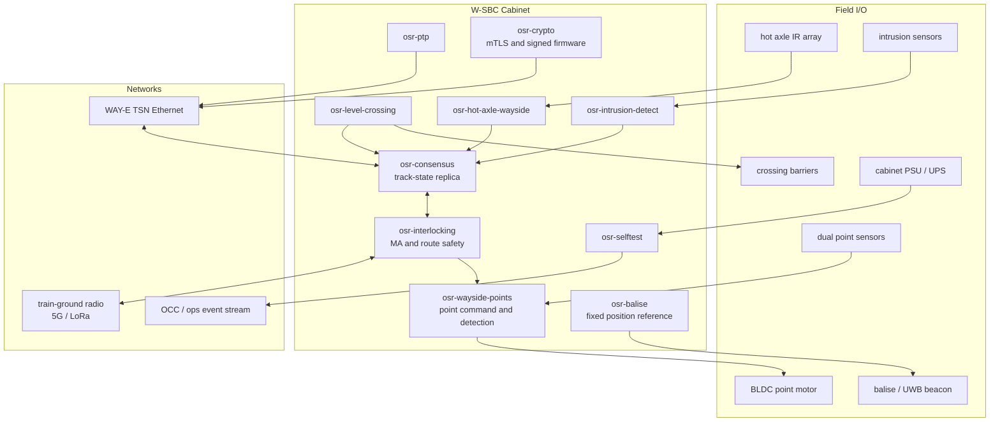
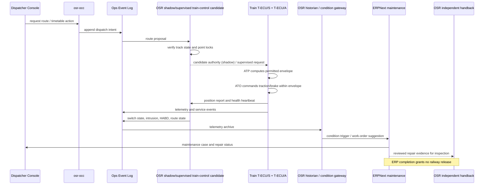
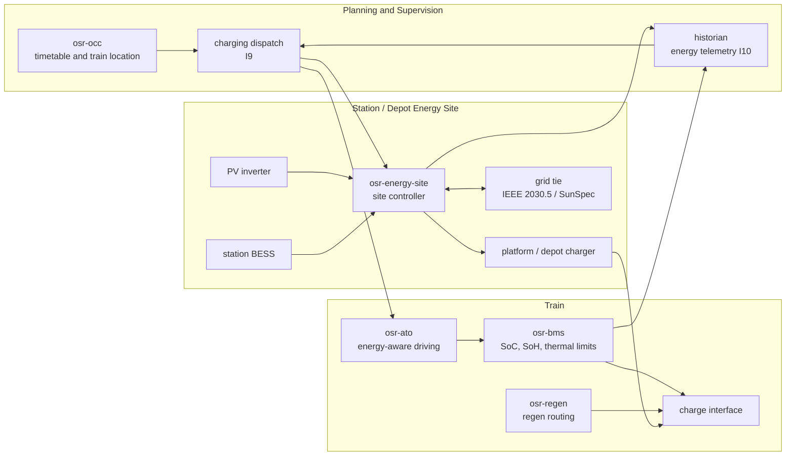
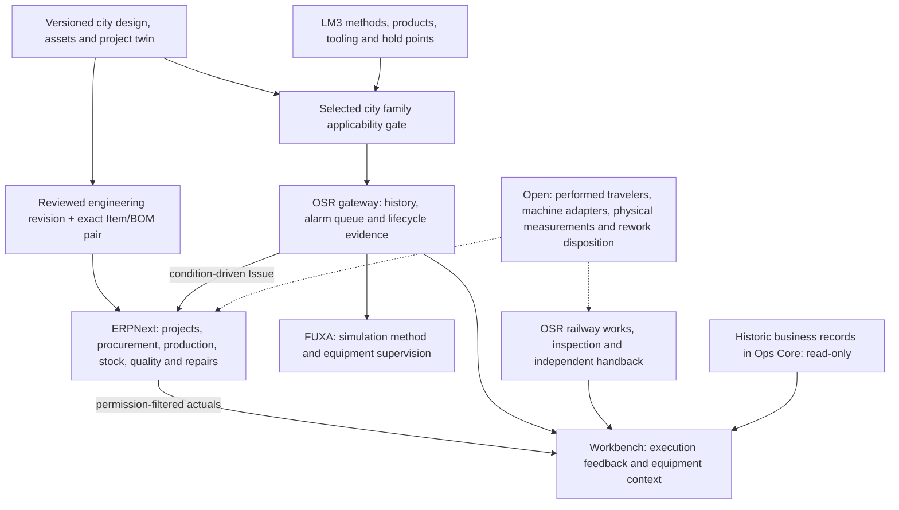

# Software Architecture Diagrams

> **Operating architecture update:** [ERPNext + Frappe HR](operating/README.md) replace custom business administration. The diagrams below describe railway and existing assurance components; ERP cannot issue railway release authority.

These diagrams expand the system map in
[`ARCHITECTURE.md`](ARCHITECTURE.md) and the crate allocations in
[`RFC 0005`](rfcs/0005-sbc-software-architecture.md). They are intended
as editable architecture drawings for implementers, operators, and
reviewers.

## 1. Deployed Demonstration Platform

Solid arrows below describe the localhost demonstration. The Rust evaluators
run against simulation fixtures; this is not a commissioned railway deployment.
Native ERPNext and FUXA accounts retain their own permissions inside Workbench.

ERP completion and alarm clearance cannot grant railway release or movement
authority. LM3 factory views apply only to the matching city family; cross-family
module reuse needs a separate reviewed mapping before it can be represented.

## 2. Integration Boundaries And Future Interfaces

Dashed interfaces are proposed or require physical commissioning. NATS is not
the transport of the deployed ERPNext/FUXA demonstration. Shared identity, TLS,
backup operations, supplier bindings and HIL evidence remain deployment work.
The remaining diagrams describe intended railway allocations and interfaces;
they are not evidence that the depicted hardware paths have been commissioned.

## 3. Onboard Train Software

## 4. Station and Depot Software

## 5. Wayside / Waypoint Node Software

In OSR language, a "waypoint" is any fixed railway location that helps
localize, command, observe, or protect the railway: balise/beacon,
switch, crossing, platform edge, intrusion sensor, hot-axle detector, or
energy/charger site.

## 6. Control and Data Flow

## 7. Energy and Charging Software

## 8. Manufacturing, QA, Maintenance, and Evidence Flow

Work Order correlation requires the Item and exact BOM from a single reviewed
mapping at the selected engineering revision. Factory views show method context
and simulation fixtures; they do not perform inspection, disposition or release.

## 9. Safety and Security Boundaries

