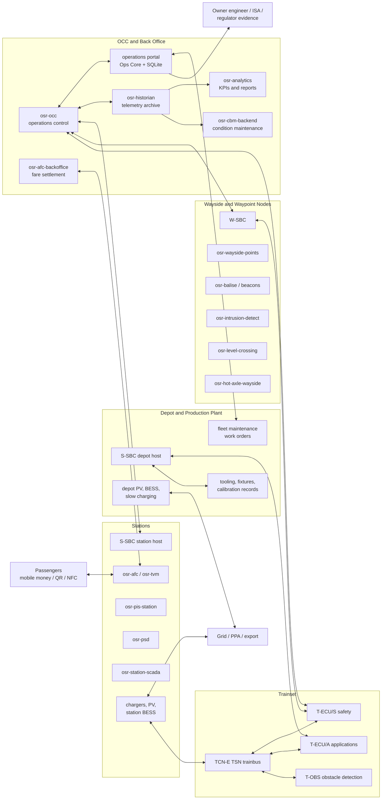
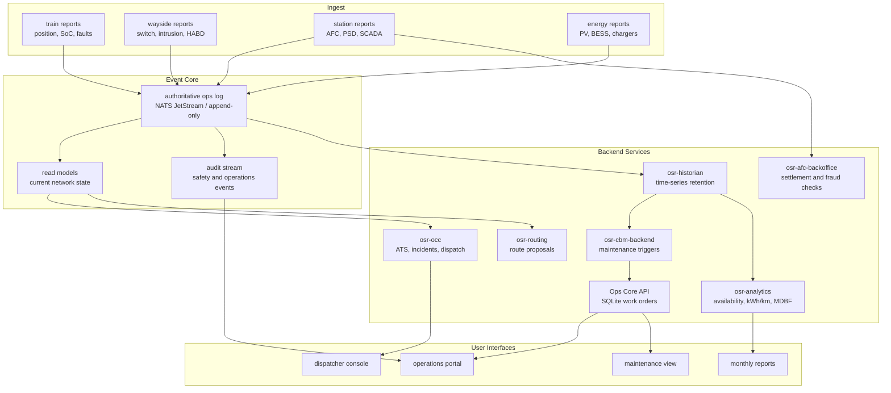
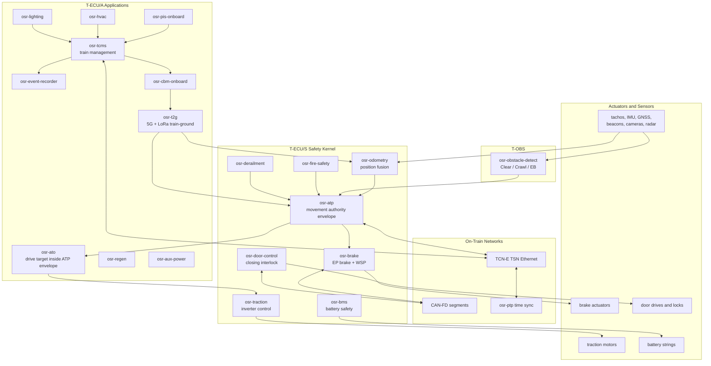
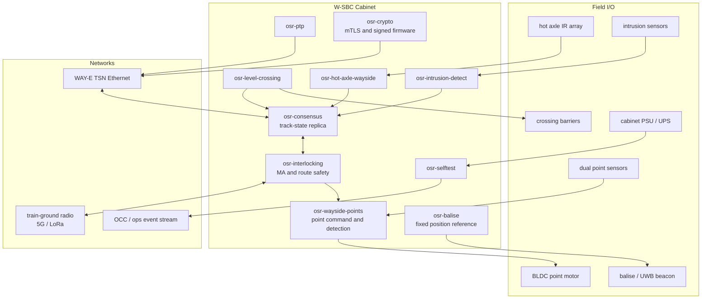
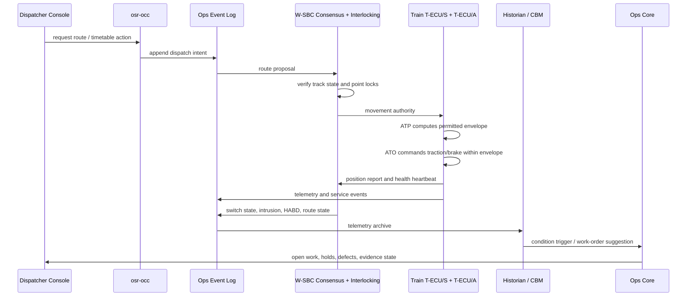
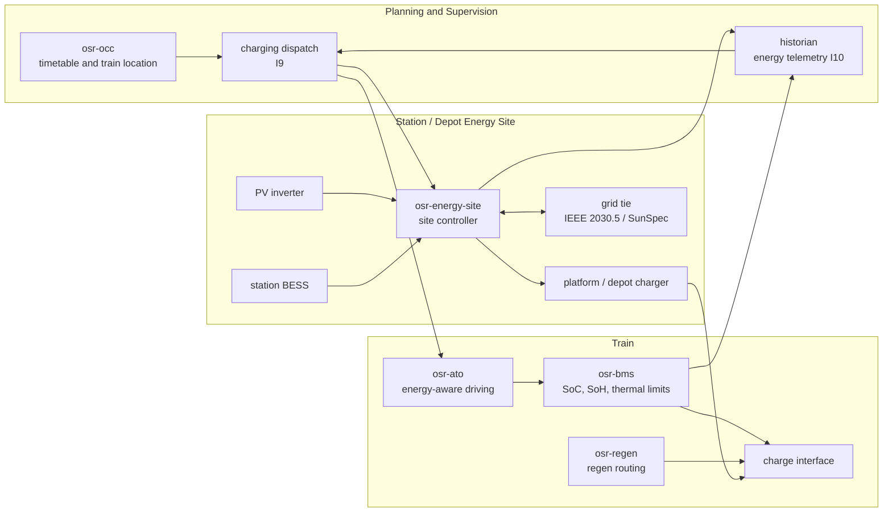
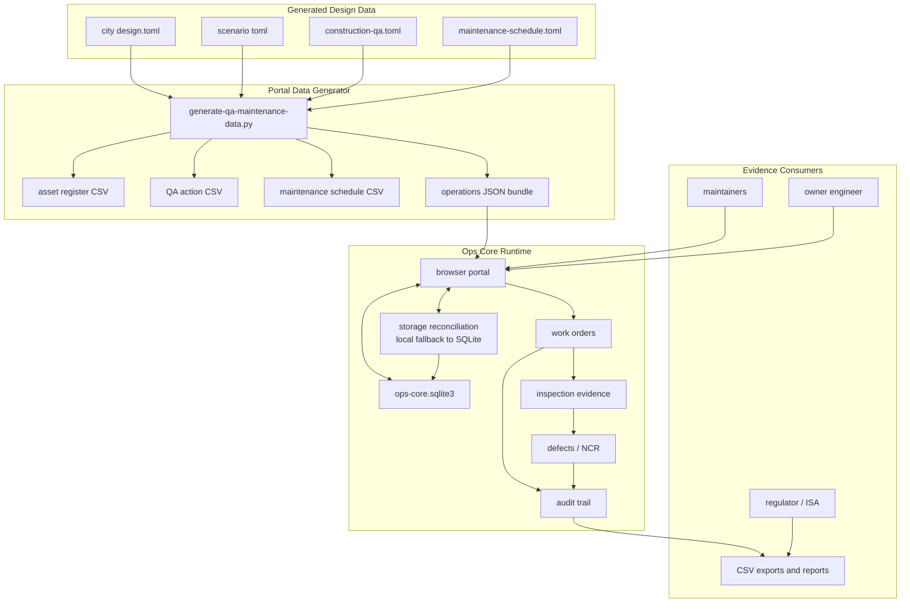
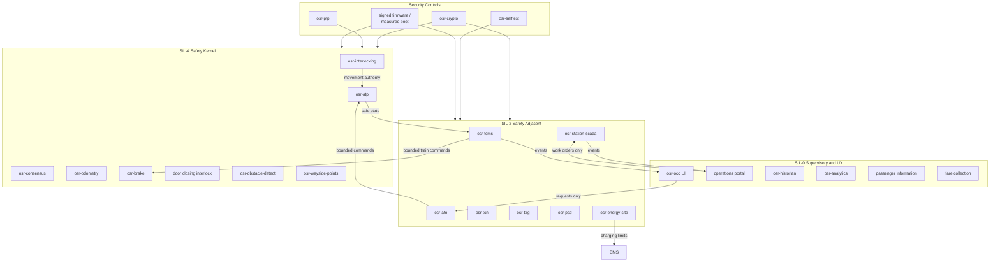

# Software Architecture Diagrams

These diagrams expand the system map in
[`ARCHITECTURE.md`](ARCHITECTURE.md) and the crate allocations in
[`RFC 0005`](rfcs/0005-sbc-software-architecture.md). They are intended
as editable architecture drawings for implementers, operators, and
reviewers.

## 1. Deployment Context

## 2. Backend / OCC Services

## 3. Onboard Train Software

## 4. Station and Depot Software

```mermaid
flowchart TB
  subgraph SSBC["S-SBC Station / Depot Host"]
    StationAgent["station agent\nhealth and config"]
    PISStation["osr-pis-station\nPIS and PA"]
    AFC["osr-afc\nfare gates"]
    TVM["osr-tvm\nticket vending"]
    PSD["osr-psd\nplatform doors"]
    Scada["osr-station-scada\nlifts, HVAC, CCTV"]
    EnergySite["osr-energy-site\nPV, BESS, chargers"]
    SelfTest["osr-selftest\nrole checks"]
  end

  subgraph LocalDevices["Local Devices"]
    Displays["platform displays"]
    Speakers["PA speakers"]
    Gates["fare gates"]
    Chargers["station chargers"]
    BESS["station battery"]
    Lifts["lifts and escalators"]
    CCTV["CCTV / NVR"]
    FirePanel["fire panel"]
    DepotTools["depot tools and fixtures"]
  end

  subgraph Backhaul["Backhaul"]
    OCC["OCC event stream"]
    OpsCore["Ops Core SQLite API"]
    AFCBack["AFC back office"]
    Historian["historian"]
  end

  PISStation --> Displays
  PISStation --> Speakers
  AFC --> Gates
  TVM --> Gates
  PSD --> Displays
  Scada --> Lifts
  Scada --> CCTV
  Scada --> FirePanel
  EnergySite --> Chargers
  EnergySite --> BESS
  StationAgent --> SelfTest
  StationAgent --> OCC
  EnergySite --> Historian
  Scada --> Historian
  AFC --> AFCBack
  SelfTest --> OpsCore
  DepotTools --> OpsCore
```

## 5. Wayside / Waypoint Node Software

In OSR language, a "waypoint" is any fixed railway location that helps
localize, command, observe, or protect the railway: balise/beacon,
switch, crossing, platform edge, intrusion sensor, hot-axle detector, or
energy/charger site.

## 6. Control and Data Flow

## 7. Energy and Charging Software

## 8. QA, Maintenance, and Evidence Flow

## 9. Safety and Security Boundaries

