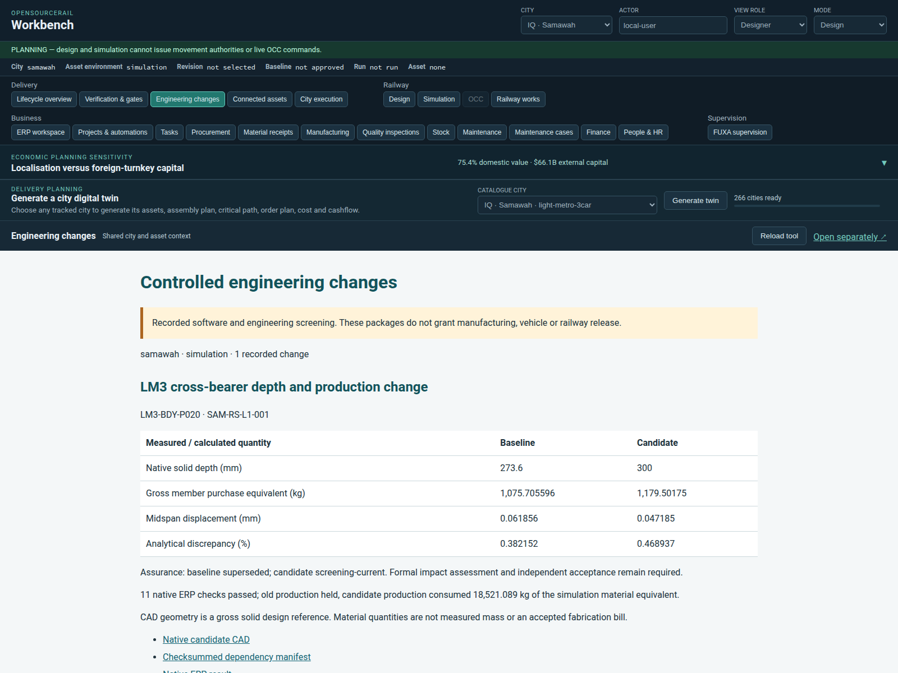

# Controlled engineering changes

Workbench → **Engineering changes** connects retained native FreeCAD geometry,
CalculiX screening, quantities, submitted ERPNext BOMs, production disposition,
manufacturing transactions and superseded evidence. City and environment selection
filter the recorded packages. Native document links are enabled only for the
recorded ERP deployment; authentication still applies.
Search links include each run's unique project/item identity so a fresh database
at the same address cannot substitute reused sequential record IDs.



## Executed Samawah example

The [retained bundle](examples/samawah-cross-bearer/manifest.json) changes one
cross-bearer in tracked `LM3-BDY-P020.FCStd`, reopens the candidate, checks all other
leaf solids remain unchanged, and executes three CalculiX meshes for each revision.
The canonical CAD remains unchanged. FreeCAD 1.1.3 and CalculiX 2.23 executed this
example; complete decks, solver output, native candidate and checksums are retained.

| Quantity | Baseline | Candidate |
| --- | ---: | ---: |
| Native depth, mm | 273.6 | 300 |
| Gross member purchase equivalent, kg | 1,075.705596 | 1,179.501750 |
| Calculated midpoint displacement, mm | 0.06185623 | 0.04718545 |
| Analytical discrepancy | 0.382% | 0.469% |
| Final mesh displacement change | 0.192% | 0.237% |

The solver uses B32 quadratic beams, a 10 kN central point load and simply
supported constraints. The analytical check includes rectangular-section shear
deformation. It is a displacement benchmark, not a strength, fatigue, buckling,
connection or complete vehicle analysis. See the
[CalculiX manual](https://www.dhondt.de/ccx_2.16.pdf) for the element formulation and
[FreeCAD's topology API](https://github.com/FreeCAD/FreeCAD-documentation/blob/main/wiki/Topological_data_scripting.md)
for native shape operations.

The CAD uses **gross solid design-reference geometry**. Density times volume,
including a configured 5% purchase allowance, is a simulation material equivalent;
it is not measured mass or an accepted fabrication BOM. The ERP material valuation
is a test value, not a procurement estimate.

The [native ERP result](examples/samawah-native-erp.json) retains eleven passing
checks: two submitted child/parent BOM revisions and work orders; old nested
production exposure; self-endorsement and premature outcome rejection; separate
software-test reviewer endorsement; actual old work-order stop and verification;
unchanged original BOM/mapping; candidate production and material consumption.
The candidate consumed 18,521.089 kg equivalent, within the native 0.0005 kg
rounding tolerance of its exploded BOM. New records use an isolated project,
warehouse and items in the example-city service. They remain inspectable.

The [Mosul profile](config/mosul.json) reuses the same workflow with a **250 mm**
candidate depth and its own city/asset/project. Its six solver runs produce
0.08071362 mm candidate displacement (0.302% analytical discrepancy), and the
[separate native ERP run](examples/mosul-native-erp.json) passes the same eleven
checks with reduced material quantities. Together the two profiles exercise both
increasing and decreasing geometry through the production workflow. Neither is
a city-specific structural design approval.

## Reproduce or configure another city

`config/generic.json` defines the shared screening assumptions. A versioned city
profile overlays city, asset and any changed assumptions. This example supports
an axis-aligned rectangular cross-bearer; other geometry needs a suitable analysis
adapter. Reusing this method does not validate an arbitrary component.

```sh
# Requires FreeCADCmd and ccx, or the org.freecad.FreeCAD Flatpak with ccx.
# Use a new output folder so previous evidence is retained.
tools/automation/osr-python tools/automation/engineering-change.py prepare \
  --profile engineering/changes/config/samawah.json \
  --output build/engineering-change/samawah-new
tools/automation/osr-python tools/automation/engineering-change.py verify \
  build/engineering-change/samawah-new

# After ./osr example-city setup; use that setup's Samawah project ID.
# This creates and submits simulation records in the example ERP database.
tools/automation/osr-python tools/automation/engineering-change.py execute \
  build/engineering-change/samawah-new --reference-project PROJ-0001 \
  --report build/engineering-change/samawah-native.json
```

Use `--compose-project`, `--compose-file` and `--site` for another isolated ERP
deployment. The reference project's city must match the profile. Execution refuses
changed dependencies, missing/extra/altered bundle files or release claims.
Reports must be new files outside the sealed bundle. Private execution diagnostics
remain under `var/engineering-change/`; public reports contain record identifiers,
checks and source hashes. Checkpoint evidence before removing example volumes.

To publish a new recorded example, retain its sealed bundle and native report and
add a city/environment entry to `catalogue.json` with the matching ERP origin.
Recorded results are historical observations; verification checks source currency,
not the present state of mutable ERP records. CI exercises the retained bundle
against a fresh example ERP and uploads its new report. Native CAD regeneration
requires the tools above and is separately reproducible.

## Acceptance still required

The old evidence is retained as `superseded`; the new result is
`screening-current`, bound to CAD, quantities and configuration hashes. Neither
status grants engineering or physical release. Software-test identities verify
role separation but do not constitute independent engineering reviewers.
Formal impact assessment, supplier/material selection, fabrication drawings,
connection/load/fatigue checks, measured mass, first-article evidence and independent
acceptance remain explicit gates. This example closes the connected software
journey for one design-reference member, not a complete released subassembly.
