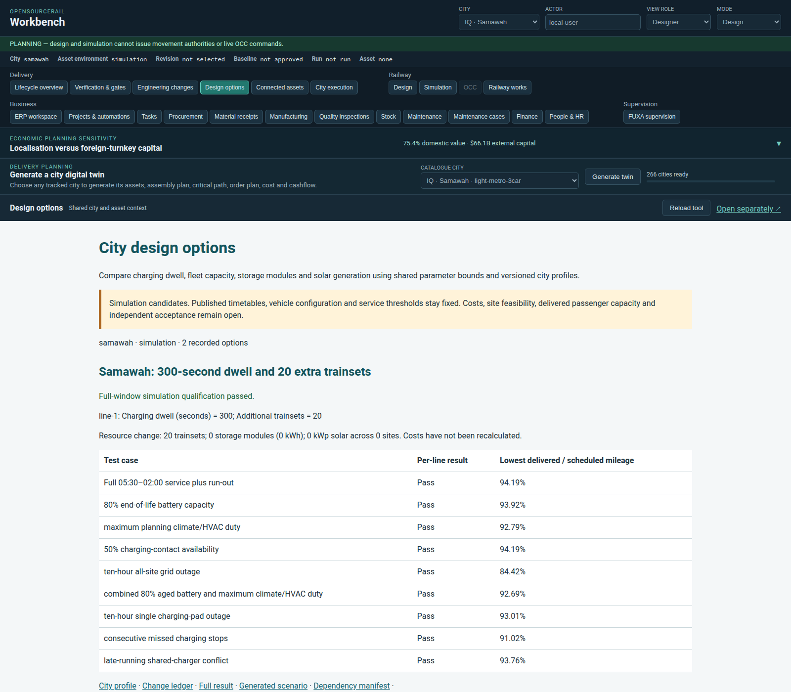

# City design options

Workbench → **Design options** compares recorded, city-scoped simulation candidates.
A shared [parameter policy](config/generic.json) supplies defaults and bounds;
small city profiles select changes by line. The same workflow works with any
catalogue city supported by the scenario generator. Canonical city packages remain
controlled baselines until their separate promotion requirements are satisfied.



## Adjustable design

| Setting | Effect | Review consequence |
| --- | --- | --- |
| `charging_dwell_seconds` | Charging dwell at powered stops on the selected line | Longer journeys, station occupation, timetable and fleet circulation |
| `additional_trainsets` | Adds service-rotation trainsets to that line's fleet | Purchase, stabling, maintenance, staffing and energy demand |
| `additional_storage_modules` | Adds whole modules at every energy site on that line, using each site's own module size | Battery footprint, fire protection, lifecycle and purchase costs |
| `additional_pv_kw` | Adds solar nameplate capacity at every energy site on that line | Land/roof area, grid connection and calibrated solar resource |

The bounds are software exploration limits, not approved hardware ratings. Shared
charger/discharge power limits remain effective: extra kWh increases endurance,
not charger power. Every site is retained when explicit overrides are generated;
other lines' settings remain unchanged. Duplicate depot planning quantities stay
consistent with their site. Unsupported keys, unknown lines, non-finite values,
fractional modules and ignored settings are rejected.

Published timetable windows/headways, vehicle configuration, reserve policy and
qualification thresholds remain fixed. Additional trains cannot reduce scheduled
mileage in the denominator. Nominal and seven degraded cases retain the 90% floor;
the ten-hour all-site grid outage retains its existing 60% floor. The existing
0.2 percentage-point numerical tolerance is unchanged. Full-window per-line
mileage is still not a measured peak-headway or passenger-capacity guarantee.

## Reproduce a candidate

Requires the normal OSR Python and Rust simulation toolchains; no additional
service or Python package is needed. Run from the repository root:

```sh
tools/automation/osr-python tools/automation/design-option.py prepare \
  --profile engineering/design-options/config/mosul-energy.json \
  --output build/design-options/my-mosul-energy
OSR_RESILIENCE_JOBS=4 tools/automation/osr-python \
  tools/automation/design-option.py qualify build/design-options/my-mosul-energy
tools/automation/osr-python tools/automation/design-option.py verify \
  build/design-options/my-mosul-energy
```

Qualification runs 90,000 simulated seconds for nominal service and each of the
eight degraded cases. It returns exit 1 for a failed qualification and preserves
the result. Use a new output folder for each experiment; existing evidence is not
overwritten. Runtime depends on city size and available CPU resources.

To configure another city, copy a profile, set its catalogue slug and option ID,
and specify only the required line overrides. `"lines": {}` is a generator-baseline
control. An omitted setting uses the generic default (existing dwell or zero added
resources). `prepare` resolves and checks the actual generated scenario before
writing its bundle. Generated inline TOML is a complete machine-readable snapshot;
the JSON profile is the human-editable source.

Each bundle contains its profile, generic policy, resolved settings, change ledger,
generator baseline, candidate design/scenario and dependency manifest. Qualification
binds the report to these files, Rust/generator/template dependencies and the native
simulator hash. `verify` checks current source currency; `verify --historical`
checks retained artifact/result binding without asserting current source currency.
Checksums detect changes; they are not independent signatures or engineering approval.

To retain a result, copy its complete bundle to `examples/<option-id>` and add a
city/environment entry to `catalogue.json`. Workbench verifies artifact/report
hashes and scope before displaying it. It shows failure results as failures and
hides other cities and physical environments. Baseline differences from the current
generator are explicitly flagged. Resource deltas are recorded; canonical cost
figures are **not recalculated or accepted** for the candidate.

## Recorded experiments

See [results and design tradeoffs](results.md) for executed trials and resource
impacts. Passing candidates are simulation evidence, not canonical promotion.

## Closing the remaining programme tasks

| Remaining task | Design or execution route | Closure evidence |
| --- | --- | --- |
| City service shortfalls | Versioned dwell, fleet and energy options, followed by the unchanged full qualification | Per-line nominal/degraded results, then observed headways and calibrated demand |
| FUXA/full-city concurrency | Existing configurable city polling, batching and bounded workers; measure gateway, FUXA and ERP together | Simultaneous native full-city load meeting the stated latency/loss targets |
| Recovery/cutover | Existing isolated coordinated restore plus deployment-specific recovery objectives | Fresh-volume recovery, then accepted production cutover and measured recovery times |
| Remaining formal-proof timeouts | Simplify equivalent implementation/harness paths or partition properties with complete coverage | Every declared property proved with original scope, unwinding checks and exact source evidence |
| CAD-to-production acceptance | Portable native CAD/solver adapters, controlled BOM revisions and production disposition | Supplier/material choices, full load cases, inspections and independent engineering review |
| Vehicle, station and civil packages | Reusable package structure with city/site-specific loads, interfaces and configuration | Controlled drawings, qualified analyses, physical evidence and authorized acceptance |

Configuration makes alternatives repeatable. It cannot substitute for proof results,
site measurements, actual recovery execution or an independent acceptance decision.
