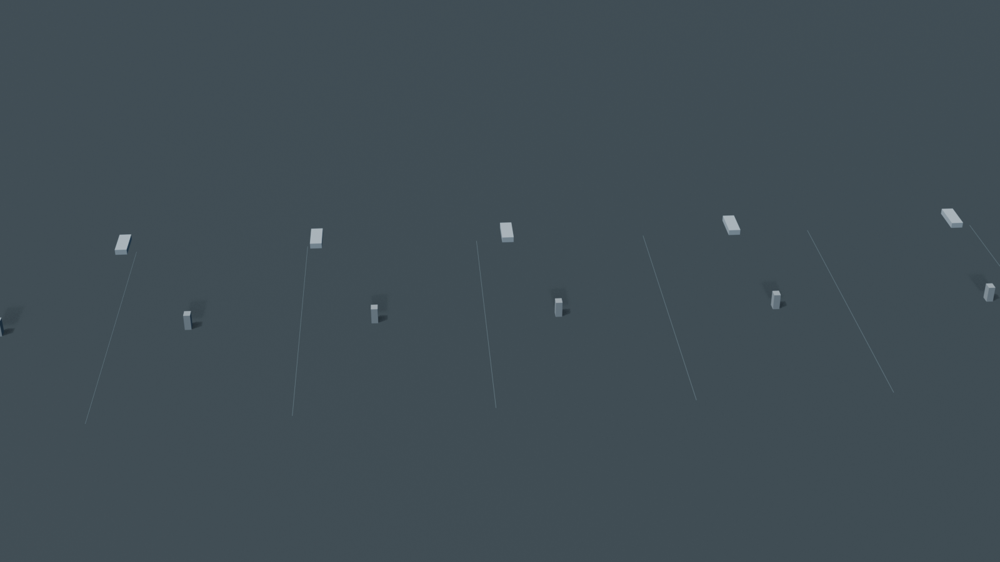
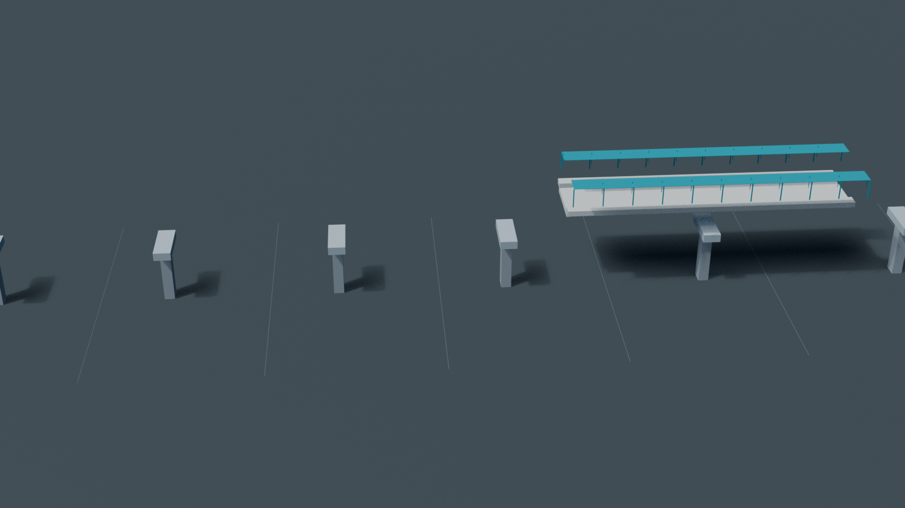
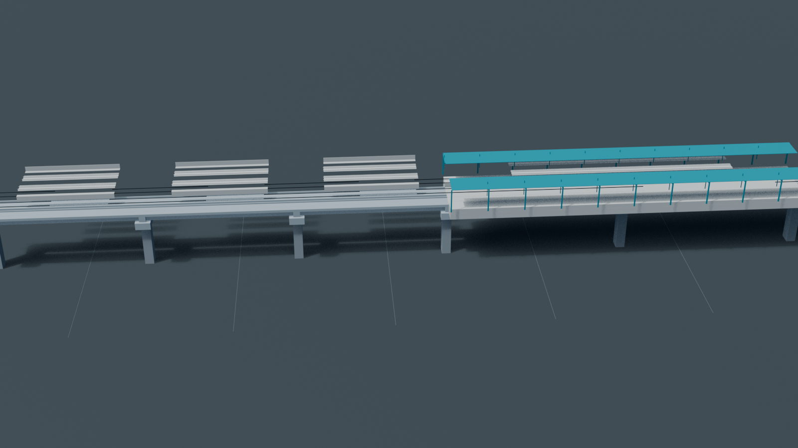

# Civil and LM3 BIM Reference Package

This is the tracked, deterministic public-review federation. It lets GitHub
users inspect the current IFC4.3 model and its requirements/evidence without
installing the complete engineering toolchain.


| Substructure | Superstructure | Track and station interfaces |
|---|---|---|
|  |  |  |

| File | Purpose |
|---|---|
| [`civil-coordination.ifc`](civil-coordination.ifc) | IFC4.3 rail/civil/station/rolling-stock coordination model |
| [`civil-coordination.index.json`](civil-coordination.index.json) | Stable IDs, classifications, source revisions, quantities and relationships |
| [`civil-coordination.validation.json`](civil-coordination.validation.json) | IFC schema and project validation summary |
| [`civil-information-requirements.ids`](civil-information-requirements.ids) | Machine-checkable information requirements |
| [`civil-information-requirements.report.json`](civil-information-requirements.report.json) | Complete IDS result report |
| [`civil-coordination-issues.bcf`](civil-coordination-issues.bcf) | Open coordination issues in BCF 3.0 form |
| [`civil-coordination-issues.index.json`](civil-coordination-issues.index.json) | Reviewable BCF issue index |
| [`civil-construction-sequence.json`](civil-construction-sequence.json) | Deterministic construction stages and object assignments |
| [`civil-coordination.blend`](civil-coordination.blend) | Native Bonsai/Blender review scene with assigned IFC assets, task IDs and construction keyframes |
| [`civil-construction-sequence.mp4`](civil-construction-sequence.mp4) | Full 48-second H.264 4D construction review |
| [`civil-construction-sequence.gif`](civil-construction-sequence.gif) | Complete GitHub-viewable preview of the same sequence |
| [`lm3-manufacturing-reference.ifc`](lm3-manufacturing-reference.ifc) | IFC4.3 LM3 product hierarchy, semantic doors/windows/fixtures/motors, manufacturing methods, sequenced tasks and 20 tooling families |
| [`lm3-manufacturing-reference.index.json`](lm3-manufacturing-reference.index.json) | IFC counts, source hashes, semantic classes and deterministic validation summary |
| [`lm3-parts/`](lm3-parts/) | 101 separate geometric IFC4.3 product files, including round running-gear meshes and semantic doors, windows, lights, furniture and motor classes |
| [`lm3-assemblies/`](lm3-assemblies/) | 26 hierarchy-preserving IFC4.3 subassembly/car/train files; the final trainset contains every active descendant product |
| [`lm3-product-library.index.json`](lm3-product-library.index.json) | Exact split-library file hashes, representation coverage and final-assembly reachability test |
| [`stations/`](stations/) | Seven geometric station IFC4.3 assemblies covering every controlled product in the halt, standard, major, interchange, elevated-interchange, terminal and depot-terminal variants |
| [`../../model-coverage.md`](../../model-coverage.md) | Generated LM3/station fidelity, source, analysis and release-evidence register |

Regenerate it from the authoritative component geometry and engineering
interchange code:

```bash
tools/automation/bonsai-civil.sh --animate \
  --out-dir engineering/models/bim/reference \
  --revision-id repository-reference
python3 engineering/interchange/trainset_manufacturing_ifc.py
python3 engineering/interchange/lm3_product_ifc_library.py
python3 engineering/interchange/station_ifc.py --all-variants \
  --output-dir engineering/models/bim/reference/stations
python3 engineering/model_coverage.py
```

The 4D review moves the assigned IFC objects themselves: substructure rises,
bearings and roofs descend, beams arrive from the erection side, and track feeds
longitudinally according to the checked task assignments. It is a deterministic
construction-state simulation, not crane physics, temporary-works verification,
clash-free path planning or an approved method statement.

These models are coordination, product-structure and manufacturing-method
evidence, not a construction release. The LM3 and station files expose their
complete current product graphs and inspectable design-reference geometry, but do not substitute
for supplier-frozen interfaces, installed-coordinate/tolerance analyses,
released shop drawings, qualified weld/laminate processes or NC surfaces.
Repeated City Studio jobs and render intermediates remain under `build/`; this
named review set is retained in Git.
