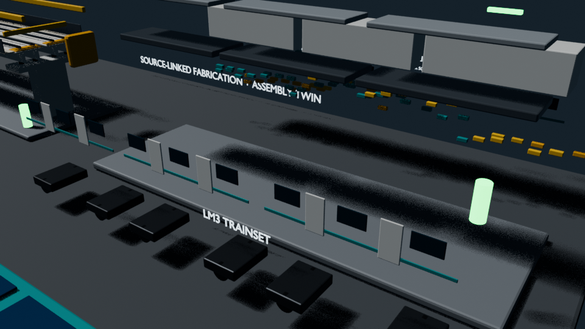
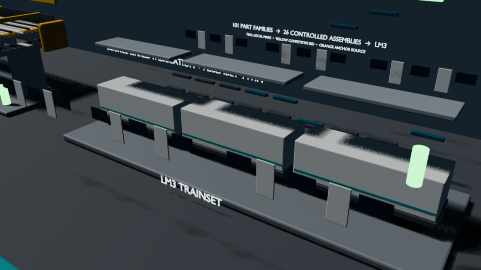

# Fabrication and assembly digital twin

This source-linked planning twin follows four representative products from
material release through fabrication, assembly, quality hold points, and
handover: a 6 m track panel, a standard twin-platform station, an OSR-Pi25
twin-track viaduct bay, and a 49.5 m three-car LM3 trainset.


| Product rows staged | Controlled subassemblies | Complete LM3 node |
|---|---|---|
|  |  |  |

The animation is an 88-second guided assembly tour. The LM3 chapter instantiates
all 101 controlled product rows and all 26 part→subassembly→car→trainset nodes;
each object is separately selectable and carries its ID, parent/children,
quantity, route and dependency timing. Components move from deterministic
staging positions only after their inputs are available, then the tour finishes
with a completed-products overview.
The chapters cover track, station, viaduct and LM3 assembly separately so small
fixtures and installation order remain visible. The MP4 is the primary review
artifact; the lower-frame-rate GIF is an inline preview of the same sequence.

The 127 LM3 nodes are coordination representations, not invented supplier shop
geometry: repeated physical occurrences stay explicit as quantity metadata and
the adjacent train geometry supplies the recognisable installed context. The
tour is explanatory rather than a project schedule. The JSON retains the
actual concurrent planning basis, durations, 25 stages, predecessors, work
centres, inputs, outputs, hold points, evidence, cross-stream interfaces, and
hashes of the controlled source documents.

The viaduct route now includes tested foundation construction, recorded pier
column delivery, erection and seat survey of the compact hollow cap, two
sub-75 t decked-beam lifts by portal/strand-jack launcher, an
actual-load-chart fallback gate, a maturity-controlled link-slab/diaphragm
connection stage, and separate walkway/containment cassettes.

| Artifact | Purpose |
|---|---|
| [`fabrication-assembly-digital-twin.json`](fabrication-assembly-digital-twin.json) | Machine-readable production route, complete 127-node LM3 DAG/timing, live-state snapshots, relationships, source hashes, and validation checks |
| [`fabrication-assembly-digital-twin.blend`](fabrication-assembly-digital-twin.blend) | Native Blender scene with separately selectable staged components and animation |
| [`fabrication-assembly-digital-twin.mp4`](fabrication-assembly-digital-twin.mp4) | Full-resolution 88-second H.264 guided assembly tour |
| [`fabrication-assembly-digital-twin.gif`](fabrication-assembly-digital-twin.gif) | Complete 88-second inline preview below the 20 MB repository limit |

Regenerate all outputs with:

```bash
design/component-catalogue/scripts/blender_fabrication_assembly_twin.sh
```

This is a fabrication-planning and first-article control twin, not released
shop drawings or an approved construction method. Numeric weld procedures,
fastener torques, lift studies, temporary works, supplier instructions, and
signed travelers remain mandatory release inputs.
