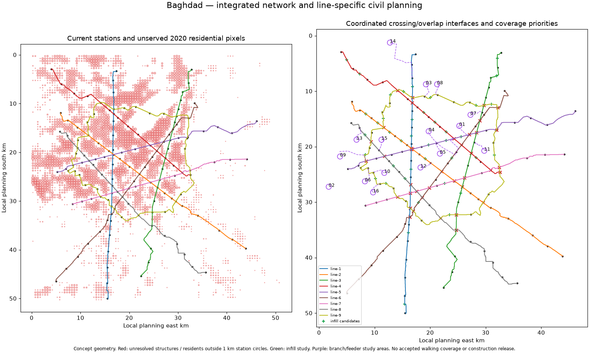

# Baghdad integrated network, foundations and assembly plan

**Coordinated design-development concept; field construction and operating adoption remain open.**

[Interactive line / support / junction viewer](network-foundation-viewer.html) lets reviewers zoom, select a line and inspect individual support packets and interface records offline.

One source-bound asset graph connects each line, actual span, shared support, beam, launcher front, junction interface, station complex and residential intervention. The current native timetable/finance remains a comparator; this package does not claim new operating service or accepted structural profiles.

The plan assigns **9,423 support-specific foundation packets**, **8,499 catalogue bay assemblies**, **376 specials** and **18 launcher fronts**. Support packets have coordinates, chainage, adjacent spans, desktop-soil investigation references and required loads/tests. Pile type/count/depth, groundwater and bearing capacity remain unselected until field design.

| Line | Foundation packets | Catalogue bay assemblies | Special packages | Candidate infill |
|---|---:|---:|---:|---:|
| [line-1](line-1-construction-plan.md) | 859 | 726 | 28 | 6 |
| [line-2](line-2-construction-plan.md) | 1084 | 912 | 77 | 5 |
| [line-3](line-3-construction-plan.md) | 844 | 794 | 20 | 3 |
| [line-4](line-4-construction-plan.md) | 978 | 879 | 44 | 6 |
| [line-5](line-5-construction-plan.md) | 842 | 774 | 27 | 3 |
| [line-6](line-6-construction-plan.md) | 891 | 791 | 48 | 2 |
| [line-7](line-7-construction-plan.md) | 830 | 777 | 22 | 1 |
| [line-8](line-8-construction-plan.md) | 866 | 759 | 45 | 3 |
| [line-9](line-9-construction-plan.md) | 2229 | 2087 | 65 | 11 |

## Junction and overlap coordination

39 crossing/shared-corridor/self-crossing interfaces need explicit structural treatment. 5 original interchange groups exceed the 600 m full-diameter screen. The new bounded grouping prevents transitive long-distance complexes and preserves platform coordinates. It does not create a track switch, measured walking path or accepted vertical profile.

[Integrated geometry and complex register](network-integration.json) · [GIS junction/residential layer](junctions-and-residential-plan.geojson) · [Foundation coordinate conflicts](foundation-location-conflicts.json).

## Residential coverage and expansion

Retained 2020 population within 1 km station circles is **40.3%**. 40 population-ranked infill candidates give a conditional radial sensitivity of **50.4%**. **2,397,003** currently unserved retained residents are also over 1 km from sampled existing corridors; infill cannot close those gaps. 16 named/located priority areas therefore require branch/extension or funded feeder/access studies. Area circles can overlap and are never summed as unique residents.

These are native population-count and distance screens, not current census, surveyed walksheds, ridership or funded service. Candidate sites need water/footprint/property/access, station structure, timetable, fleet, energy and full installed cost review.

[Expansion corridor plans](expansion-corridors.json) provide 15 source-bound routes along the retained arterial graph, tied to existing station connections, with access gaps and proposed stopping sites. Compare rail branches with frequent feeders; traffic direction, bridge grades/loads, railway curvature and walk routes are unverified. The combined infill/feeder 500 m stop-circle sensitivity is 55.7%; the rail 1 km sensitivity is 62.5%. [Shared corridor edges](shared-expansion-corridor-edges.json) count overlapping candidate road segments once. No corridor is adopted or funded.

## Foundation and assembly execution

[Foundation register](foundation-register.csv.gz) has one row per unique proposed support. [Span assembly register](span-assembly-register.csv.gz) has identified component pairs and both foundation parents, actual line/run, unique front assignment, sequence and predecessor. [Launcher fronts](launcher-fronts.json) preserve disconnected runs and relocation gates. [Stage library](assembly-stage-library.json) defines foundation/column/cap/bearing, factory/delivery, first/second beam securing, advance and handover dependencies. Specials and junctions use their own design/erection chains.

Decode compressed CSV using `python -c "import gzip; print(gzip.open('foundation-register.csv.gz','rt').read())"`. Coordinates are interpolated from the retained planning route; desktop soil does not select a foundation, and no pile depth or allowable bearing value is invented.

[Complete per-line summary](line-assembly-summary.json) · [Wider catalogue audit](catalogue-audit.csv) · [Catalogue findings and provenance](catalogue-audit-summary.json).

[Companion data archive](Baghdad-Network-and-Foundation-Planning.zip) contains this planning package and new controlled inputs. The original Baghdad proposal archive retains the baseline city/engineering input evidence. Use both for the full planning review; the companion does not imply physical release.

Run `python tools/automation/integrated-network-plan.py`; `--check` validates source/output hashes. `--retain-context` creates the immutable retained OSM road/name input from the cached extraction. Native route and financial assumptions change only through a subsequent fully regenerated, validated adoption revision.
