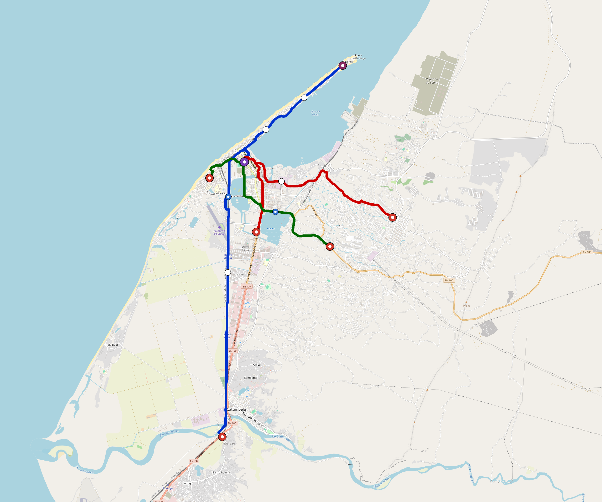
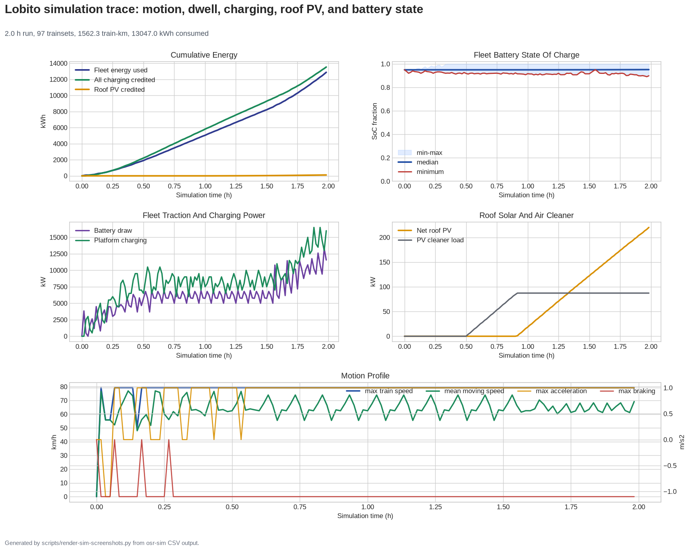

# Lobito OpenSourceRail Campaign
<!-- Generated by scripts/generate-marketing-campaigns.py. -->

Municipality outreach package for **Lobito, Angola**. Figures are
screening outputs for discussion, not a bid, endorsement or construction release.

## Audience

- Office of the Mayor or city executive for Lobito
- Lobito municipal transport and urban-planning authority
- Lobito climate, energy or sustainability office
- Lobito municipal finance and investment unit

## Local proposition

| Measure | Current planning result |
|---|---:|
| Population represented | 500,000 |
| Lines / route length | 3 / 38.1 km |
| Line-platform stops / fleet | 15 / 83 trainsets |
| Practical capacity ceiling | 401,760 passenger-trips/day |
| Station/depot PV / storage | 9.2 MW / 47.0 MWh |
| City programme CAPEX | $299 M |
| Local capital and value share | $227 M (76%) |
| Illustrative external-capital saving | $466 M |
| Annual OPEX planning value | $8 M |

Lead with locally buildable infrastructure, open design review, renewable-energy
integration and a staged feasibility process. Do not lead with the comparator;
it is an illustrative sensitivity, not a vendor quotation.

## Visuals and evidence

| Network concept | Deterministic simulation |
|---|---|
|  |  |

- [City design brief](../../../../../designs/east-africa/Angola/Lobito/README.md)
- [National programme](../../../../../designs/east-africa/Angola/NATIONAL-BRIEF.md)
- [Finance evidence](../../../../../designs/east-africa/Angola/Lobito/engineering/finance/summary.json)
- [Energy evidence](../../../../../designs/east-africa/Angola/Lobito/engineering/energy/summary.json)
- [Send-ready plain-text email](email.txt)

## Call to action

Ask for a 30-minute technical review, nomination of a municipal counterpart,
access to current mobility/land/utility data, and agreement on the scope of an
independent feasibility study. Verify the recipient in
[`contact-research.csv`](../../../../contact-research.csv)
before sending.
