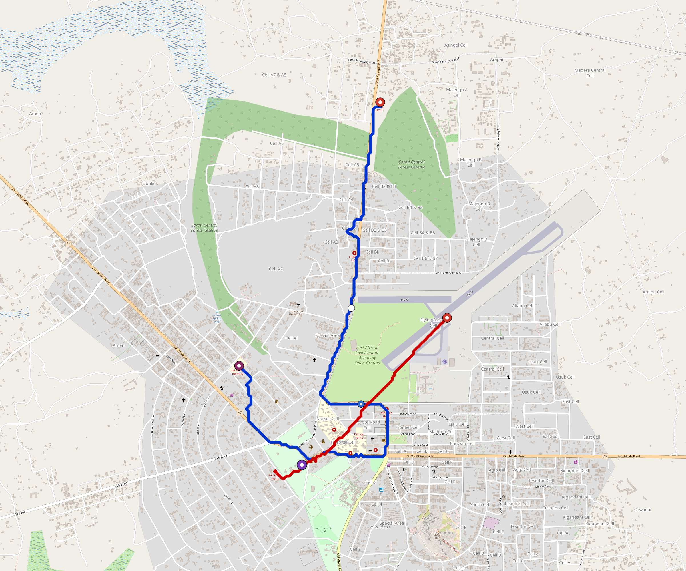
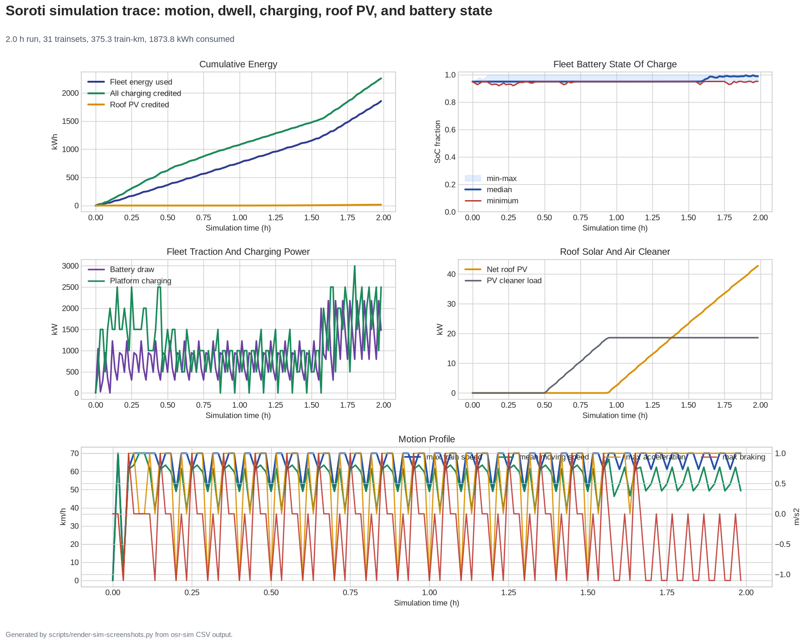

# Soroti OpenSourceRail Campaign
<!-- Generated by scripts/generate-marketing-campaigns.py. -->

Municipality outreach package for **Soroti, Uganda**. Figures are
screening outputs for discussion, not a bid, endorsement or construction release.

## Audience

- Office of the Mayor or city executive for Soroti
- Soroti municipal transport and urban-planning authority
- Soroti climate, energy or sustainability office
- Soroti municipal finance and investment unit

## Local proposition

| Measure | Current planning result |
|---|---:|
| Population represented | 200,000 |
| Lines / route length | 2 / 7.9 km |
| Line-platform stops / fleet | 6 / 23 trainsets |
| Practical capacity ceiling | 178,560 passenger-trips/day |
| Station/depot PV / storage | 6.5 MW / 42.5 MWh |
| City programme CAPEX | $97 M |
| Local capital and value share | $77 M (79%) |
| Illustrative external-capital saving | $154 M |
| Annual OPEX planning value | $2 M |

Lead with locally buildable infrastructure, open design review, renewable-energy
integration and a staged feasibility process. Do not lead with the comparator;
it is an illustrative sensitivity, not a vendor quotation.

## Visuals and evidence

| Network concept | Deterministic simulation |
|---|---|
|  |  |

- [City design brief](../../../../../designs/east-africa/Uganda/Soroti/README.md)
- [National programme](../../../../../designs/east-africa/Uganda/NATIONAL-BRIEF.md)
- [Finance evidence](../../../../../designs/east-africa/Uganda/Soroti/engineering/finance/summary.json)
- [Energy evidence](../../../../../designs/east-africa/Uganda/Soroti/engineering/energy/summary.json)
- [Send-ready plain-text email](email.txt)

## Call to action

Ask for a 30-minute technical review, nomination of a municipal counterpart,
access to current mobility/land/utility data, and agreement on the scope of an
independent feasibility study. Verify the recipient in
[`contact-research.csv`](../../../../contact-research.csv)
before sending.
