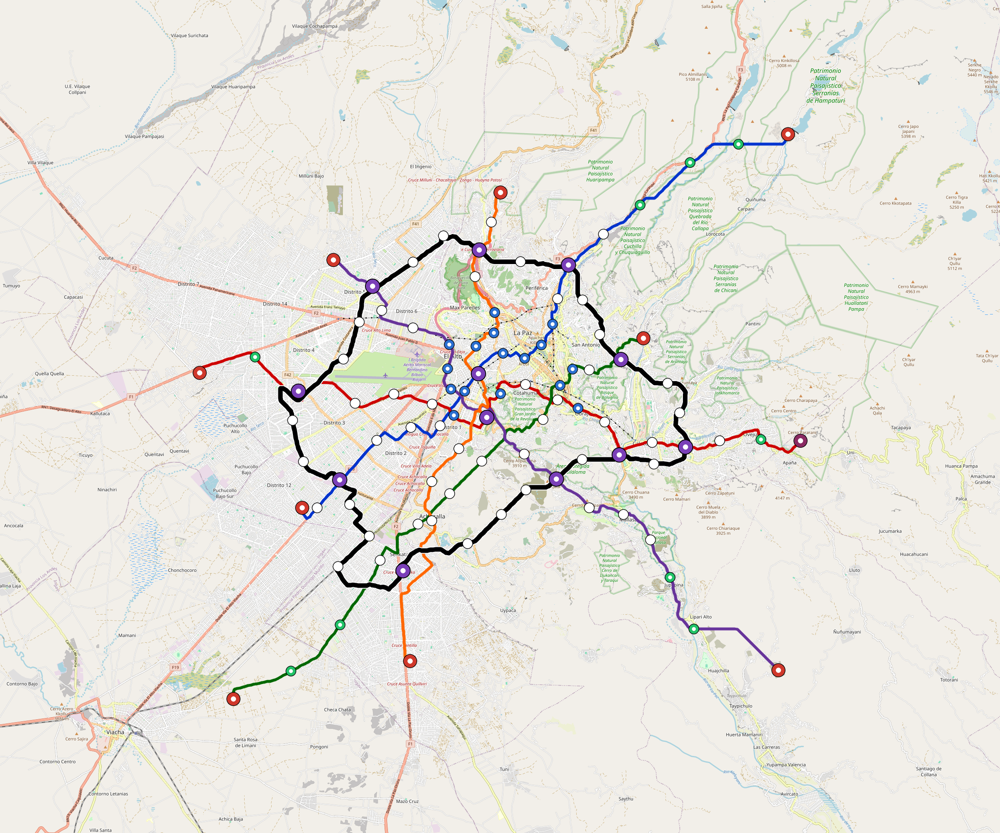

# OpenSourceRail × CAF — Development Bank of Latin America and the Caribbean
<!-- Generated by scripts/generate-marketing-campaigns.py. -->

Tailored partnership approach for **CAF — Development Bank of Latin America and the Caribbean**.

| Target detail | Value |
|---|---|
| Category | `regional-development-bank` |
| Engagement route | Eligibility and project-preparation enquiry |
| Design regions | latin-america |
| Applicable city models | 3 cities across 3 countries |
| Intended recipient | Urban mobility, infrastructure or country office |
| Named public contact | None; use the official organisational route |
| Public route | info@caf.com |
| Official contact | [https://www.caf.com/en/who-we-are/where-are-we/](https://www.caf.com/en/who-we-are/where-are-we/) |
| Contact source | [https://www.caf.com/en/currently/news/caf-approves-more-than-usd-2-billion-for-sustainable-development-in-latin-america-and-the-caribbean/](https://www.caf.com/en/currently/news/caf-approves-more-than-usd-2-billion-for-sustainable-development-in-latin-america-and-the-caribbean/) |
| Last checked | 2026-08-29 |
| Programme fit | Sustainable urban mobility, resilient cities and regional infrastructure finance |

**Routing constraint:** Confirm member-country, promoter and operation eligibility before presenting any financing request.

## Partnership proposition

OpenSourceRail offers a transparent early-stage pipeline spanning 3 cities,
3 countries, 551
route-km and 63.6 MW of station/depot PV in the current
screening models. The request is for technical routing, pilot preparation and
independent review—not endorsement or funding on the strength of screening data.

| La-Paz network | San-Salvador simulation |
|---|---|
|  |  |

- [Send-ready plain-text email](email.txt)
- [OpenSourceRail overview](../../../../README.md)
- [City catalogue](../../../../designs/README.md)
