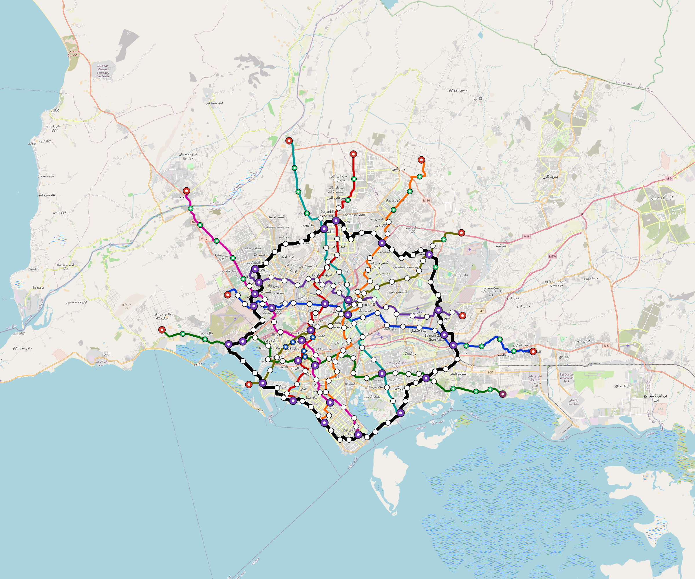

# OpenSourceRail × REN21
<!-- Generated by scripts/generate-marketing-campaigns.py. -->

Tailored partnership approach for **REN21**.

| Target detail | Value |
|---|---|
| Category | `renewable-energy-network` |
| Engagement route | Technical partnership and peer-review enquiry |
| Design regions | global |
| Applicable city models | 266 cities across 44 countries |
| Intended recipient | Knowledge, cities or partnerships team |
| Named public contact | None; use the official organisational route |
| Public route | secretariat@ren21.net |
| Official contact | [https://www.ren21.net/contact/](https://www.ren21.net/contact/) |
| Contact source | [https://www.ren21.net/about-us/who-we-are/](https://www.ren21.net/about-us/who-we-are/) |
| Last checked | 2026-08-29 |
| Programme fit | Renewable-energy evidence, city energy transitions and international knowledge networks |

**Routing constraint:** Offer data and a reproducible case study; REN21 is a knowledge network rather than a project financier.

## Partnership proposition

OpenSourceRail offers a transparent early-stage pipeline spanning 266 cities,
44 countries, 29,106
route-km and 4048.6 MW of station/depot PV in the current
screening models. The request is for technical routing, pilot preparation and
independent review—not endorsement or funding on the strength of screening data.

| Karachi network | Kinshasa simulation |
|---|---|
|  |  |

- [Send-ready plain-text email](email.txt)
- [OpenSourceRail overview](../../../../README.md)
- [City catalogue](../../../../designs/README.md)
