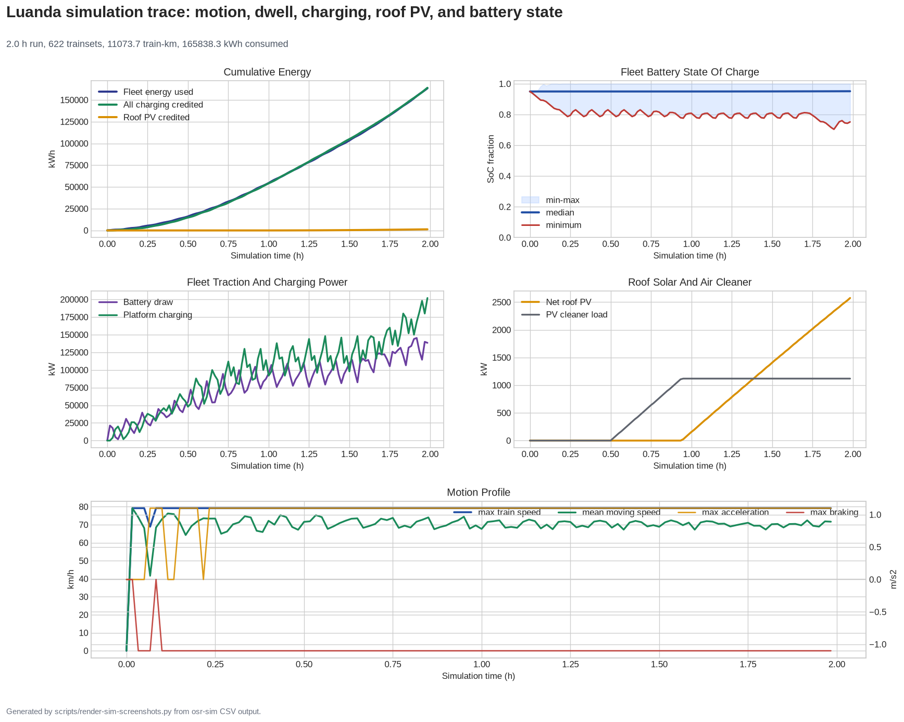

# OpenSourceRail × Africa Transport Policy Program
<!-- Generated by scripts/generate-marketing-campaigns.py. -->

Tailored partnership approach for **Africa Transport Policy Program**.

| Target detail | Value |
|---|---|
| Category | `development-transport-programme` |
| Engagement route | Research, data and peer-review collaboration |
| Design regions | central-africa, east-africa, north-africa, south-africa, west-africa |
| Applicable city models | 124 cities across 21 countries |
| Intended recipient | Urban Transport and Mobility or programme team |
| Named public contact | None; use the official organisational route |
| Public route | Official form/contact route only |
| Official contact | [https://www.ssatp.org/](https://www.ssatp.org/) |
| Contact source | [https://www.ssatp.org/who-we-are](https://www.ssatp.org/who-we-are) |
| Last checked | 2026-08-29 |
| Programme fit | African transport policy, sustainable urban mobility, institutional capacity and evidence-based reform |

**Routing constraint:** Offer open evidence for an African-led policy discussion; SSATP is not a direct unsolicited project-finance route.

## Partnership proposition

OpenSourceRail offers a transparent early-stage pipeline spanning 124 cities,
21 countries, 11,595
route-km and 1740.2 MW of station/depot PV in the current
screening models. The request is for technical routing, pilot preparation and
independent review—not endorsement or funding on the strength of screening data.

| Kinshasa network | Luanda simulation |
|---|---|
|  |  |

- [Send-ready plain-text email](email.txt)
- [OpenSourceRail overview](../../../../README.md)
- [City catalogue](../../../../designs/README.md)
