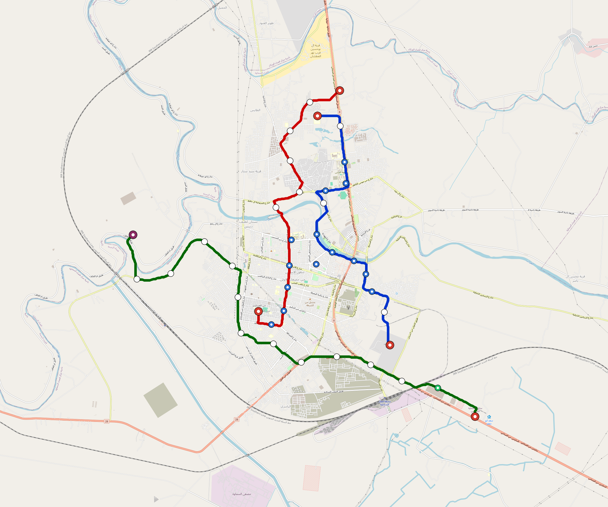
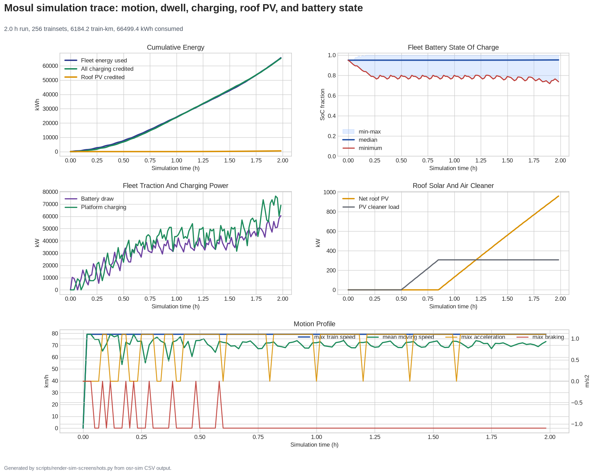

# OpenSourceRail × WRI Ross Center for Sustainable Cities
<!-- Generated by scripts/generate-marketing-campaigns.py. -->

Tailored partnership approach for **WRI Ross Center for Sustainable Cities**.

| Target detail | Value |
|---|---|
| Category | `urban-sustainability-nonprofit` |
| Engagement route | Technical partnership and peer-review enquiry |
| Intended recipient | Urban mobility, cities or relevant international office |
| Named public contact | None; use the official organisational route |
| Public route | Official form/contact route only |
| Official contact | [https://www.wri.org/about/contact](https://www.wri.org/about/contact) |
| Contact source | [https://www.wri.org/cities](https://www.wri.org/cities) |
| Last checked | 2026-08-29 |
| Programme fit | Integrated urban planning, sustainable mobility, road safety and climate action |

**Routing constraint:** Seek evidence review or programme fit; a model catalogue is not a substitute for locally led alternatives analysis.

## Partnership proposition

OpenSourceRail offers a transparent early-stage pipeline spanning 266
cities, 44 countries, 29,106
route-km and 4048.6 MW of station/depot PV in the current
screening models. The request is for technical routing, pilot preparation and
independent review—not endorsement or funding on the strength of screening data.

| Samawah network | Mosul simulation |
|---|---|
|  |  |

- [Send-ready plain-text email](email.txt)
- [OpenSourceRail overview](../../../../README.md)
- [City catalogue](../../../../designs/README.md)
