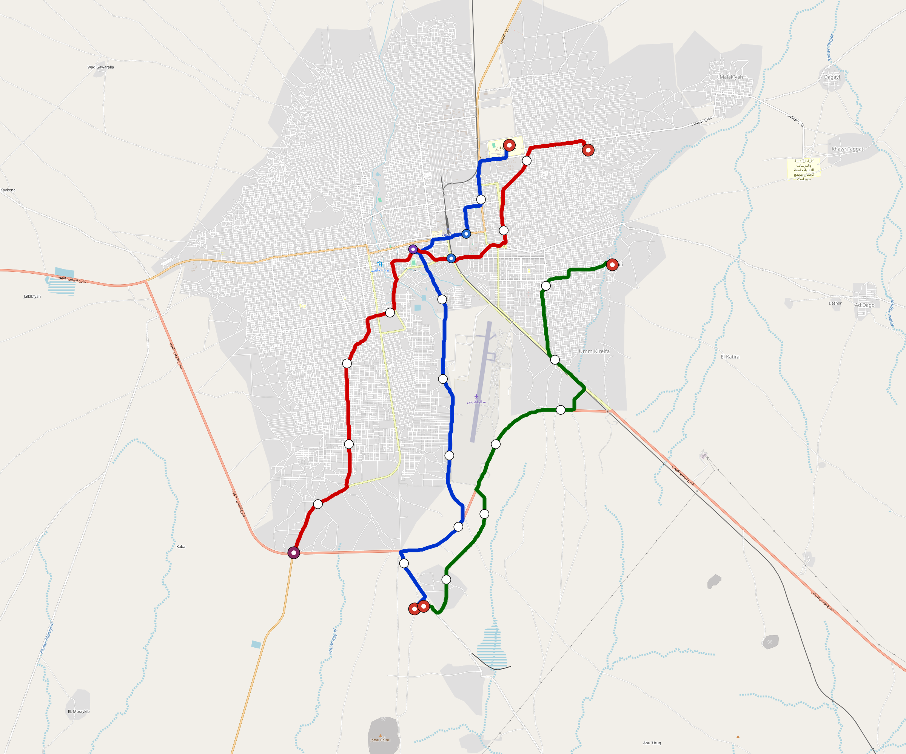
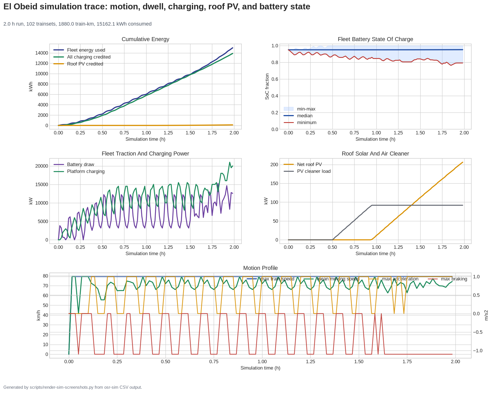

# El-Obeid OpenSourceRail Campaign
<!-- Generated by scripts/generate-marketing-campaigns.py. -->

Municipality outreach package for **El-Obeid, Sudan**. Figures are
screening outputs for discussion, not a bid, endorsement or construction release.

## Audience

- Office of the Mayor or city executive for El-Obeid
- El-Obeid municipal transport and urban-planning authority
- El-Obeid climate, energy or sustainability office
- El-Obeid municipal finance and investment unit

## Local proposition

| Measure | Current planning result |
|---|---:|
| Population represented | 500,000 |
| Lines / route length | 3 / 47.2 km |
| Line-platform stops / fleet | 19 / 102 trainsets |
| Practical capacity ceiling | 401,760 passenger-trips/day |
| Station/depot PV / storage | 10.4 MW / 49.0 MWh |
| City programme CAPEX | $385 M |
| Local capital and value share | $293 M (76%) |
| Illustrative external-capital saving | $601 M |
| Annual OPEX planning value | $10 M |

Lead with locally buildable infrastructure, open design review, renewable-energy
integration and a staged feasibility process. Do not lead with the comparator;
it is an illustrative sensitivity, not a vendor quotation.

## Visuals and evidence

| Network concept | Deterministic simulation |
|---|---|
|  |  |

- [City design brief](../../../../../designs/north-africa/Sudan/El-Obeid/README.md)
- [National programme](../../../../../designs/north-africa/Sudan/NATIONAL-BRIEF.md)
- [Finance evidence](../../../../../designs/north-africa/Sudan/El-Obeid/engineering/finance/summary.json)
- [Energy evidence](../../../../../designs/north-africa/Sudan/El-Obeid/engineering/energy/summary.json)
- [Send-ready plain-text email](email.txt)

## Call to action

Ask for a 30-minute technical review, nomination of a municipal counterpart,
access to current mobility/land/utility data, and agreement on the scope of an
independent feasibility study. Verify the recipient in
[`contact-research.csv`](../../../../contact-research.csv)
before sending.
