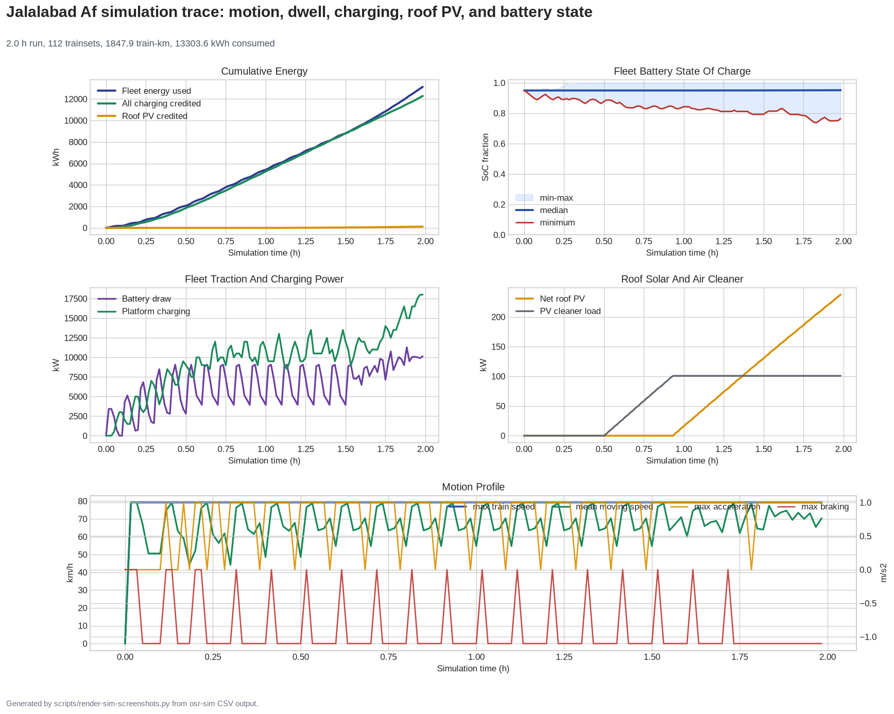

# Jalalabad-Af OpenSourceRail Campaign
<!-- Generated by scripts/generate-marketing-campaigns.py. -->

Municipality outreach package for **Jalalabad-Af, Afghanistan**. Figures are
screening outputs for discussion, not a bid, endorsement or construction release.

## Audience

- Office of the Mayor or city executive for Jalalabad-Af
- Jalalabad-Af municipal transport and urban-planning authority
- Jalalabad-Af climate, energy or sustainability office
- Jalalabad-Af municipal finance and investment unit

## Local proposition

| Measure | Current planning result |
|---|---:|
| Population represented | 350,000 |
| Lines / route length | 3 / 47.0 km |
| Line-platform stops / fleet | 16 / 112 trainsets |
| Practical capacity ceiling | 401,760 passenger-trips/day |
| Station/depot PV / storage | 9.5 MW / 47.5 MWh |
| City programme CAPEX | $369 M |
| Local capital and value share | $278 M (75%) |
| Illustrative external-capital saving | $573 M |
| Annual OPEX planning value | $9 M |

Lead with locally buildable infrastructure, open design review, renewable-energy
integration and a staged feasibility process. Do not lead with the comparator;
it is an illustrative sensitivity, not a vendor quotation.

## Visuals and evidence

| Network concept | Deterministic simulation |
|---|---|
|  |  |

- [City design brief](../../../../../designs/south-asia/Afghanistan/Jalalabad-Af/README.md)
- [National programme](../../../../../designs/south-asia/Afghanistan/NATIONAL-BRIEF.md)
- [Finance evidence](../../../../../designs/south-asia/Afghanistan/Jalalabad-Af/engineering/finance/summary.json)
- [Energy evidence](../../../../../designs/south-asia/Afghanistan/Jalalabad-Af/engineering/energy/summary.json)
- [Send-ready plain-text email](email.txt)

## Call to action

Ask for a 30-minute technical review, nomination of a municipal counterpart,
access to current mobility/land/utility data, and agreement on the scope of an
independent feasibility study. Verify the recipient in
[`contact-research.csv`](../../../../contact-research.csv)
before sending.
