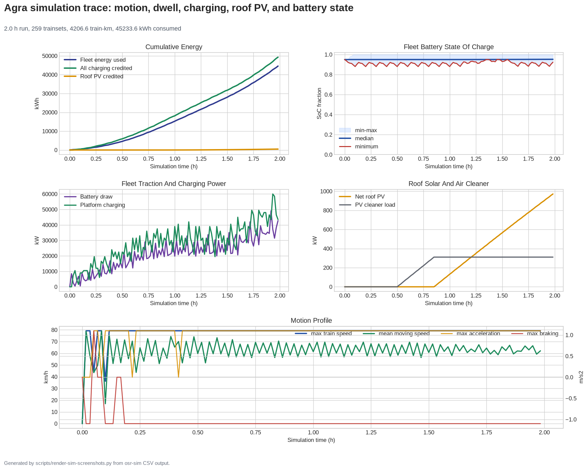

# Agra OpenSourceRail Campaign
<!-- Generated by scripts/generate-marketing-campaigns.py. -->

Municipality outreach package for **Agra, India**. Figures are
screening outputs for discussion, not a bid, endorsement or construction release.

## Audience

- Office of the Mayor or city executive for Agra
- Agra municipal transport and urban-planning authority
- Agra climate, energy or sustainability office
- Agra municipal finance and investment unit

## Local proposition

| Measure | Current planning result |
|---|---:|
| Population represented | 1,700,000 |
| Lines / route length | 5 / 160.2 km |
| Line-platform stops / fleet | 58 / 187 trainsets |
| Practical capacity ceiling | 803,520 passenger-trips/day |
| Station/depot PV / storage | 20.6 MW / 118.0 MWh |
| City programme CAPEX | $1.42 B |
| Local capital and value share | $1.10 B (77%) |
| Illustrative external-capital saving | $2.23 B |
| Annual OPEX planning value | $33 M |

Lead with locally buildable infrastructure, open design review, renewable-energy
integration and a staged feasibility process. Do not lead with the comparator;
it is an illustrative sensitivity, not a vendor quotation.

## Visuals and evidence

| Network concept | Deterministic simulation |
|---|---|
|  |  |

- [City design brief](../../../../../designs/south-asia/India/Agra/README.md)
- [National programme](../../../../../designs/south-asia/India/NATIONAL-BRIEF.md)
- [Finance evidence](../../../../../designs/south-asia/India/Agra/engineering/finance/summary.json)
- [Energy evidence](../../../../../designs/south-asia/India/Agra/engineering/energy/summary.json)
- [Send-ready plain-text email](email.txt)

## Call to action

Ask for a 30-minute technical review, nomination of a municipal counterpart,
access to current mobility/land/utility data, and agreement on the scope of an
independent feasibility study. Verify the recipient in
[`contact-research.csv`](../../../../contact-research.csv)
before sending.
